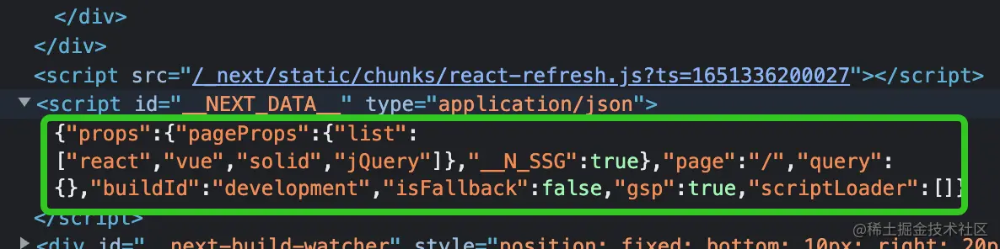
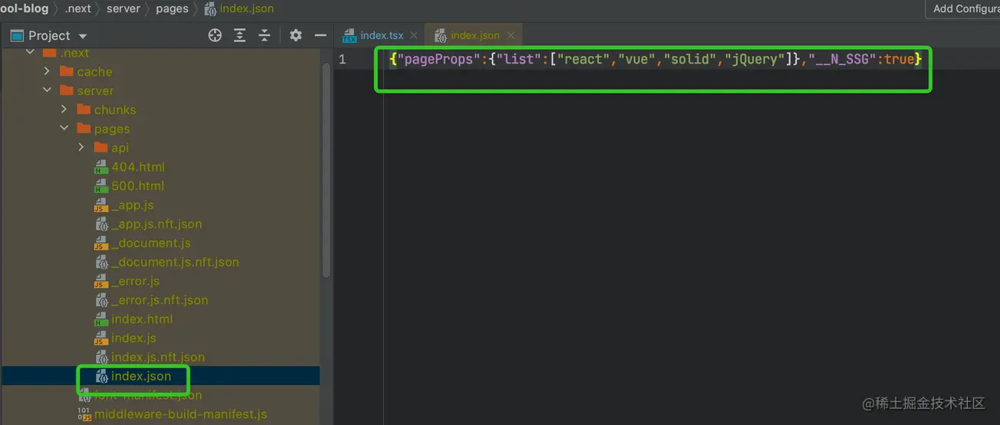
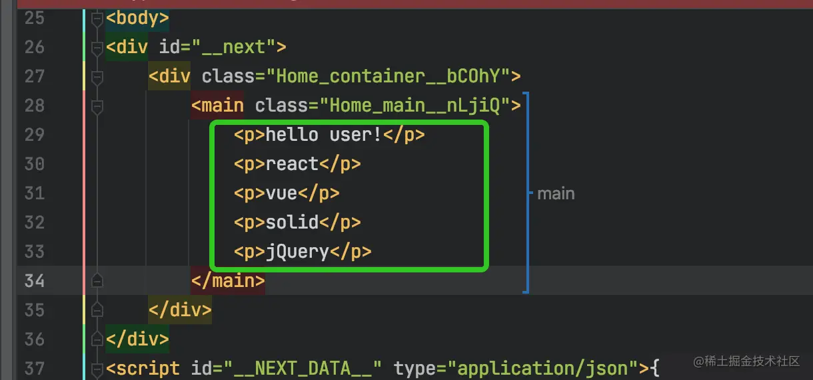

CSR：客户端渲染 Client Side Render，即现在的 Vue / React / Solid，SPA 架构的方式

SSR：服务端渲染 Server Side Render，PHP / Java / Python 后台基本能力，生成 HTML 模板，交由浏览器渲染

SSG：页面静态化 Static Side Generation，例如把 PHP 提前渲染成 HTML

## CSR

Vue / React 裸框架，都使用了 JS 的能力，向 `<div id="App"></div>` 中动态填充 HTML，完全由浏览器渲染，搜索引擎抓取不到任何关于页面的信息

缺点：

- 白屏，在 AJAX 得到渲染之前，页面中并没有内容，只能通过 Loading 来过度。
- SEO 不友好，搜索引擎爬取页面内容时，不会执行 JS，无法抓取页面关键信息
- ...

## SSG

在文章列表页面里，其实每个用户查到的内容都是一样的，那为什么还需要在每个人的浏览器上渲染一遍呢？ 为什么不在后端渲染好，然后发给每个人，这样 N 次渲染，变成了 1 次渲染，N 次客户端渲染变成了 1 次静态页面生成

- 优点：解决 SEO、白屏问题
- 缺点：所有用户看到的都是同一个页面（ 突出一个静态 ）

下面是一个在 Next.js 中的示例

```tsx
function getAjaxData(): Promise<{data: string[], status: 'done'|'fail'}> {
  return new Promise((resolve, _) => {
    setTimeout(() => {
      resolve({
        data: [
          'react',
          'vue',
          'solid',
          'jQuery'
        ],
        status: 'done'
      })
    }, 200)
  })
}
```

```tsx
import type { NextPage, GetStaticProps } from 'next'

// 避免 TS 报错，预定义 SSG 数据结构
type HomeProps = {
  list: string[]
}

const Home: NextPage<HomeProps> = (props) => {

  // 取出 SSG 数据
  const { list = [] } = props

  return (
    <>
      <p>hello user!</p>
      {
        list.map((item: any) => <p key={item}>
          {item}
        </p>)
      }
    </>
  )
}

export default Home

// 实现 SSG
export const getStaticProps: GetStaticProps = async () => {
  const { data, status } = await getAjaxData();

  // return 出的内容可以通过组件的 Props 取到
  return {
    props: {
      list: data
    }
  };
};
```

SSG 数据只在服务端获取了，如何传递给前端的？ajax 请求没有发现。

检查生成的 DOM 结构，发现有一个特殊的 script 标签：



里面存储着传递给组件的 Props 数据

何时静态化?

- 开发环境，每次请求都会运行一次 getStaticProps
- 生产环境，getStaticProps 只在 build 时运行一次

本地 build 之后发现：



直接将接口的数据生成 json

再看生成的 index.html 结构：



## SSR

页面与用户状态相关，例如不同类型用户需要展示不同内容，没办法静态化；只有两个方案：

- SSR
- CSR

```tsx
import type { NextPage, GetServerSideProps } from 'next'
import {IncomingHttpHeaders} from 'http';

type HomeProps = {
  UAInfo: string
}

const Home: NextPage<HomeProps> = (props) => {
  const { UAInfo = '' } = props

  return (
    <>
      <p>Your browser info:</p>
      <p>{UAInfo}</p>
    </>
  )
}

// 实现SSR
export const getServerSideProps: GetServerSideProps = async (context) => {
  const headers:IncomingHttpHeaders = context.req.headers;
  const browser = headers['user-agent'];

  return {
    props: {
      UAInfo: browser
    }
  };
};
```

后端将页面渲染，返回 HTML String 格式，传递到前端，前端进行 hydrate() ,会保留 HTML 并附上时间监听，也就是说后端渲染 HTML，前端添加监听

前端也会渲染一次，用以确保前后端渲染结果一致
