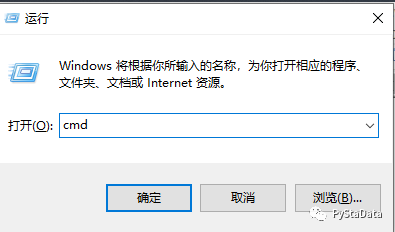
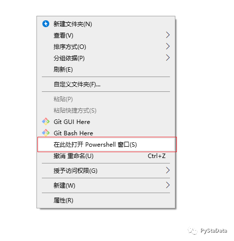

使用 `win+R` 快捷键打开 **运行** 对话框，输入 `cmd` 打开控制台命令窗口

也可以通过`cmd /c` 命令 和 `cmd /k` 命令的方式来直接运行命令

其中，`/c` 表示执行完命令后关闭 cmd 窗口；`/k` 表示执行完命令后保留 cmd 窗口



在指定路径打开命令窗口：在目标路径空白处按住 `Shift` ，然后右键弹出快捷菜单，点击“在此处打开命令行窗口”（或者“在此处打开 Powershell 窗口”）



- `command /?` 用于查看 command 命令的帮助说明；
- 中断命令执行：`Ctrl+Z`；
- 使用上下方向键，查看使用过的命令；
- 使用 `Tab` 键补齐命令

> 参考：Windows Command-Line: Backgrounder: https://devblogs.microsoft.com/commandline/windows-command-line-backgrounder/

## cd

用于切换目录

`cd` 可以显示当前目录，`cd + path` 进入指定的路径（path），如果文件夹名称包含空格，需使用双引号将路径引起来，如：cd "c:\program file\my.txt"

`cd ..` 表示进入父目录

```shell
C:\Users\mudaozi>cd Documents

C:\Users\mudaozi\Documents>cd ..

C:\Users\mudaozi>cd ../..

C:\>
```

## dir

显示目录中的内容

显示当前目录下的子文件夹与文件

## tree

图示目录结构

卷 OS 的文件夹 PATH 列表; 卷序列号为 D048-2ACC

```shell
C:.
├─code
├─doc
│      01_Introduction.md
│      02_Directory_Operation.md
│      Windows_Command_Line_and_Stata.md
│
└─img
        1-1.jpg
        1-2.png
        1-3.png
```

在自己实证研究或者与人合作时，项目说明文档如果能写清楚文件夹结构，这样整个项目内容一清二楚

那么怎么才能如上图显示文件结构呢？

使用 `tree` 命令

`tree c:\myfiles` 表示显示 `d:\myfiles` 路径下的文件夹，`tree c:\myfiles /F` 则显示每个文件夹中文件的名称

## mkdir

创建文件夹

`mkdir` 或者 `md` 命令可以创建文件夹

```shell
MKDIR [drive:]path
MD [drive:]path
```

如果命令扩展被启用，MKDIR 会如下改变: 如果需要，MKDIR 会在路径中创建中级目录

例如: 假设 `\a` 不存在，那么:

```shell
mkdir \a\b\c\d
```

与

```shell
    mkdir \a
    chdir \a
    mkdir b
    chdir b
    mkdir c
    chdir c
    mkdir d
```

相同

如果扩展被停用，则需要键入 `mkdir \a\b\c\d`

## rmdir

删除文件夹

`rmdir` 或者 `rd` 用于删除文件夹

默认删除路径下文件夹，如果需要删去所有子目录和文件，添加 `/s` 选项

使用 `/s` 选项时，默认会询问是否确认删除，如果添加 `/q` 选项，则为安静模式，不需要确认

```shell
RMDIR [/S] [/Q] [drive:]path
RD [/S] [/Q] [drive:]path
```

- `/s`

  除目录本身外，还将删除指定目录下的所有子目录和文件

  用于删除目录树

- `/q`

  安静模式，带 `/s` 删除目录树时不要求确认

