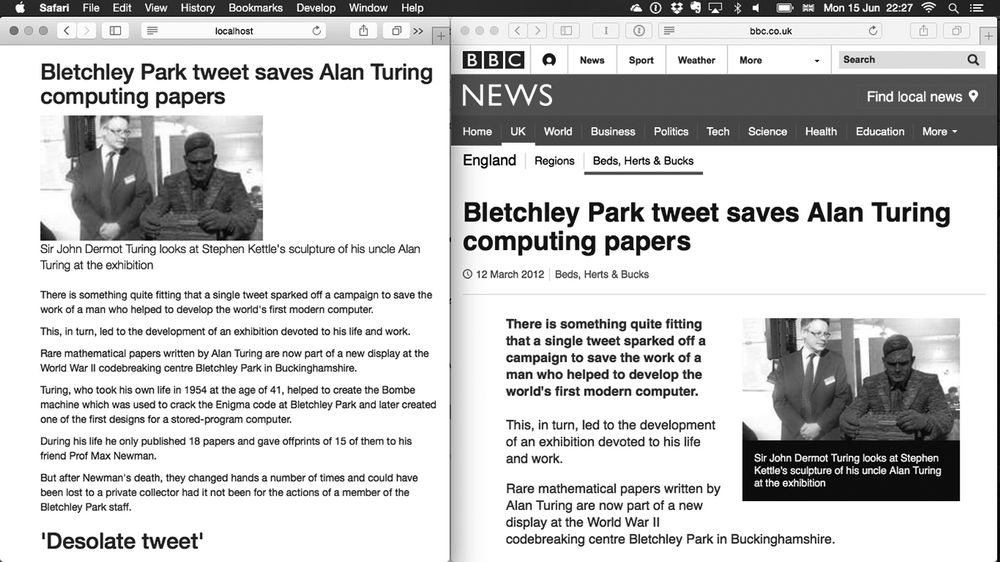

# 一个 Web 应用是怎样的?

本章介绍的内容全部都是关于Node Web程序的，其它服务器的概念也类似

看完之后，你不仅会知道Node Web程序看起来是什么样的，还能学会如何开始搭建这样的程序

Web开发人员在开发程序时要做的每一件事你都会看到

我们准备带你一起搭建一个名为later的Web程序，其创意来自Instapaper和Pocket这样的“回头再看”网站

涉及的工作包括开始一个新的Node项目、管理依赖项、创建RESTful API、把数据保存到数据库中，以及用模板做一个用户界面

虽然看起来有很多内容，但不用担心，我们还会在后续章节中详细讲解这里提到的每一项工作

最终结果的样子



左侧的“回头再看”页面剥离了目标网站的无关元素，只留下了标题和内容主体

更重要的是这篇文章被永久存放到了数据库中，也就是说即便将来连原始文章都找不到了，你还是可以读到它

在开始搭建Web程序之前，应该先创建一个新项目

接下来我们会介绍如何从头开始创建一个Node项目

## 了解Node Web程序的结构

典型的Node Web程序是由下面几部分组成的：

- package.json—— 一个包含依赖项列表和运行这个程序的命令的文件；
- public/—— 静态资源文件夹，CSS和客户端JavaScript都放在这里；
- node_modules/——项目的依赖项都会装到这里；
- 放程序代码的一个或多个JavaScript文件

程序代码一般又会分成下面几块：

- app.js或index.js——设置程序的代码；
- models/——数据库模型；
- views/——用来渲染页面的模板；
- controllers/ 或 routes/——HTTP请求处理器；
- middleware/——中间件组件

如何组织程序是你的自由：大部分Web框架都很灵活，并且需要配置

但大多数程序都是按照上面给出的结构组织的

最好的学习方法就是亲自动手实践，所以让我们看看老练的Node程序员是如何创建Web程序框架的

### 开始一个新的Web程序

要创建一个新的Web程序，需要先做一个新的Node项目

很简单，只需要创建一个目录，然后运行`npm init`，记得加上接受所有默认值的参数：

```shell
mkdir later
cd later
npm init -fy
```

有了新项目，然后呢？

大多数人都会用npm上的模块来降低开发难度

Node自带了一个http模块，它有个服务器

但使用http模块依然需要做很多套路化的开发工作，所以我们一般会选择使用更便捷的Express

下面来看一下怎么安装

1. 添加依赖性

   要添加项目依赖项，可以用`npm install`

   下面这个就是安装Express的命令：

   ```shell
   npm install --save express
   ```

   如果现在看一下package.json，你应该会看到Express已经给加上去了

   也就是说package.json中应该会有类似于下面这样的代码：

   ```json
   "dependencies": {
     "express": "^4.14.0"
   }
   ```

   Express模块也应该装在了这个项目的node_modules/ 文件夹下

   如果想卸载Express，可以运行`npm rm express --save`

   这个命令会把它从node_modules/ 中删除，还会更新package.json文件

2. 一个简单的服务器

   Express以Node自带的http模块为基础，致力于在HTTP请求和响应上来建模Web程序

   为了做出一个最基本的程序，我们需要用`express()`创建一个程序实例，添加路由处理器，然后将这个程序实例绑定到一个TCP端口上

   下面是最基本的程序所需的全部代码：

   ```javascript
   const express = require('express');
   const app = express();
   　
   const port = process.env.PORT || 3000;
   　
   app.get('/', (req, res) => {
     res.send('Hello World');
   });
   　
   app.listen(port, () => {
     console.log(`Express web app available at localhost: ${port}`);
   });
   ```

   看起来并不像你想的那么复杂！

   将这段代码放到index.js文件中，用`node index.js`运行它

   然后访问`http://localhost:3000`看一下结果

   每个程序的运行命令可能会不太一样，记起来很麻烦，所以大部分人会用npm脚本解决这个问题

3. npm 脚本

   启动服务器的命令（`node index.js`）可以保存为npm脚本，打开package.json文件，在`scripts`里添加一个`start`属性：

   ```json
   "scripts": {
     "start": "node index.js",
     "test": "echo \"Error: no test specified\" && exit 1"
   },
   ```

   现在只要运行`npm start`就可以启动程序了

   如果你看到有错误提示说端口3000已经被占用，那么可以运行`PORT=3001 npm start`使用另外一个端口

   npm脚本可以做很多事情：构建客户端包、执行测试、生成文档等

   它基本上就是一个微型脚本调用工具，所以只要你喜欢，放什么都行

## 搭建一个RESTful Web服务

你的程序需要一个RESTful Web服务，以便像Instapaper和Pocket那样创建和保存文件

为了将杂乱的Web页面变成整洁的文章，这个服务需要用到一个模块，类似最早的Readability服务

设计RESTful服务时，要想好需要哪些操作，并将它们映射到Express里的路由上

就此例而言，需要实现保存文章、获取文章、获取包含所有文章的列表和删除不再需要的文章这几个功能

分别对应下面这些路由：

- `POST /articles`——创建新文章；
- `GET /articles/:id`——获取指定文章；
- `GET /articles`——获取所有文章；
- `DELETE /articles/:id`——删除指定文章

在考虑数据库和Web界面等问题之前，我们先重点解决如何用Express创建RESTful资源的问题

你可以用cURL向示例程序发起请求，然后再逐步实现数据存储等更加复杂的操作，让它越来越像一个真正的Web程序

下面这个简单的Express程序实现了这些路由，不过现在是用JavaScript数组来存储文章的

```javascript
const express = require('express');
const app = express();

const articles = [{title: 'Example'}];

app.set('port', process.env.PORT || 3000);

app.get('/articles', (req, res, next) => {
  // 获取所有文章
  res.send(articles);
});

app.post('/articles', (req, res, next) => {
  // 创建一篇文章
  res.send('ok');
});

app.get('/articles/:id', (req, res, next) => {
  // 获取指定文章
  const id = req.params.id;
  console.log('Fetching:', id);
  res.send(articles[id]);
});

app.delete('/articles/:id', (req, res, next) => {
  // 删除指定文章
  const id = req.params.id;
  console.log('Deleting:', id);
  delete articles[id];
  res.send({message: 'Deleted'});
});

app.listen(app.get('port'), () => {
  console.log('App started on port', app.get('port'));
});

module.exports = app;
```

将这段代码保存为index.js，然后就可以用`node index.js`运行了

请按下面的步骤使用这个例子：

```shell
mkdir listing3_1
cd listing3_1
npm init -fy
run npm install --save express@4.12.4
```

> 在运行这些示例代码时，每次修改之后一定要记得重启服务器
>
> 重启方法是按住Ctrl-C结束Node进程，然后再用`node index.js`启动它

上面代码中有一个示例数据数组，用Express的`res.send`方法发送JSON响应时返回的所有文章都在这个数组中

Express能自动将数组转换成JSON响应，非常适合制作REST API。

这个例子也可以用同样的办法发送一篇文章

甚至可以用标准的JavaScript `delete`关键字和URL中指定的数字ID删除一篇文章

可以在路由字符串中指定参数，比如`/articles/:id`，然后用`req.params.id`获取URL中对应位置的值

上面代码还没实现创建文章的功能，因为那需要一个请求体解析器；我们下一节再讲这个

现在先看看如何用cURL访问这个例子。

用`node index.js`把这个例子跑起来之后，可以用浏览器或cURL向它发送请求

要获取一篇文章，可以运行下面的命令：

```shell
curl http://localhost:3000/articles/0
```

要获取所有文章，可以请求`/articles`：

```shell
curl http://localhost:3000/articles
```

甚至可以删除一篇文章：

```shell
curl -X DELETE http://localhost:3000/articles/0
```

但为什么说不能创建文章呢？

主要是因为处理POST请求需要**消息体解析**

之前Express有个内置的消息体解析器，但因为实现方法太多，所以开发人员把它分离出来做成了一个独立的模块

消息体解析器知道如何接收MIME-encoded（**多用途互联网邮件扩展**） POST请求消息的主体部分，并将其转换成代码可用的数据

一般来说，它给出的是易于处理的JSON数据

只要网站上有涉及提交表单的请求，服务器端就肯定会有一个消息体解析器来参与这个请求的处理

可以运行下面的命令添加受到官方支持的消息体解析器：

```shell
npm install --save body-parser
```

接下来像下面的代码那样，在靠近文件顶部的地方加载这个消息体解析器

```javascript
const express = require('express');
const app = express();
const articles = [{ title: 'Example' }];
const bodyParser = require('body-parser');
　
app.set('port', process.env.PORT || 3000);

// 支持编码为 JSON 的请求消息体
app.use(bodyParser.json());
// 支持编码为表单的请求消息体
app.use(bodyParser.urlencoded({extended: true}));

app.post('/articles', (req, res, next) => {
  const article = {title: req.body.title};
  article.push(article);
  res.send(article);
});
```

这样一来程序新增了两个很实用的功能：JSON消息体解析和表单编码消息体解析

还新增了一个非常简单的文章创建功能：如果发送一个带有`title`域的POST请求，文章数组中会增加一篇新文章

下面是发出这样请求的cURL命令：

```shell
curl --data "title=Example 2" http://localhost:3000/articles
```

恭喜你，这已经跟真正的Web程序差不多了

你只需要再完成两个任务就大功告成了

第一个任务是将数据永久保存在数据库里，第二个任务是为网上找到的文章生成一个可读版本

## 添加数据库

就往Node程序中添加数据库而言，并没有一定之规，但一般会涉及下面几个步骤

(1) 决定想要用的数据库系统

(2) 在npm上看看那些实现了数据库驱动或对象-关系映射（ORM）的热门模块

(3) 用`npm --save`将模块添加到项目中

(4) 创建模型，封装数据库访问API

(5) 把这些模型添加到Express路由中

在添加数据库之前，我们还是先在Express中添加第(5)步的路由处理代码

程序中的HTTP路由处理器会向模型发出一个简单的调用

这里有个例子：

```javascript
app.get('/articles', (req, res, err) => {
  Article.all(err, articles) => {
    if (err) return next(err);
    res.send(articles);
  });
});
```

这个HTTP路由是用来获取所有文章的，所以对应的模型方法应该类似于`Article.all`

这要取决于数据库API，一般来说应该是`Article.find({}, cb)`和`Article.fetchAll(). then(cb)`，其中的`cb`是**回调**（callback）的缩写

这个例子中选了SQLite， 但你也可以选用其它数据库

### 制作自己的模型 API

文章应该能被创建、被获取、被删除，所以模型类`Article`应该提供下面这些方法：

- `Article.all(cb)`——返回所有文章；
- `Article.find(id, cb)` ——给定ID，找到对应的文章；
- `Article.create({ title,content }, cb)`——创建一篇有标题和内容的文章；
- `Article.delete(id, cb)` —— 根据ID删除文章

这些都可以用sqlite3模块实现

有了这个模块，我们可以用`db.all`获取多行数据，用`db.get`获取一行数据

不过先要有数据库连接

下面的代码清单演示了如何在Node中使用SQLite实现上述功能

这段代码应该存在db.js中

```javascript
const sqlite3 = require("sqlite3").verbose();
const dbName = "later.sqlite";
const db = new sqlite3.Database(dbName);

db.serialize(() => {
  const sql = `
    CREATE TABLE IF NOT EXISTS articles (
      id integer primary key,
      title,
      content TEXT
    )
  `;
  db.run(sql);
});

class Article {
  static all(cb) {
    db.all("SELECT * FROM articles", cb);
  }

  // 问号表示参数
  static find(id, cb) {
    db.get("SELECT * FROM articles WHERE id = ?", id, cb);
  }

  static create(data, cb) {
    const sql = "INSERT INTO articles(title, content) VALUES (?, ?)";
    db.run(sql, data.title, data.content, cb);
  }

  static delete(id, cb) {
    if (!id) return cb(new Error('Please provide an id'));
    db.run('DELETE FROM articles WHERE id = ?', id, cb);
  }
}

module.exports = db;
module.exports.Article = Article;
```

这个例子中创建了一个名为`Article`的对象，它可以用标准SQL和sqlite3模块创建、获取和删除数据

首先用`sqlite3.Database`打开一个数据库文件，然后创建表`articles`

这里用到了SQL语法`IF NOT EXISTS`，以防一不小心重新运行代码时删掉之前的表重新创建一个

数据库和表准备好之后，这个程序就可以进行查询了

用sqlite3的`all`方法可以获取所有文章

用给带问号的查询语法提供具体值的方法可以获取指定文章，sqlite3会把ID插入到查询语句中

最后，可以用`run`方法插入和删除数据

我们还需要用`npm install --save sqlite3`安装sqlite3

基本的数据库功能已经实现了，接下来我们将它添加到HTTP路由中

下面这段代码添加了所有方法，除了`POST`（因为需要用到readability模块，但你还没有装好，所以要单独处理）

```javascript
const express = require('express');
const app = express();
const bodyParser = require('body-parser');
// 加载数据库模块
const Article = require('./db').Article;

app.set('port', process.env.PORT || 3000);

// 支持编码为 JSON 的请求消息体
app.use(bodyParser.json());
// 支持编码为表单的请求消息体
app.use(bodyParser.urlencoded({extended: true}));

app.get('/articles', (req, res, next) => {
  // 获取所有文章
  Article.all((err, articles) => {
    if (err)
      return next(err);
    res.send(articles);
  });
});

app.get('/articles/:id', (req, res, next) => {
  // 获取指定文章
  const id = req.params.id;
  Article.find(id, (err, article) => {
    if (err)
      return next(err);
    res.send(article);
  });
});

app.delete('/articles/:id', (req, res, next) => {
  // 删除指定文章
  const id = req.params.id;
  Article.delete(id, (err) => {
    if (err)
      return next(err);
    res.send({message: 'Deleted'});
  });
});

app.listen(app.get('port'), () => {
  console.log('App started on port', app.get('port'));
});

module.exports = app;
```

Node会加载那个模块，然后用它获取所有文章，查找特定文章和删除一篇文章

最后一件事情是实现创建文章的功能

因此需要下载文章，还要用神奇的readability算法处理它们

我们需要一个来自npm的模块

RESTful API已经搭建好了，数据也可以持久化到数据库中了，接下来该写代码把网页转换成简化版的“阅读视图”了

### 让文章可读

不过我们不用自己实现，因为npm中已经有这样的模块了

在npm上搜索readability会找到很多模块。我们试一下node-readability

用`npm install node-readability --save`安装它

这个模块提供了一个异步函数，可以下载指定URL的页面并将HTML转换成简化版

下面这段代码演示了node-readability的用法

```javascript
const read = require('node-readability');

const url = 'http://www.manning.com/cantelon2/';

read(url, (err, result) => {
  // result ...
})
```

还可以和数据库类结合起来，用`Article.create`方法保存文章：

```javascript
read(url, (err, result) => {
  Article.create(
    { title: result.title, content: result.content },
    (err, article) => {
      // 将文章保存到数据库中
    }
  );
});
```

打开index.js，添加新的`app.post`路由处理器，用上面的方法实现下载和保存文章的功能

综合我们上面学到的所有知识，即关于Express中的HTTP POST和消息体解析器，可以得出下面这段代码

```javascript
app.post('/articles', (req, res, next) => {
  const url = req.body.url;

  read(url, (err, result) => {
    if (err || !result)
      res.status(500).send('Error downloading article');
    Article.create({ title: result.title, content: result.content }, (err, article) => {
      if (err)
        return next(err);
      res.send('OK');
    })
  })
})
```

在这段代码中，先从POST消息体中得到URL，然后用node-readability模块获取这个URL指向的页面

用模型类`Article`保存文章

如果有错误，将处理权交给Express的中间件栈；否则，将JSON格式的文章发送给客户端

你可以用 `--data`参数给这个例子发送一个POST请求：

```shell
curl --data "url=http://manning.com/cantelon2/" http://localhost:3000/articles
```

经过前面这些讲解，我们做了很多工作：添加了一个数据库模块，创建了一个封装了数据库模块的JavaScript API，并将它绑到了RESTful API上

作为服务器端开发人员，你将来会做很多这样的工作

我们的程序现在已经可以保存文章了，也可以获取它们

为了能够阅读这些文章，还需要添加Web界面

## 添加用户界面

给Express项目添加界面需要做几件事

首先是使用模板引擎

我们会简单地介绍一下如何安装模板引擎，并用它渲染模板

程序还需要服务静态文件，比如CSS

在渲染模板和编写CSS之前，你还需要了解，如何在必要时让前面例子中的路由处理器同时支持JSON和HTML响应

### 支持多种格式

之前我们用`res.send()`往客户端发送JavaScript对象

用cURL发送请求时，JSON很方便，因为在控制台里看起来很清晰

但在现实应用中，这个程序还需要支持HTML

怎么才能同时支持这两种格式呢？

基本做法是用Express的`res.format`方法

它可以根据请求发送相应格式的响应

它的用法如下所示，提供一个包含格式及对应的响应函数的列表：

```javascript
res.format({
  html: () => {
    res.render('articles.ejs', { articles: articles });
  },
  json: () => {
    res.send(articles);
  }
});
```

在这段代码中，`res.render`会渲染view文件夹下的模板articles.ejs

但这需要安装模板引擎并创建相应的模板

### 渲染模板

模板引擎有很多，EJS（嵌入式JavaScript）属于简单易学那种

从npm上安装EJS模块：

```shell
npm install ejs --save
```

`res.render`可以渲染EJS格式的HTML文件

如果你换掉代码中`app.get('/articles')`路由处理器中的`res.send(articles)`，在浏览器中访问`http://localhost:3000/articles`时，程序应该会尝试渲染articles.ejs

接下来在view文件夹中创建模板articles.ejs，你可以用下面代码清单中这个完整的模板

```html
<% include head %>  <!-- 包含另一个模板 -->
<ul>
  <% articles.forEach((article) => { %>   <!-- 循环遍历每篇文章并渲染它 -->
    <li>
      <a href="/articles/<%= article.id %>">
        <%= article.title %>   <!-- 将文章的标题作为链接文本 -->
      </a>
    </li>
  <% }) %>
</ul>
<% include foot %>
```

文章列表模板在内部嵌入了页眉和页脚模板，具体代码请见下面的代码清单

这是为了避免在每个模板文件中重复这两部分代码

文章列表的循环遍历是用标准的JavaScript循环`forEach`实现的，文章的ID和标题是用EJS的`<%= value %>`语法嵌入到模板中的

下面是页眉模板示例，保存为views/head.ejs：

```html
<html>
  <head>
    <title>Later</title>
  </head>
  <body>
    <div class="container">
```

这是对应的页脚（保存为views/foot.ejs）:

```html
    </div>
  </body>
</html>
```

`res.format`也可以用来显示指定的文章

从这儿开始变得有意思了，因为按照这个程序的要求，文章看起来应该简洁易读

### 用npm管理客户端依赖项

模板搞定了，接下来就该添加样式了

我们不用自己创建样式，重用已有的样式会更简单，甚至这也能用npm来做

热门的Bootstrap客户端框架也在npm上，把它加到项目中：

```shell
npm install bootstrap --save
```

如果看一下node_modules/bootstrap/，应该会看到Bootstrap项目的源码

然后，在dist/css文件夹中有来自Bootstrap的CSS文件

要使用这些文件，需要让服务器响应静态文件请求

1. 响应静态文件请求

   Express自带了一个名为`express.static`的中间件，可以给浏览器发送客户端JavaScript、图片和CSS文件

   只要将它指向包含这些文件的目录，浏览器就能访问到这些文件了

   在靠近Express主文件（index.js）的顶部，有加载项目所需的中间件的代码：

   ```javascript
   app.use(bodyParser.json());
   app.use(bodyParser.urlencoded({ extended: true }));
   ```

   要加载Bootstrap的CSS，用`express.static`将文件注册到恰当的URL上：

   ```javascript
   app.use(
     '/css/bootstrap.css',
     express.static('node_modules/bootstrap/dist/css/bootstrap.css')
   );
   ```

   接下来我们把 /css/bootstrap.css添加到模板中，来获得一些酷炫的Bootstrap样式

   views/head.ejs看起来应该是这样的：

   ```html
   <html>
     <head>
       <title>later;</title>
       <link rel="stylesheet" href="/css/bootstrap.css">
     </head>
     <body>
       <div class="container">
   ```

   这只是Bootstrap的CSS

   它还有很多文件，包括图标、字体以及jQuery插件

   你可以往项目里添加更多文件，或者用工具把它们打包成一个文件，让浏览器更容易加载

2. 用npm和客户端开发工具做更多事情

   前面那个例子很简单，只是为了说明可以通过npm使用浏览器端的库

   Web开发人员一般会下载Bootstrap的文件，然后手动添加到项目中

   那些制作简单的静态站的Web设计师通常都是这么做的

   但时髦的前端开发人员不仅用npm下载这些库，还会用npm在客户端JavaScript中加载它们

   借助Browserify和Webpack，可以释放出npm安装器和加载依赖项的`require`的全部力量

   想象一下，不仅在写Node代码时，在做前端开发时也可以敲入`const React = require('react')`这样的代码

   这超出了本章的范围，不过你应该感受到了吧，把源自Node的编程技术跟前端开发结合起来将释放出多么大的能量

## 总结

- 用`npm init`和Express可以快速搭建出一个Node Web应用程序
- `npm install`是安装依赖项的命令
- 可以用Express制作带有RESTful API的Web程序
- 选择合适的数据库系统和数据库模块需要你根据自己的需求做一些前期调研
- 对于小项目来说，SQLite很好用
- 在Express中用EJS渲染模板很容易
- Express支持很多种模板引擎，包括Pug和Mustache
