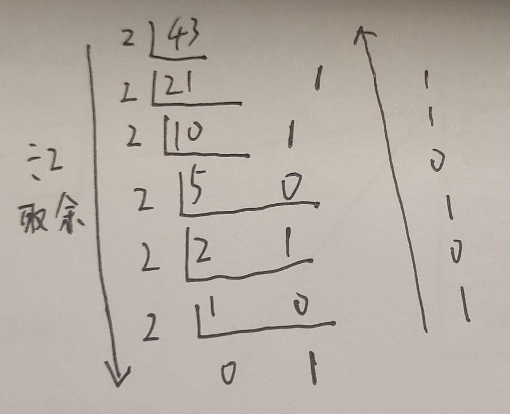
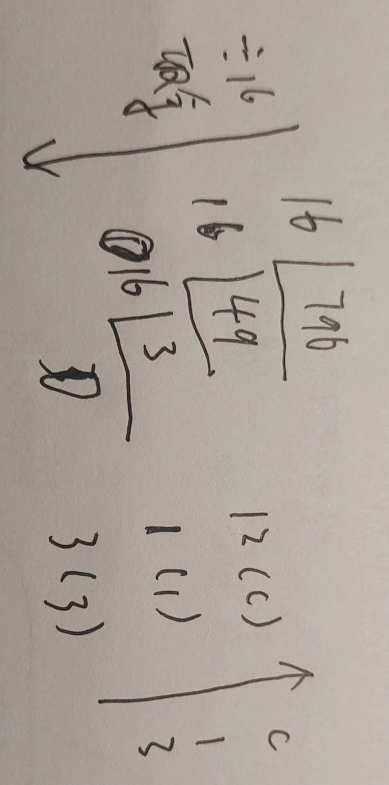
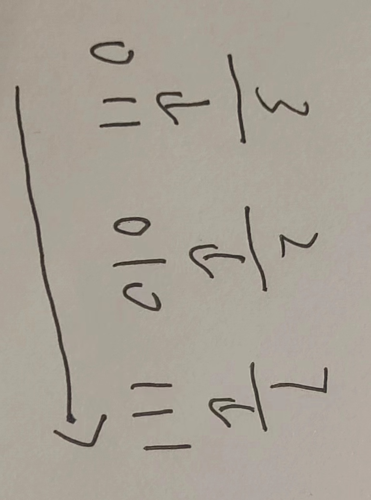
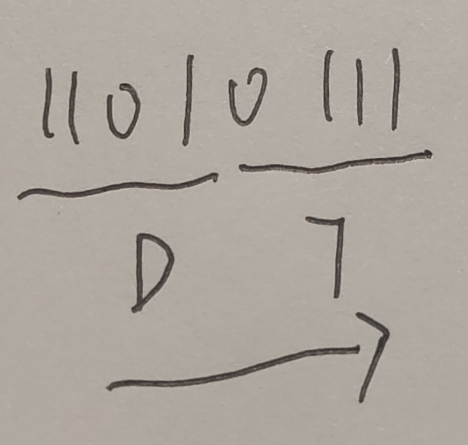
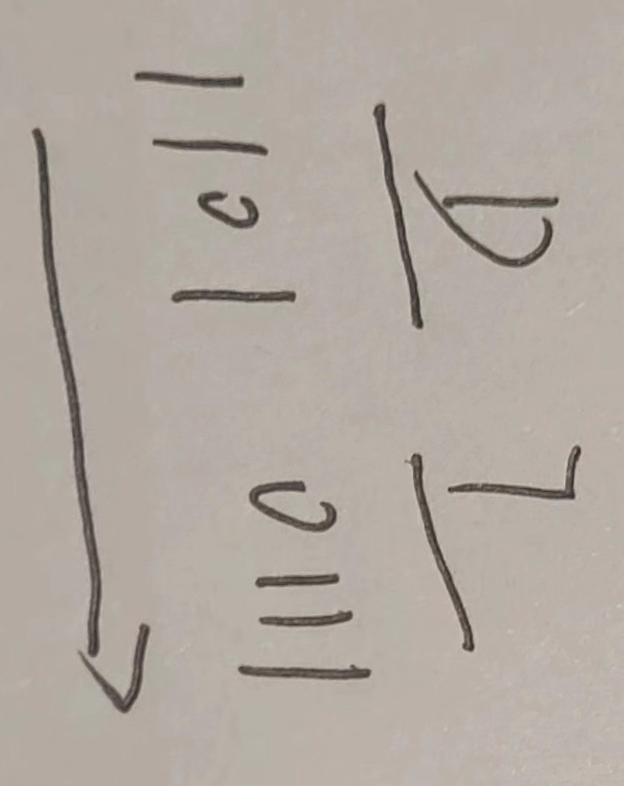
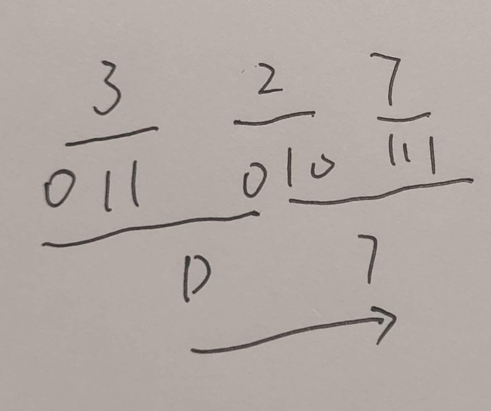
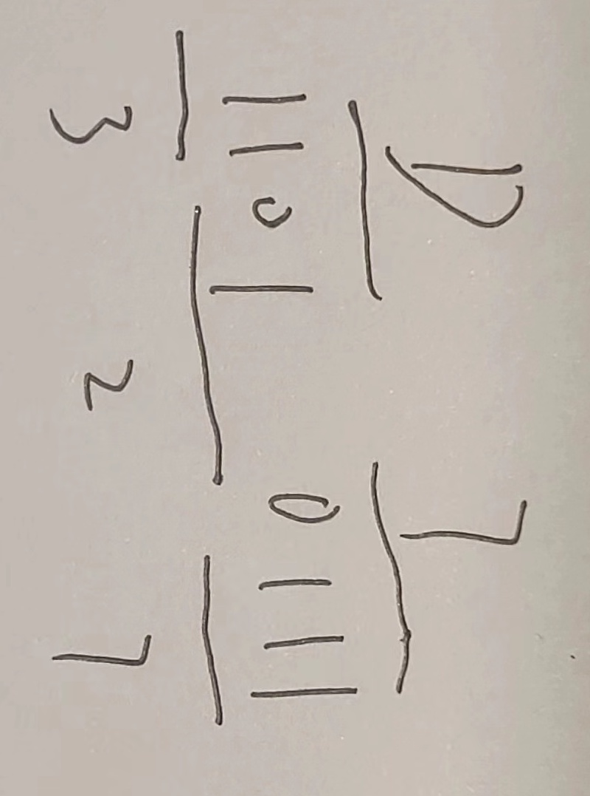

在数字后面加上不同的字母来表示不同的进位制, B(Binary)表示二进制, O(Octal)表示八进制, D(Decimal)或不加表示十进制, H(Hexadecimal)表示十六进制; 例如: (101011)B=(53)O=(43)D=(2B)H

## * -> 十进制

### 二进制 -> 十进制

二进制数从低位到高位(即从右往左)计算, 第0位的权值是2的0次方, 第1位的权值是2的1次方, 第2位的权值是2的2次方, 依次递增下去, 把最后的结果相加的值就是十进制的值了

例: 将二进制的(101011)B转换为十进制的步骤如下: 

1. 第0位 1 x 2^0 = 1
2. 第1位 1 x 2^1 = 2
3. 第2位 0 x 2^2 = 0
4. 第3位 1 x 2^3 = 8
5. 第4位 0 x 2^4 = 0
6. 第5位 1 x 2^5 = 32
7. 读数, 把结果值相加, 1+2+0+8+0+32=43, 即(101011)B=(43)D

### 八进制 -> 十进制

八进制数从低位到高位(即从右往左)计算, 第0位的权值是8的0次方, 第1位的权值是8的1次方, 第2位的权值是8的2次方, 依次递增下去, 把最后的结果相加的值就是十进制的值了

> 八进制就是逢8进1, 八进制数采用 0～7这八数来表达一个数

例: 将八进制的(53)O转换为十进制的步骤如下:

1. 第0位 3 x 8^0 = 3
2. 第1位 5 x 8^1 = 40
3. 读数, 把结果值相加, 3+40=43, 即(53)O=(43)D

### 十六进制 -> 十进制

十六进制数从低位到高位(即从右往左)计算, 第0位的权值是16的0次方, 第1位的权值是16的1次方, 第2位的权值是16的2次方, 依次递增下去, 把最后的结果相加的值就是十进制的值了

> 十六进制就是逢16进1, 十六进制的16个数为0123456789ABCDEF

例: 将十六进制的(2B)H转换为十进制的步骤如下: 

1. 第0位 B x 16^0 = 11
2. 第1位 2 x 16^1 = 32
3. 读数, 把结果值相加, 11+32=43, 即(2B)H=(43)D

## 十进制 -> *

### 十进制 -> 二进制

除2取余法, 即每次将整数部分除以2, 余数为该位权上的数, 而商继续除以2, 余数又为上一个位权上的数, 这个步骤一直持续下去, 直到商为0为止, 最后读数时候, 从最后一个余数读起, 一直到最前面的一个余数; 例: 将十进制的(43)D转换为二进制的步骤如下: 

1. 将商43除以2, 商21余数为1；
2. 将商21除以2, 商10余数为1；
3. 将商10除以2, 商5余数为0；
4. 将商5除以2, 商2余数为1；
5. 将商2除以2, 商1余数为0； 
6. 将商1除以2, 商0余数为1； 
7. 读数, 因为最后一位是经过多次除以2才得到的, 因此它是最高位, 读数字从最后的余数向前读, 101011, 即(43)D=(101011)B

### 十进制 -> 八进制

除8取余法, 即每次将整数部分除以8, 余数为该位权上的数, 而商继续除以8, 余数又为上一个位权上的数, 这个步骤一直持续下去, 直到商为0为止, 最后读数时候, 从最后一个余数起, 一直到最前面的一个余数; 例: 将十进制的(796)D转换为八进制的步骤如下: 

1. 将商796除以8, 商99余数为4
2. 将商99除以8, 商12余数为3
3. 将商12除以8, 商1余数为4
4. 将商1除以8, 商0余数为1
5. 读数, 因为最后一位是经过多次除以8才得到的, 因此它是最高位, 读数字从最后的余数向前读, 1434, 即(796)D=(1434)O

你也可以使用间接法, 先将十进制转换成二进制, 然后将二进制又转换成八进制

### 十进制 -> 十六进制

除16取余法, 即每次将整数部分除以16, 余数为该位权上的数, 而商继续除以16, 余数又为上一个位权上的数, 这个步骤一直持续下去, 直到商为0为止, 最后读数时候, 从最后一个余数起, 一直到最前面的一个余数; 例: 将十进制的(796)D转换为十六进制的步骤如下: 

1. 将商796除以16, 商49余数为12, 对应十六进制的C
2. 将商49除以16, 商3余数为1
3. 将商3除以16, 商0余数为3
4. 读数, 因为最后一位是经过多次除以16才得到的, 因此它是最高位, 读数字从最后的余数向前读, 31C, 即(796)D=(31C)H

你也可以使用间接法: 先将十进制转换成二进制, 然后将二进制又转换成十六进制

## 二进制 <-> 八, 十六进制

### 二进制 -> 八进制

取三合一法, 即从二进制的小数点为分界点, 向左(向右)每三位取成一位, 接着将这三位二进制按权相加, 然后, 按顺序进行排列, 小数点的位置不变, 得到的数字就是我们所求的八进制数; 如果向左(向右)取三位后, 取到最高(最低)位时候, 如果无法凑足三位, 可以在小数点最左边(最右边), 即整数的最高位(最低位)添0, 凑足三位; 例: 将二进制的(11010111.0100111)B转换为八进制的步骤如下: 

1. 小数点前111 = 7; 010 = 2; 11补全为011, 011 = 3
2. 小数点后010 = 2; 011 = 3; 1补全为100, 100 = 4
3. 读数, 读数从高位到低位, 即(11010111.0100111)B=(327.234)O

二进制与八进制编码对应列表:

- 000(B) <=> 0(O)
- 001(B) <=> 1(O)
- 010(B) <=> 2(O)
- 011(B) <=> 3(O)
- 100(B) <=> 4(O)
- 101(B) <=> 5(O)
- 110(B) <=> 6(O)
- 111(B) <=> 7(O)

### 八进制 -> 二进制

取一分三法, 即将一位八进制数分解成三位二进制数, 用三位二进制按权相加去凑这位八进制数, 小数点位置照旧; 例: 将八进制的(327)O转换为二进制的步骤如下: 

1. 3 = 011
2. 2 = 010
3. 7 = 111
4. 读数, 读数从高位到低位, 011010111, 即(327)O=(11010111)B

### 二进制 -> 十六进制

取四合一法, 即从二进制的小数点为分界点, 向左(向右)每四位取成一位, 接着将这四位二进制按权相加, 然后, 按顺序进行排列, 小数点的位置不变, 得到的数字就是我们所求的十六进制数; 如果向左(向右)取四位后, 取到最高(最低)位时候, 如果无法凑足四位, 可以在小数点最左边(最右边), 即整数的最高位(最低位)添0, 凑足四位; 例: 将二进制的(11010111)B转换为十六进制的步骤如下: 

1. 0111 = 7
2. 1101 = D
3. 读数, 读数从高位到低位, 即(11010111)B=(D7)H

### 十六进制 -> 二进制

取一分四法, 即将一位十六进制数分解成四位二进制数, 用四位二进制按权相加去凑这位十六进制数, 小数点位置照旧; 例: 将十六进制的(D7)H转换为二进制的步骤如下: 

1. D = 1101
2. 7 = 0111
3. 读数, 读数从高位到低位, 即(D7)H=(11010111)B

## 八进制 <-> 十六进制

### 八进制 -> 十六进制

将八进制转换为二进制, 然后再将二进制转换为十六进制, 小数点位置不变; 例: 将八进制的(327)O转换为十六进制的步骤如下: 

1. 3 = 011
2. 2 = 010
3. 7 = 111
4. 0111 = 7
5. 1101 = D
6. 读数, 读数从高位到低位, D7, 即(327)O=(D7)H

### 十六进制 -> 八进制

将十六进制转换为二进制, 然后再将二进制转换为八进制, 小数点位置不变; 例: 将十六进制的(D7)H转换为八进制的步骤如下: 

1. 7 = 0111
2. D = 1101
3. 0111 = 7
4. 010 = 2
5. 011 = 3
6. 读数, 读数从高位到低位, 327, 即(D7)H=(327)O

