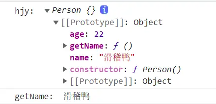
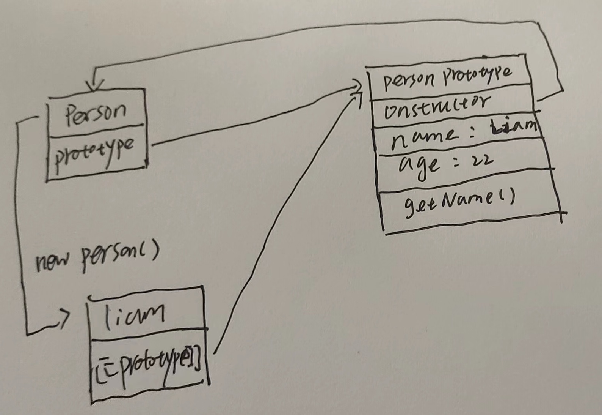
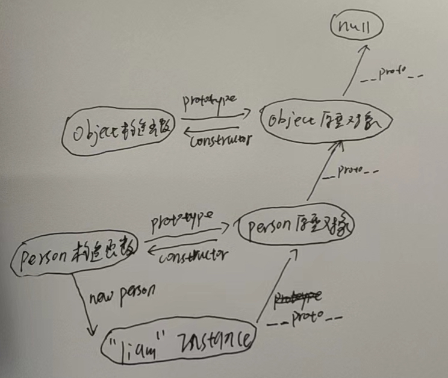

# JS 原型链

在面向对象编程中, 继承是非常实用也非常核心的功能, 这一切都是基于面向对象语言中的类

然而, javascript 和一般的面向对象的语言不同, 它没有类作为蓝图, 在 javascript 中只有对象, 但抽象继承的思想又是如此重要, 于是 javascript 的开发者们就利用了一个原型链的特性来实现了与普通面向对象语言一样的继承方式

## 何为原型

要想弄清楚原型链, 我们得先把原型搞清楚, 原型可以理解为是一种设计模式

`javascript`中的对象有一个特殊的 `[[Prototype]]` 内置属性, 其实就是对其他对象的引用, 几乎所有的对象在创建时 `[[Prototype]]` 都会被赋予一个非空的值

*javascript高级程序设计*是这样描述原型的

> 每个函数都会创建一个 `prototype` 属性, 这个属性是一个对象, 包含应该由特定引用类型的实例共享的属性和方法, 实际上, 这个对象就是通过调用构造函数创建的对象的原型, 使用原型对象的好处是, 在它上面定义的属性和方法都可以被对象实例共享, 原来在构造函数中直接赋给对象实例的值, 可以直接赋值给它们的原型

我们通过一段代码来理解这两段话

```javascript
function Person() { }

// 在Person的原型对象上挂载属性和方法
Person.prototype.name = 'Liam'
Person.prototype.age = 22
Person.prototype.getName = function () {
  return this.name
}

const liam = new Person()

console.log('Liam: ',liam)
console.log('getName: ',liam.getName())
```

这是上面这段代码在 `chrome` 控制台中显示的结果



可以看到, 我们先是创建了一个空的构造函数 `Person`, 然后创建了一个 `Person` 的实例 `liam`, `liam` 本身是没有挂载任何属性和方法的, 但是它有一个`[[Prototype]]`内置属性, 这个属性是个对象, 里面有`name`, `age`属性和`getName`函数, 定睛一看, 这玩意儿可不就是上面写的`Person.prototype`对象嘛, 事实上, `Person.prototype`和`liam`的`[[Prototype]]`都指向同一个对象, 这个对象对于`Person`构造函数而言叫做原型对象, 对于`liam`实例而言叫做原型, 下面一张图直观地展示上述代码中构造函数, 实例, 原型之间的关系:



因此, 构造函数, 原型对象和实例的关系是这样的: 每个构造函数都有一个原型对象(实例的原型), 原型对象有一个 `constructor` 属性指回构造函数, 实例有一个内部指针指向其原型(你可以使用 `Object.getPrototypeOf()` 来访问实例的原型, 在 chrome, firefox, safari 浏览器中你可以使用非标准的 `__proto__`)

## 原型链

在上述原型的基础上, 如果 `liam` 的原型又是另一个构造函数的实例呢? 于是 `liam` 的原型本身又有一个内部指针用于指向另一个原型, 相应的另一个原型也有一个指针指向另一个构造函数, 这样, 实例和原型之间形成了一条长长的链条, 这就是原型链

> 所有普通的 `[[Prototype]]` 都会指向内置的 `Object.prototype`, 而`Object` 的 `[[Prototype]]` 指向 `null`, 也就是说所有的普通对象都源于 `Object.prototype`, 它包含 `javascript` 中许多通用的功能

在原型链中, 如果在对象上找不到需要的属性或者方法, 引擎就会继续在 `[[Prototype]]` 指向的原型上查找, 同理, 如果在后者也没有找到需要的东西, 引擎就会继续查找它的 `[[Prototype]]` 指向的原型



