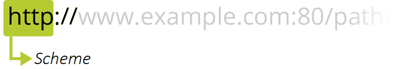

URL 是浏览器用来检索 web 上公布的任何资源的机制; 理论上说, 每个有效的 URL 都指向一个唯一的资源, 这个资源可以是一个 HTML 页面, 一个 CSS 文档, 一幅图像, 等等, 下面是一些基础的 URL 示例:

```
https://developer.mozilla.org
https://developer.mozilla.org/en-US/docs/Learn/
https://developer.mozilla.org/en-US/search?q=URL
```

一个 URL 由不同的部分组成, 其中一些是必须的, 而另一些是可选的, 让我们以下面这个 URL 为例看看其中最重要的部分:

```
http://www.example.com:80/path/to/myfile.html?key1=value1&key2=value2#SomewhereInTheDocument
```




`http` 是协议, 它表明了浏览器应该使用的何种协议, 通常都会使用 HTTP 协议或是 HTTP 协议的安全版, 即 HTTPS, Web 需要它们二者之一

> 浏览器也知道如何处理其他协议, 比如 `mailto:`(打开邮件客户端)或者 `ftp:`(处理文件传输), 所以当你看到这些其它的协议时, 不必惊讶


`www.example.com` 是域名, 它表明正在请求哪个 Web 服务器, 或者, 你可以直接使用IP address, 但是因为它不太方便, 所以它不经常在网络上使用

> 有时, 你可能会看到有些网址有子域名, 例如 `www.s1.example.com`, 那么, 这时这个网址的域名就是整个 `www.s1.example.com`

`:80` 是端口, 它代表 Web 服务器上的资源的技术“门”


`/path/to/myfile.html` 是网络服务器上资源的路径


`?key1=value1&key2=value2` 是提供给网络服务器的额外参数, 这些参数是用 `&` 符号分隔的键值对列表; 在返回资源之前, Web 服务器可以使用这些参数来执行额外的操作


`#SomewhereInTheDocument` 是资源本身的另一部分的锚点, 例如, 在 HTML 文档上, 浏览器将会自动滚动到该锚点的位置, 在视频或音频文档上, 浏览器将尝试转到锚代表的时间, 值得注意的是, `＃`后面的部分(也称为片段标识符)不会发送到请求的服务器

在 HTML 中, 例如 img 元素不仅接收绝对 URL, 也接受相对 URL

- 绝对 URL:
  - 完整网址: `https://developer.mozilla.org/en-US/docs/Learn`
  - 隐去协议: `//developer.mozilla.org/en-US/docs/Learn`
  - 隐去域名: `/en-US/docs/Learn`
- 相对 URL:
  - 子资源: `Skills/Infrastructure/Understanding_URLs`
  - 到目录树中导航: `../CSS/display`, `./CSS/display` 

Data URLs, 即前缀为 `data:` 协议的 URL, 其允许内容创建者向文档中嵌入小文件, 它由四个部分组成:前缀 (`data:`); 指示数据类型的 MIME 类型; 可选的`base64`标记(如果数据是非文本); 数据本身

```
data:[<mediatype>][;base64],<data>
```

