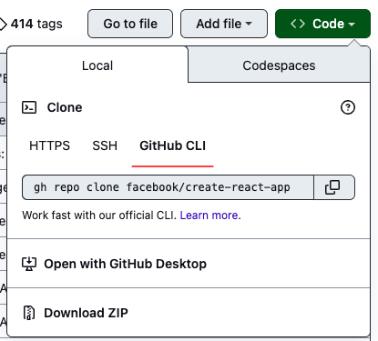
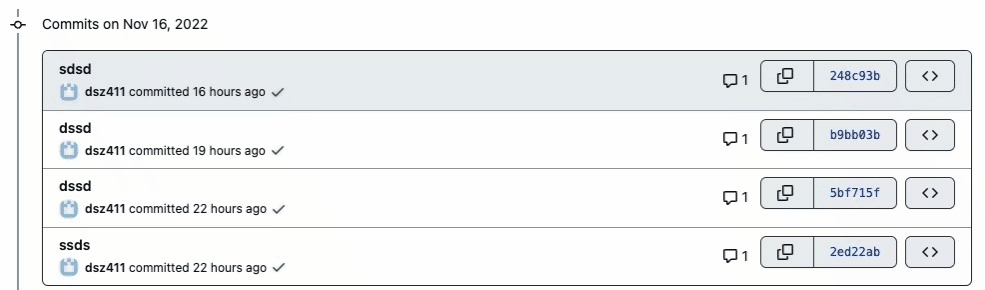
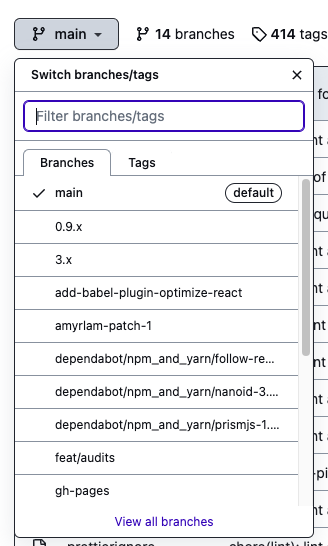

初始化git控制: `git init`

将文件添加到版本控制系统: `git add ...`

> 一般情况下, 都是执行 `git add *`, 代表将项目中所有文件添加到版本控制系统, 如果有不想添加到版本控制系统的软件, 你可以将其添加到 `.gitignore`, git 会自动排除里面的软件

提交此次记录: `git commit -m ...`

> `-m` 后面跟你对此次提交的描述

拉取远程仓库: `git clone ...`

> 建议使用 `gh`  来拉取仓库, https://cli.github.com/
>
> 你可以在这里获得提示:
>
> 

新建远程仓库: 点击 Github 网站右上角的 `+`, 然后点击 `New repository`, 然后根据流程来即可

点击了创建之后，就会出现你如何提交代码，如何将代码推送到远程服务器上的提示

当你成功将代码提交到了github后, 你的代码就会出现在 code 栏下

> 建议下载 Github Desktop, 它提供了一个可视化界面, 可以帮助你管理整个项目的版本控制, 用它来做上面这些操作, 是非常简单的, VS Code 也有 Github 的扩展, 同样也可以简化工作流

恢复到项目的某个版本: `git reset --hard ...`

> `--hrad` 后面跟项目的提交序号, 你可以从这里得到:
>
> 

新建 git 分支: `git branch ...`

> 项目只有一个 master 分支, 有时你可能需要开发一些新功能, 而不想影响现有项目的运行, 就需要新建分支

切换分支: `git checkout ...`

> 此时对于项目的切换就会出现在当前分支里

分支合并: `git checkout master; git merge ...`

> 先切回主分支, 再合并, 如果遇到冲突, 例如主分支与副分支有多处不一样, 改动比较大, git 无法自动分辨, 这时你就需要人工自动审核
>
> 你可以在这里看到你的所有分支, 注意 main 分支就是 master 分支
>
> 