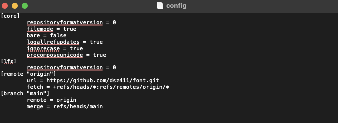
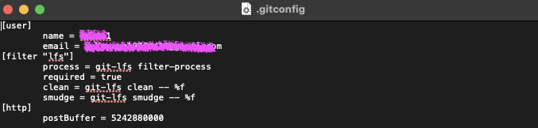

初始化git仓库: `git init`

> 此时在你的文件夹中会出现一个 `.git` 目录, 它包含你的项目的配置, 你可以打开它出来看看, 例如它里面有个 config 文件
>
> 如果你无法找到这个 `.git` 文件夹, 那么可能你需要按 `command + shift + .` 来在目录中显示隐藏的文件夹
>
> 下面是一个真实项目的 git 目录的 config 文件
>
> 
>
> 除了在具体的项目中的 `.git` 目录有一个配置文件之外, 当你安装 git 的时候, git 还会在你的全局目录中生成一个 `.gitconfig 文件`, 在 Mac OS 中, 这个位置就是: `/Users/your-name/`, 这个文件包含了你 git 的一般配置, 你可以打开它来看看:
>
> 
>
> 例如上面的 postBuffer 就控制着你一次性提交的更改的总大小(数据单位, 默认为 B), 顺便提一下, 数据单位有: bit, B, KB, MB, GB, TB, PB, EB, ZB, YB, BB (*KMGT*), 它们之间的换算为: *1B = 8bit; 1KB = 1024B; 1MB = 1024KB; 1GB = 1024MB; 1TB = 1024GB...*

将文件添加到版本控制系统: `git add ...`

<!--truncate-->

> 一般情况下, 都是执行 `git add *`, 代表将项目中所有文件添加到版本控制系统, 如果有不想添加到版本控制系统的软件, 你可以将其添加到 `.gitignore`, git 会自动排除里面的文件或目录

提交此次记录: `git commit -m ...`

> `-m` 后面跟你对此次提交的描述

拉取远程仓库: `git clone ...`

> 建议使用 `gh`  来拉取仓库, https://cli.github.com/
>
> 你可以在这里获得提示:
>
> 

新建远程仓库: 点击 Github 网站右上角的 `+`, 然后点击 `New repository`, 然后根据流程来即可

点击了创建之后，就会出现你如何提交代码，如何将代码推送到远程服务器上的提示

当你成功将代码提交到了github后, 你的代码就会出现在 code 栏下

> 建议下载 Github Desktop, 它提供了一个可视化界面, 可以帮助你管理整个项目的版本控制, 用它来做上面这些操作, 是非常简单的, VS Code 也有 Github 的扩展, 同样也可以简化工作流

恢复到项目的某个版本: `git reset --hard ...`

> `--hard` 后面跟项目的提交序号, 你可以从这里得到:
>
> 

新建 git 分支: `git branch ...`

> 项目只有一个 master 分支, 有时你可能需要开发一些新功能, 而不想影响现有项目的运行, 就需要新建分支

切换分支: `git checkout ...`

> 此时对于项目的更改就会出现在当前分支里

分支合并: `git checkout master; git merge ...`

> 先切回主分支, 再合并, 如果遇到冲突, 例如主分支与副分支有多处不一样, 改动比较大, git 无法自动分辨, 这时你就需要自己手动审核
>
> 你可以在这里看到你的所有分支, 注意 main 分支有时也叫 master 分支, 是一样的
>
> 