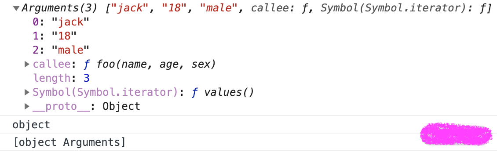
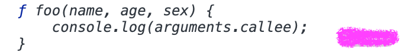
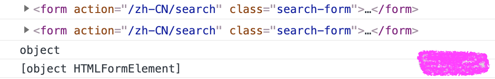
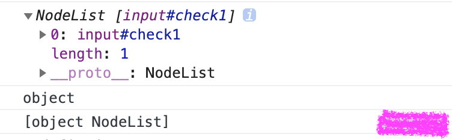

# 理解类数组

除了普通数组之外, JS 中一直还存在着一种类似数组的对象, 我们叫它 `Array-like`, 它们不能直接调用数组的方法, 但是又和数组比较类似, 一般会在某些特定的编程场景中会出现, 我们先来看看在 JavaScript 中有哪些情况下的对象是类数组的, 主要有以下几种: 

- 函数里面的参数对象 `arguments`
- 用 `getElements{ByTagName | ClassName | Name}()` 获得的 `HTMLCollection`
- 用 `querySelector()` 获得的 `NodeList`

## arguments

它只定义在函数体中, 包括了函数的参数和其他属性, 我们先通过一段代码来看下 arguments 的使用方法, 如下所示:

```javascript
function foo(name, age, sex) {
    console.log(arguments);
    console.log(typeof arguments);
    console.log(Object.prototype.toString.call(arguments));
}
foo('jack', '18', 'male');
```

这段代码比较简单, 就是直接将这个函数的 `arguments` 在函数内部打印出来



从结果中可以看到, `typeof arguments` 返回的是 `'object'`, 通过 `Object.prototype.toString.call` 返回的结果是 `'[object arguments]'`, 可以看出来返回的不是 `'[object array]'`, 这就说明 arguments 和数组有区别的

length 属性是很好理解的, 它就是函数参数的长度, 我们从打印出的代码也可以看得出来; 另外可以看到: `arguments` 不仅仅有一个 `length` 属性, 还有一个 `callee` 属性, 我们接下来看看这个 `callee` 是干什么的, 代码如下所示:

```javascript
function foo(name, age, sex) {
    console.log(arguments.callee);
}
foo('jack', '18', 'male');
```



从控制台可以看到, 输出的就是函数自身, 如果在函数内部直接执行调用 callee 的话, 那它就会不停地执行当前函数, 直到执行到内存溢出

> 需要注意的是: arguments 在严格模式下是不可用的

## HTMLCollection

HTMLCollection 简单来说是 HTML DOM 对象的一个接口, 这个接口包含了获取到的 DOM 元素集合, 返回的类型是类数组对象, 如果用 typeof 来判断的话, 它返回的是 'object'; 它是及时更新的, 当文档中的 DOM 变化时, 它也会随之变化

描述起来比较抽象, 还是通过一段代码来看下 HTMLCollection 最后返回的是什么, 我们先随便找一个页面中有 form 表单的页面, 在控制台中执行下述代码: 

```javascript
var elem1, elem2;
// document.forms 是一个 HTMLCollection
elem1 = document.forms[0];
elem2 = document.forms.item(0);
console.log(elem1);
console.log(elem2);
console.log(typeof elem1);
console.log(Object.prototype.toString.call(elem1));
```

在这个有 form 表单的页面执行上面的代码, 得到的结果如下:



可以看到, `Object.prototype.toString.call` 的结果与 arguments 返回的比较类似, `typeof` 返回的都是 `'object'`

## NodeList

NodeList 对象是节点的集合, 通常是由 querySlector 返回的, NodeList 不是一个数组, 是一种类数组; 虽然 NodeList 不是一个数组, 但是可以使用 `for...of` 来迭代

> 在一些情况下, NodeList 是一个实时集合, 也就是说, 如果文档中的节点树发生变化, NodeList 也会随之变化

```javascript
var list = document.querySelectorAll('input[type=checkbox]');
for (var checkbox of list) {
  checkbox.checked = true;
}
console.log(list);
console.log(typeof list);
console.log(Object.prototype.toString.call(list));
```



结果和以前是相似的

## 类数组应用场景

介绍三种典型的类数组应用场景:

- 遍历参数操作

  我们在函数内部可以直接获取 arguments 这个类数组的值, 那么也可以对于参数进行一些操作, 比如下面这段代码, 我们可以将函数的参数默认进行求和操作

  ```javascript
  function add() {
      var sum =0,
          len = arguments.length;
      for(var i = 0; i < len; i++){
          sum += arguments[i];
      }
      return sum;
  }
  add()                           // 0
  add(1)                          // 1
  add(1, 2)                       // 3
  add(1,2,3,4);                   // 10
  ```

- 定义链接字符串函数

  定义一个函数来连接字符串, 这个函数唯一正式声明了的参数是一个字符串, 该参数指定一个字符作为衔接点来连接字符串, 该函数定义如下

  ```javascript
  function myConcat(separa) {
    var args = Array.prototype.slice.call(arguments, 1);
    return args.join(separa);
  }
  myConcat(", ", "red", "orange", "blue");
  // "red, orange, blue"
  myConcat("; ", "elephant", "lion", "snake");
  // "elephant; lion; snake"
  myConcat(". ", "one", "two", "three", "four", "five");
  // "one. two. three. four. five"
  ```

  这段代码说明了: 你可以传递任意数量的参数到该函数, 并使用每个参数作为列表中的项创建列表进行拼接

- 传递参数使用

  可以借助 arguments 将参数从一个函数传递到另一个函数, 请看下面这个例子 

  ```javascript
  // 使用 apply 将 foo 的参数传递给 bar
  function foo() {
      bar.apply(this, arguments);
  }
  function bar(a, b, c) {
     console.log(a, b, c);
  }
  foo(1, 2, 3)   //1 2 3
  ```

  上述代码中, 通过在 foo 函数内部调用 apply 方法, 用 foo 函数的参数传递给 bar 函数, 这样就实现了借用参数的妙用

## 如何将类数组转换成数组

- 类数组借用数组方法转数组

  类数组因为不是真正的数组, 所以没有数组类型上自带的那些方法, 我们就需要利用下面这几个方法去借用数组的方法

  比如借用数组的 push 方法, 请看下面的一段代码

  ```javascript
  var arrayLike = { 
    0: 'java',
    1: 'script',
    length: 2
  } 
  Array.prototype.push.call(arrayLike, 'jack', 'lily'); 
  console.log(typeof arrayLike); // 'object'
  console.log(arrayLike);
  // {0: "java", 1: "script", 2: "jack", 3: "lily", length: 4}
  ```

  arrayLike 是一个对象, 但我们用特殊的方式将其模拟为了一个数组

  > 数组其实也是一种对象, 它是特殊的以索引作为 key 的对象, 例如 `['apple', 'pear', 'banana']` 在内存中就表示为: `{0: "apple", 1: "pear", 2: "banana", length: "3"}`

  从代码中还可以看出, 用 typeof 来判断输出的是 'object', 它自身是不会有数组的 push 方法的, 这里我们就用 call 的方法来借用 Array 原型链上的 push 方法

  从控制台的结果可以看出, 数组的 push 方法满足了我们想要实现添加元素的诉求; 我们再来看下 arguments 如何转换成数组, 请看下面这段代码

  ```javascript
  function sum(a, b) {
    let args = Array.prototype.slice.call(arguments);
   // let args = [].slice.call(arguments); // 这样写也是一样效果
    console.log(args.reduce((sum, cur) => sum + cur));
  }
  sum(1, 2);  // 3
  function sum(a, b) {
    let args = Array.prototype.concat.apply([], arguments);
    console.log(args.reduce((sum, cur) => sum + cur));
  }
  sum(1, 2);  // 3
  ```

  这段代码中可以看到, 还是借用 Array 原型链上的各种方法, 来实现 sum 函数的参数相加的效果

  一开始都是将 arguments 通过借用数组的方法转换为真正的数组, 最后都又通过数组的 reduce 方法实现了参数转化的真数组 args 的相加, 最后返回预期的结果

- ES6 的方法转数组

  对于类数组转换成数组的方式, 我们还可以采用 ES6 新增的 Array.from 方法以及展开运算符; 那么还是围绕上面这个 sum 函数来进行改变, 我们看下用 Array.from 和展开运算符是怎么实现转换数组的, 请看下面一段代码的例子

  ```javascript
  function sum(a, b) {
    let args = Array.from(arguments);
    console.log(args.reduce((sum, cur) => sum + cur));
  }
  sum(1, 2);    // 3
  function sum(a, b) {
    let args = [...arguments];
    console.log(args.reduce((sum, cur) => sum + cur));
  }
  sum(1, 2);    // 3
  function sum(...args) {
    console.log(args.reduce((sum, cur) => sum + cur));
  }
  sum(1, 2);    // 3
  ```

  从代码中可以看出, Array.from 和 ES6 的展开运算符, 都可以把 arguments 这个类数组转换成数组 args, 从而实现调用 reduce 方法对参数进行累加操作

  其中第二种和第三种都是用 ES6 的展开运算符, 虽然写法不一样, 但是基本都可以满足多个参数实现累加的效果

