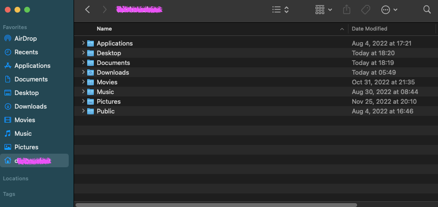
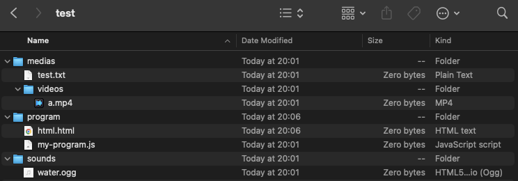

不论是 MAC OS 还是 WINDOWS OS, 它们都提供一了非常完善的文件系统功能, 并都为用户提供了一个管理文件的可视化界面, 在 MAC 上, 这叫 Finder, 在 WINDOWS 上, 叫 This PC, 例如下面是 MAC 上 Finder 的截图:



<!--truncate-->

文件系统是一个树形结构, 想象一下, 操作系统使用一个称之为路径的东西来让用户在文件系统中导航(操作系统的路径与 URL 地址是非常相似的, 它们拥有相同的原理), 例如如果我们在 Finder 的 Documents 下新建了一个 test/ 文件夹, 里面有一个 my.txt 的文本文件, 那么这个 my.rtf 文件的路径将会是: `/Users/dushouzhou/Documents/test`(完整的应该是: `Macintosh HD/Users/dushouzhou/Documents/test`, 斜杠开头代表的是绝对路径)

> 在 Windows 上, 可能是 `C:/apps/...`, 在windows 上还有一种路径写法是: `C:\\apps\\...`, 其实windows 既支持 `/` 作为分隔符, 也支持 `\` 作为分隔符, 但一般都会写两个杠 `\\`, 这是为了与编程语言中的特殊字符, 例如 `\n` 想区别, 一般统一使用 `/` 作为分隔符就可以了

还有一种路径, 称为相对路径, 它们以 `.` 或 `..` 开头, 例如如果我们在 test/ 文件夹下有以下的文件结构:



例如我们在 html.html 中编程, 那么为了链接到 my-program.js, 我们除了写:

```html
<script src="/Users/dushouzhou/Documents/test/program/my-program.js"></script>
```

之外, 还可以写:

```html
<script src="./my-program.js"></script>
```

另外如果想链接 medias 文件夹里的视频, 我们除了写:

```html
<video src="/Users/dushouzhou/Documents/test/medias/videos/a.mpg"></video>
```

我们可以将其换为:

```html
<video src="../medias/videos/a.mp4"></video>
```

这基本上就说明了 `.` 与 `..` 的作用, `.` 代表当前所处的文件夹, 而 `..` 代表上一级文件夹

最后你还需要了解一些操作系统的终端命令, 下面是一些你经常会使用的常用的命令:

- cd: 切换目录, 遵循一般操作系统的规则
- dir: 显示当前目录下的子文件夹与文件
- tree: 图示目录的结构
- mkdir: 创建文件夹
- touch: 新建文件
- rmdir: 删除文件夹
- echo: 输出一段简单的文字到某个文件夹, 例如 `echo node_modules > .gitignore` 

> 何为终端? MDN 上有一系列完整的关于终端的文档, 参见: https://developer.mozilla.org/en-US/docs/Learn/Tools_and_testing/Understanding_client-side_tools/Command_line
>
> 建议你去找一本关于操作系统的书来研读一下