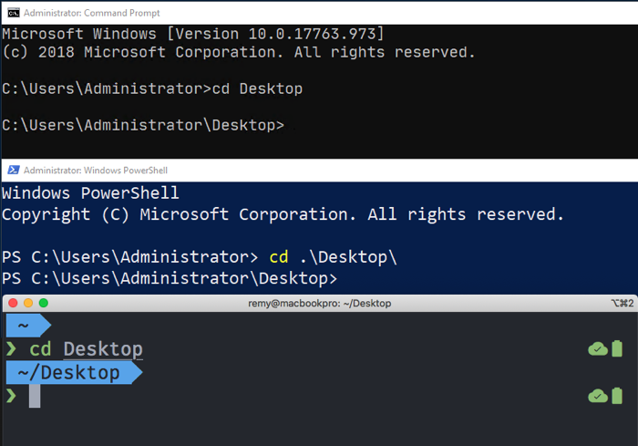
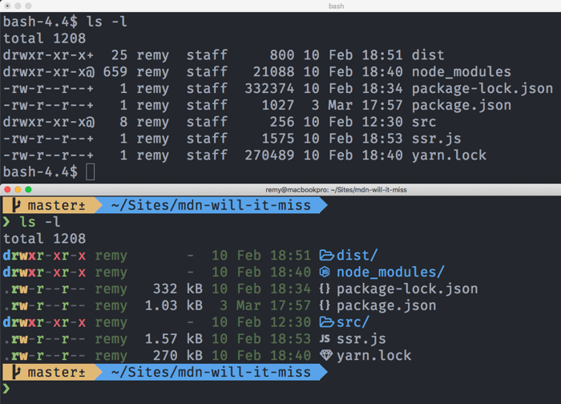

# 基本的内置终端命令

说的够多了，让我们开始看看一些终端命令吧!下面是命令行可以做的一些事情，以及每种情况下相关工具的名称

- 导航计算机的文件系统以及基本级别的任务，如创建、复制、重命名和删除：
  - 移动您的目录结构 : `cd`
  - 建立目录: `mkdir`
  - 创建文件（修改他们的原数据）: `touch`
  - 复制文件: `cp`
  - 移动文件: `mv`
  - 删除文件或目录: `rm`
- 下载在特定的url找到的文件: `curl`
- 在较大的文件体中寻找特定的片段: `grep`
- 主页查看文件的内容: `less`, `cat`
- 操作和转换文本流（例如，讲HTML文件中`<div>`的所有实例改为`<article>`）: `awk`, `tr`, `sed`

> 在web上有许多很好的教程深入了解web上的命令行——这只是一个简短的介绍

让我们继续，看看在命令行上使用这些工具中的几个

在进一步操作之前，先打开终端程序

## 在命令行中导航

当您访问命令行时，您将不可避免地需要导航到一个特定的目录“做一些事情”

所有的操作系统(假设是默认设置)都将在您的“home”目录中启动它们的终端程序，从那里您可能想要移动到另一个地方

 `cd` 命令允许您更改目录

从技术上讲，cd不是一个程序，而是内置的

这意味着您的操作系统可以开箱即用地提供它，而且您也不会意外地删除它，感谢上帝!您不需要过多地担心某个命令是否是内置的，但是要记住，内置的命令会在所有基于unix的系统上出现

要更改目录，请在终端中键入cd，然后输入要移动到的目录

假设该目录在您的主目录中，您可以使用 `cd Desktop` (请参见下面的屏幕截图)



试着把这个输入到你的系统终端

```
cd Desktop
```

如果您想回到上一个目录，您可以使用两个点

```
cd ..
```

> 一个非常有用的终端快捷方式是使用tab 键自动完成你知道的名字，而不是必须键入整个东西
>
> 例如，在键入以上两个命令后，尝试键入 `cd D` 并按下tab — 它应该自动完成目录名称 `Desktop` 对于您，只要它存在于当前目录中
>
> 在你前进的过程中记住这一点

如果要转到的目录嵌套得很深，则需要知道访问该目录的路径

当您更加熟悉文件系统的结构时，这通常会变得更容易，但是如果您不确定路径，通常可以使用ls命令（请参见下文）的组合并在其中单击来确定它的路径

“资源管理器/查找器”窗口可查看目录相对于当前位置的位置

例如，如果您想进入一个名为src的目录，该目录位于桌面的一个名为project的目录中，您可以从您的主文件夹键入这三个命令来到达该目录

```
cd Desktop
cd project
cd src
```

但这只是浪费时间，相反，您可以键入一个命令，用斜杠分隔路径中的不同项，就像在CSS、HTML或JavaScript代码中指定图像或其他资产的路径一样

```
cd Desktop/project/src
```

例如，请注意，在路径上包含一个前斜线将使路径成为绝对路径 `/Users/your-user-name/Desktop`

像我们上面做的那样，省略前导斜杠可以使路径相对于当前的工作目录

这与您在web浏览器中看到的url完全相同

前面的斜杠意味着“在网站的根”，而省略斜杠意味着“这个URL是相对于我当前页面的”

> 在windows中，你使用反斜杠而不是正斜杠
>
> `cd Desktop\project\src` — 他的可能看起来很奇怪，但是如果你感兴趣的话, [watch this YouTube clip](https://www.youtube.com/watch?v=5T3IJfBfBmI), 微软的一位主要工程师对此进行了解释

## 列出目录内容

另一个内置的Unix命令是ls (list的缩写)，它列出当前所在目录的内容

注意，这不会工作，如果你使用默认的Windows命令提示符(cmd)，相当于dir

现在试着在终端上运行它

```shell
ls
```

这提供了当前工作目录中的文件和目录的列表，但这些信息实际上很基本，您只能得到每个项的名称，而不能知道它是文件还是目录，或者其他任何东西

幸运的是，对命令的用法进行一个小小的更改就可以提供更多的信息

## 介绍命令选项

大多数终端命令都有选项，这些选项是您添加到命令末尾的修饰符，它们使命令的行为略有不同

它们通常由命令名后的空格、后接破折号、后接一个或多个字母组成

例如，试一试看，你能得到什么？

```shell
ls -l 
```

至于 `ls`, the `-l` 选项为您提供每行一个文件或目录的清单，并显示更多信息

可以通过查找行最左边的字母“d”来识别目录

这些是我们可以做到的 `cd` 进入

下面是一个屏幕截图，顶部是一个普通的macOS终端，还有一个定制的终端，添加了一些额外的图标和颜色，让它看起来生动，都显示了运行的结果`ls -l`:



> 要确切地了解每个命令有哪些可用选项，您可以查看[man wiki](https://en.wikipedia.org/wiki/Man_page)
>
> 通过键入 `man` 命令，后跟要查找的命令的名称，例如`man ls`
>
> 这将在终端的默认文本文件查看器中打开手册页(例如, `less`(在我的终端中)，然后您应该能够使用箭头键或其他类似的机制在页面中滚动
>
> 手册页详细地列出了所有选项，一开始可能有点吓人，但至少在需要时您知道它就在那里
>
> 一旦您完成了对手册页的查看，您需要使用文本查看器的quit命令退出它("q" 在 `less`;如果不明显，你可能需要在网上搜索才能找到)

> 要同时运行具有多个选项的命令，通常可以将它们全部放在破折号后面的单个字符串中`ls -lah`, 或`ls -ltrh`
>
> 尝试在 `ls` 了解这些额外选项的作用

既然我们已经讨论了两个基本命令，那么稍微浏览一下您的目录，看看是否可以从一个位置导航到下一个位置