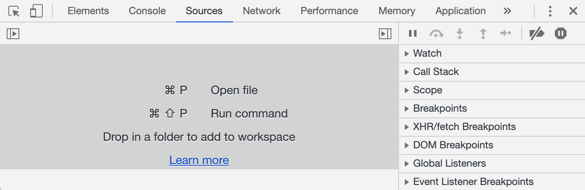
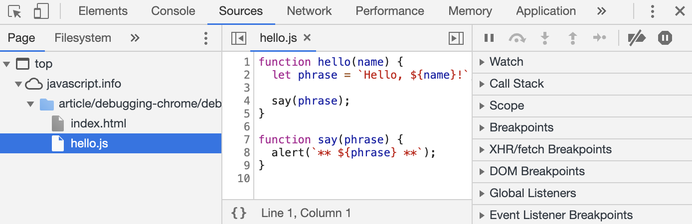

# 资源(Sources)面板

你的 Chrome 版本可能看起来有一点不同，但是它应该还是处于很明显的位置

- 在 Chrome 中打开 [示例页面](https://zh.javascript.info/article/debugging-chrome/debugging/index.html)
- 使用快捷键 F12（Mac：Cmd+Opt+I）打开开发者工具
- 选择 `Sources（资源）` 面板

如果你是第一次这么做，那你应该会看到下面这个样子：

切换按钮 ▶️ 会打开文件列表的选项卡

让我们在预览树中点击和选择 `hello.js`

这里应该会如下图所示：

资源（Sources）面板包含三个部分：

1. 文件导航（File Navigator） 区域列出了 HTML、JavaScript、CSS 和包括图片在内的其他依附于此页面的文件

   Chrome 扩展程序也会显示在这

2. 代码编辑（Code Editor） 区域展示源码

3. JavaScript 调试（JavaScript Debugging） 区域是用于调试的，我们很快就会来探索它

现在你可以再次点击切换按钮 ◀️ 隐藏资源列表来给代码腾出一些空间