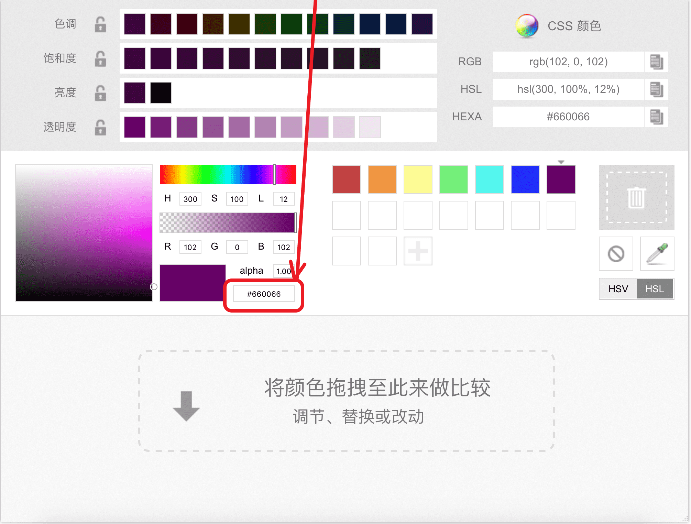
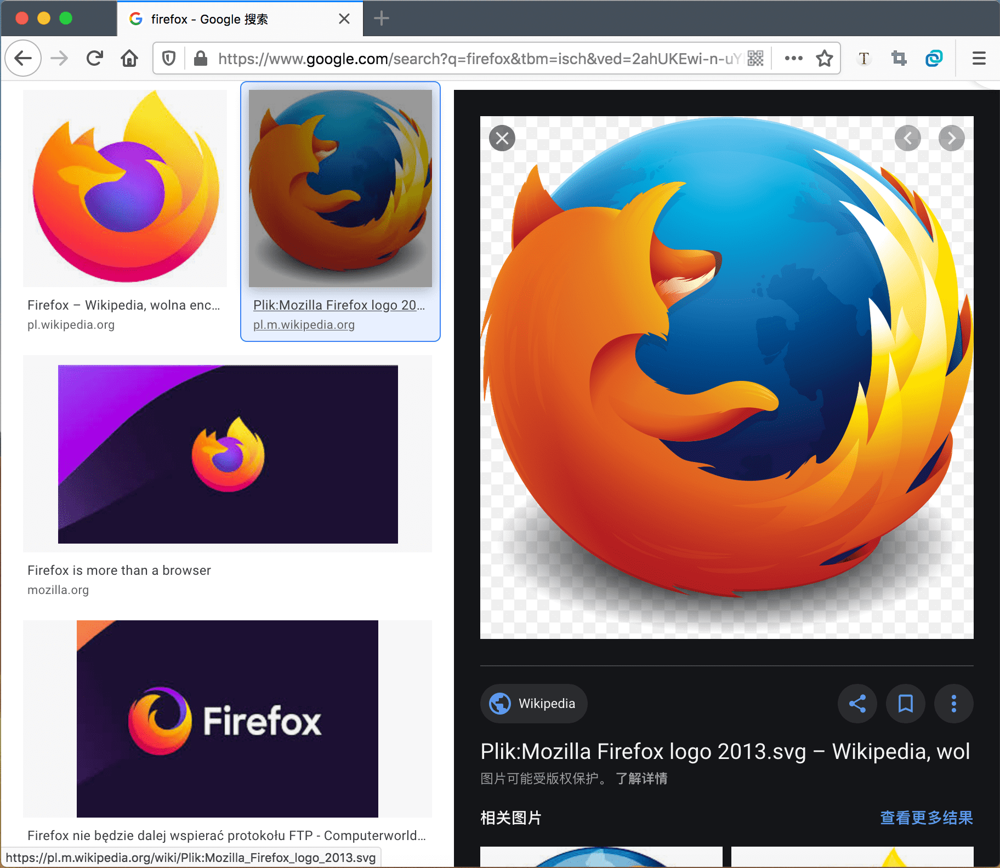
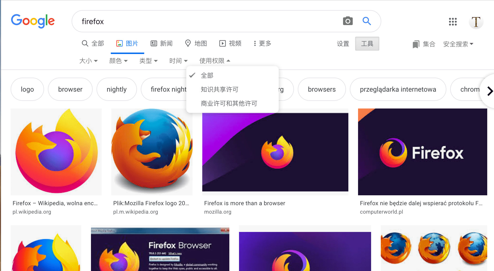
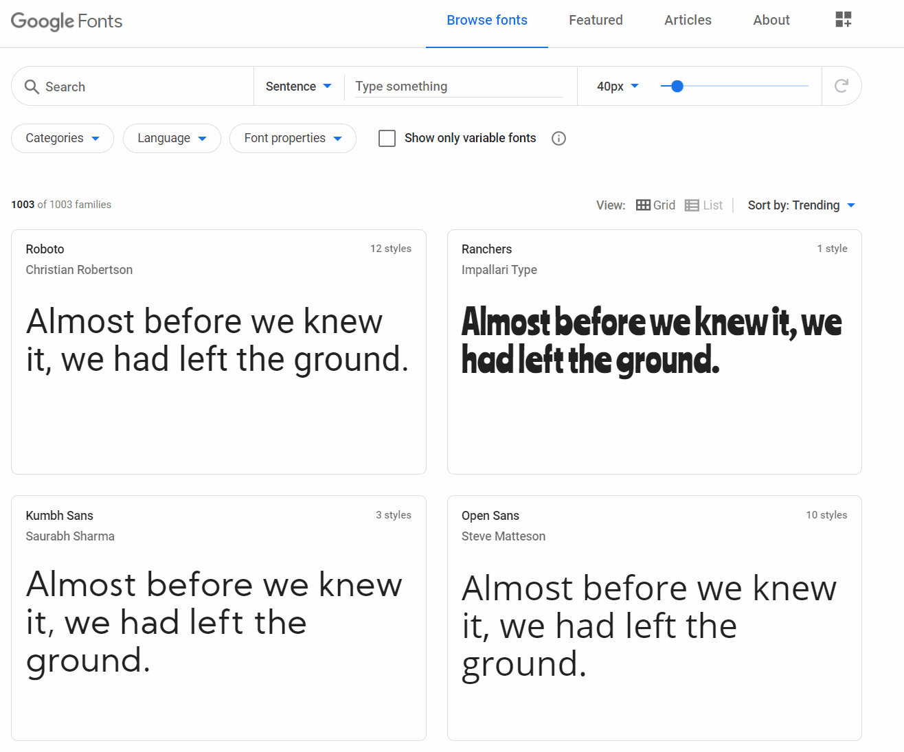

# 设计网站外观

本节主要讨论：编写代码之前如何做好计划和设计工作

包括：“网页要提供什么信息？”、“要用什么字体和颜色？”、“网页是用来做什么的？”

做任何事之前都需要一些想法

你的网站要达到哪种目的？任何 1 个网站均具备基本作用，但首先你应该保持简单

我们要先写出包含了标题、图像，以及数段文字的简单网页

开始之前，请考虑以下问题：

1. 网站的主题是什么？是狗、上海城市还是吃豆人？
2. 基于所选主题要展示哪些信息？写下标题和几段文字，构思一个用于展示的图形。
3. 网站采用怎样的外观？用高阶术语说就是，选什么背景色？什么字体（正式的还卡通的，粗体还是细体）？

> 复杂项目需要更详细的指引，包括颜色、字体、间距、编写规范等等，亦称为设计指南、设计系统、品牌手册
>
> 参见： [FireFox Photon Design System](https://design.firefox.com/photon/)

接下来，拿出纸笔画出网站草图

虽然第一个简单网页能做的不多，但最好在一开始就该养成这样的习惯

画草图很有用，而且并不需要梵高的手法

> 即使在现实的复杂网站中，设计团队也是首先在纸上画出草稿，然后在图形编辑器中或者使用 Web 技术作出数码模型
>
> Web 团队通常包括一个图形设计师和 用户体验设计师
>
> 图形设计师的作用很明显是将网页视觉部分组合在一起
>
> 用户体验设计师则以一种更抽象的模式来定义用户的浏览和交互

此时可以开始组织网页上的内容了

准备好刚才撰写的标题和文字

打开[色彩选择器](https://developer.mozilla.org/zh-CN/docs/Web/CSS/CSS_Colors/Color_picker_tool)挑选心仪的颜色

选中某种颜色时，你会看到一个六位神秘代码，类似于 `#660066`，它是一个十六进制数，用于表示颜色

将其复制并暂存

访问 [Google 图片搜索](https://www.google.com/imghp?gws_rd=ssl) 来搜索合适的图片

1. 找到心仪的图片时，单击放大

2. 右击图片（Mac 用 Control + 点击），选择 “另存图像为...”，然后选择一个安全的位置存放这张图像

   也可以复制你的浏览器地址栏上的图像地址以便后来使用

请注意大多数网络图片（包括 Google 图片）都是受版权保护的

为了降低盗版风险，可以使用“Google 许可证过滤器”

点击“工具”按钮，然后在使用权限的选项下选择类似“标记为可再利用”的选项：

要选择一种字体：

1. 访问 [Google Fonts](https://www.google.com/fonts) 

   打开右侧边栏可现实选中的字体家族

2. 可通过 Categories（类别）、Languages（语言）、Font Properties（字体属性）过滤想要的字体

3. 在列出的字体风格列表中，选择合适的粗细、是否倾斜等信息

4. 在右侧边栏中可以看到 Google 给出的代码片段，将其复制到文本编辑器就可以使用了

> 若无法访问 Google Fonts，可参考 [阿里字体素材平台](https://www.taobao.com/markets/fuwu/fontmarket_freefonts)