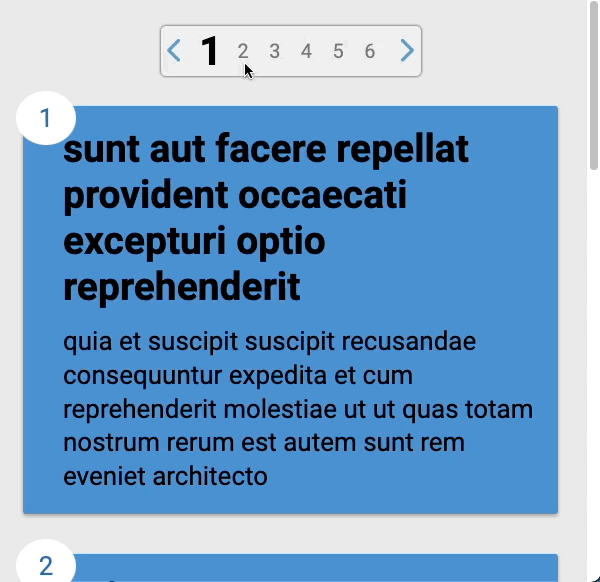
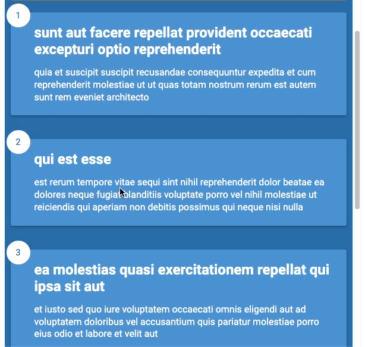

# 分页

> [source code](https://github.com/dsz411/dsz411.github.io/tree/main/blog-examples/pagination)

分页是一种降低服务器以及前端页面负载的一种有效且非常常见的方式, 它一次只请求少量的数据来渲染, 基本的分页 API 端点基本就是这样的:

```
https://jsonplaceholder.typicode.com/posts?_limit=20&_page=3
```

你可以在很多地方看到分页的应用, 例如 Twitter 主页或 Facebook 主页的 Feed 流, 当你滑到屏幕的底部时, 又会有新的帖子加载出来

> 上面的 API 指的是我们请求第三页的数据,每页是20, 也是就数据 40~60

分页UI主要有以下几种交互方式:

- 点击指定页数显示该页数据
- 点击上一页显示上一页数据
- 点击下一页显示下一页数据
- 点击最后一页显示最后一页数据
- 无限滚动





这里我们的 API 返回的结果类似:

```json
[
  {
    "userId": 1,
    "id": 6,
    "title": "dolorem eum magni eos aperiam quia",
    "body": "ut aspernatur corporis harum nihil quis provident sequi\nmollitia nobis aliquid molestiae\nperspiciatis et ea nemo ab reprehenderit accusantium quas\nvoluptate dolores velit et doloremque molestiae"
  },
  {
    "userId": 1,
    "id": 7,
    "title": "magnam facilis autem",
    "body": "dolore placeat quibusdam ea quo vitae\nmagni quis enim qui quis quo nemo aut saepe\nquidem repellat excepturi ut quia\nsunt ut sequi eos ea sed quas"
  },
  {
    "userId": 1,
    "id": 8,
    "title": "dolorem dolore est ipsam",
    "body": "dignissimos aperiam dolorem qui eum\nfacilis quibusdam animi sint suscipit qui sint possimus cum\nquaerat magni maiores excepturi\nipsam ut commodi dolor voluptatum modi aut vitae"
  },
  {
    "userId": 1,
    "id": 9,
    "title": "nesciunt iure omnis dolorem tempora et accusantium",
    "body": "consectetur animi nesciunt iure dolore\nenim quia ad\nveniam autem ut quam aut nobis\net est aut quod aut provident voluptas autem voluptas"
  },
  {
    "userId": 1,
    "id": 10,
    "title": "optio molestias id quia eum",
    "body": "quo et expedita modi cum officia vel magni\ndoloribus qui repudiandae\nvero nisi sit\nquos veniam quod sed accusamus veritatis error"
  }
]
```

