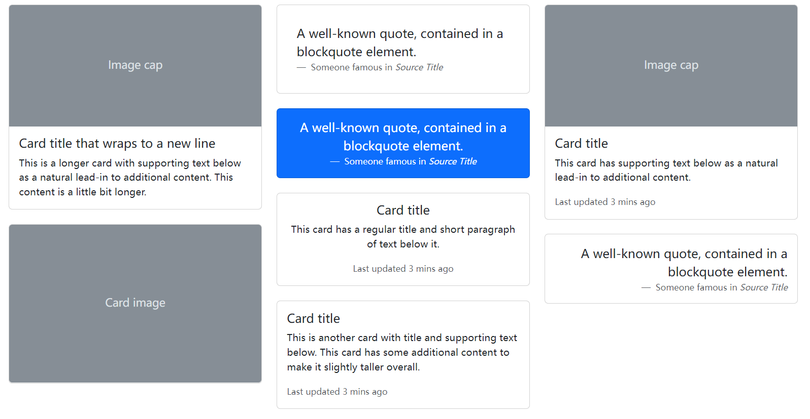
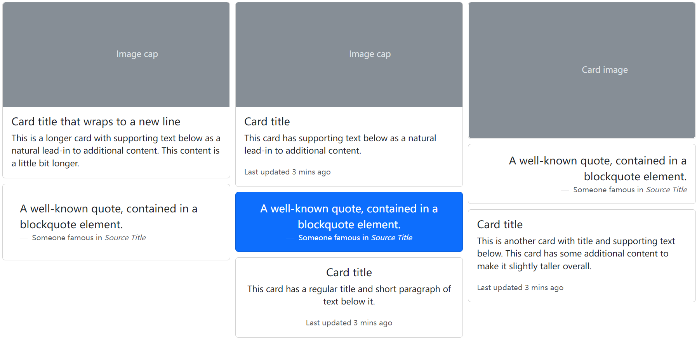
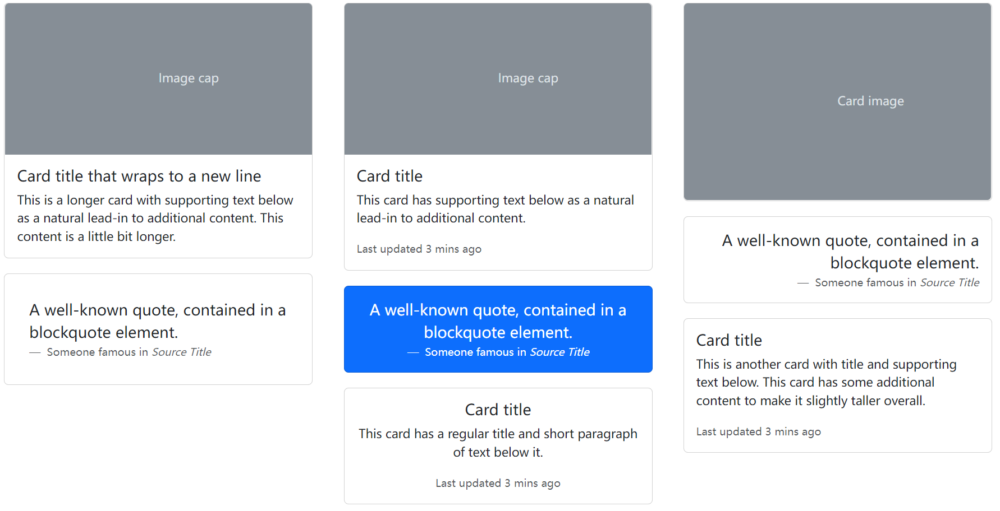
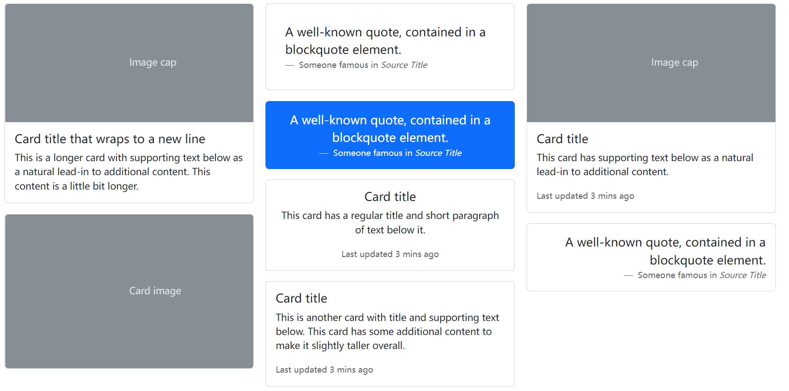

# Masonry 布局

也就是俗称的瀑布流布局

> [source code](https://github.com/dsz411/dsz411.github.io/tree/main/blog-examples/masonry); [live](http://dsz411.github.io/blog-examples/masonry/)

本篇会先从 bootstrap + masonry 入手, 教你什么是 masonry 布局, 然后我们会手动实现一个自己的 masonry 布局; 链入 CDN

```html
<script src="https://cdn.jsdelivr.net/npm/masonry-layout@4.2.2/dist/masonry.pkgd.min.js" integrity="sha384-GNFwBvfVxBkLMJpYMOABq3c+d3KnQxudP/mGPkzpZSTYykLBNsZEnG2D9G/X/+7D" crossorigin="anonymous" async></script>
```

通过在 `.row` 包装器中添加 `data-masonry='{"percentPosition": true }'`，我们可以结合Bootstrap的响应式网格和Masonry的定位功能

```html
<!DOCTYPE html>
<html lang="en">
  <head>
    <meta charset="UTF-8" />
    <meta http-equiv="X-UA-Compatible" content="IE=edge" />
    <meta name="viewport" content="width=device-width, initial-scale=1.0" />
    <title>Bootstrap Masonry</title>
    <link
      rel="stylesheet"
      href="https://getbootstrap.com/docs/5.2/dist/css/bootstrap.min.css"
    />
    <style>
      body {
        padding: 20px 50px;
      }
    </style>
  </head>
  <body>
    <div class="row" data-masonry='{"percentPosition": true }'>
      <div class="col-sm-6 col-lg-4 mb-4">
        <div class="card">
          <svg
            class="bd-placeholder-img card-img-top"
            width="100%"
            height="200"
            xmlns="http://www.w3.org/2000/svg"
            role="img"
            aria-label="Placeholder: Image cap"
            preserveAspectRatio="xMidYMid slice"
            focusable="false"
          >
            <title>Placeholder</title>
            <rect width="100%" height="100%" fill="#868e96" />
            <text x="50%" y="50%" fill="#dee2e6" dy=".3em">Image cap</text>
          </svg>

          <div class="card-body">
            <h5 class="card-title">Card title that wraps to a new line</h5>
            <p class="card-text">
              This is a longer card with supporting text below as a natural
              lead-in to additional content. This content is a little bit
              longer.
            </p>
          </div>
        </div>
      </div>
      <div class="col-sm-6 col-lg-4 mb-4">
        <div class="card p-3">
          <figure class="p-3 mb-0">
            <blockquote class="blockquote">
              <p>A well-known quote, contained in a blockquote element.</p>
            </blockquote>
            <figcaption class="blockquote-footer mb-0 text-muted">
              Someone famous in <cite title="Source Title">Source Title</cite>
            </figcaption>
          </figure>
        </div>
      </div>
      <div class="col-sm-6 col-lg-4 mb-4">
        <div class="card">
          <svg
            class="bd-placeholder-img card-img-top"
            width="100%"
            height="200"
            xmlns="http://www.w3.org/2000/svg"
            role="img"
            aria-label="Placeholder: Image cap"
            preserveAspectRatio="xMidYMid slice"
            focusable="false"
          >
            <title>Placeholder</title>
            <rect width="100%" height="100%" fill="#868e96" />
            <text x="50%" y="50%" fill="#dee2e6" dy=".3em">Image cap</text>
          </svg>

          <div class="card-body">
            <h5 class="card-title">Card title</h5>
            <p class="card-text">
              This card has supporting text below as a natural lead-in to
              additional content.
            </p>
            <p class="card-text">
              <small class="text-muted">Last updated 3 mins ago</small>
            </p>
          </div>
        </div>
      </div>
      <div class="col-sm-6 col-lg-4 mb-4">
        <div class="card bg-primary text-white text-center p-3">
          <figure class="mb-0">
            <blockquote class="blockquote">
              <p>A well-known quote, contained in a blockquote element.</p>
            </blockquote>
            <figcaption class="blockquote-footer mb-0 text-white">
              Someone famous in <cite title="Source Title">Source Title</cite>
            </figcaption>
          </figure>
        </div>
      </div>
      <div class="col-sm-6 col-lg-4 mb-4">
        <div class="card text-center">
          <div class="card-body">
            <h5 class="card-title">Card title</h5>
            <p class="card-text">
              This card has a regular title and short paragraph of text below
              it.
            </p>
            <p class="card-text">
              <small class="text-muted">Last updated 3 mins ago</small>
            </p>
          </div>
        </div>
      </div>
      <div class="col-sm-6 col-lg-4 mb-4">
        <div class="card">
          <svg
            class="bd-placeholder-img card-img"
            width="100%"
            height="260"
            xmlns="http://www.w3.org/2000/svg"
            role="img"
            aria-label="Placeholder: Card image"
            preserveAspectRatio="xMidYMid slice"
            focusable="false"
          >
            <title>Placeholder</title>
            <rect width="100%" height="100%" fill="#868e96" />
            <text x="50%" y="50%" fill="#dee2e6" dy=".3em">Card image</text>
          </svg>
        </div>
      </div>
      <div class="col-sm-6 col-lg-4 mb-4">
        <div class="card p-3 text-end">
          <figure class="mb-0">
            <blockquote class="blockquote">
              <p>A well-known quote, contained in a blockquote element.</p>
            </blockquote>
            <figcaption class="blockquote-footer mb-0 text-muted">
              Someone famous in <cite title="Source Title">Source Title</cite>
            </figcaption>
          </figure>
        </div>
      </div>
      <div class="col-sm-6 col-lg-4 mb-4">
        <div class="card">
          <div class="card-body">
            <h5 class="card-title">Card title</h5>
            <p class="card-text">
              This is another card with title and supporting text below. This
              card has some additional content to make it slightly taller
              overall.
            </p>
            <p class="card-text">
              <small class="text-muted">Last updated 3 mins ago</small>
            </p>
          </div>
        </div>
      </div>
    </div>
    <script src="https://getbootstrap.com/docs/5.2/dist/js/bootstrap.bundle.min.js"></script>
    <script
      async
      src="https://cdn.jsdelivr.net/npm/masonry-layout@4.2.2/dist/masonry.pkgd.min.js"
      integrity="sha384-GNFwBvfVxBkLMJpYMOABq3c+d3KnQxudP/mGPkzpZSTYykLBNsZEnG2D9G/X/+7D"
      crossorigin="anonymous"
    ></script>
  </body>
</html>
```



主要有四种实现 Masonry 布局的方案:

- Column 布局
- Flexbox
- JS + CSS Position-absolute
- CSS Grid `grid-template-rows: masonry`, 支持不够, 仅限于 Firefox, 并且需要显示启用

*Column 布局*

```html
<!DOCTYPE html>
<html lang="en">
  <head>
    <meta charset="UTF-8" />
    <meta http-equiv="X-UA-Compatible" content="IE=edge" />
    <meta name="viewport" content="width=device-width, initial-scale=1.0" />
    <title>Bootstrap Masonry of Column</title>
    <link
      rel="stylesheet"
      href="https://getbootstrap.com/docs/5.2/dist/css/bootstrap.min.css"
    />
    <style>
      body {
        padding: 20px 50px;
      }

      .wrapper {
        column-count: 3;
        column-gap: 10px;
      }

      .wrapper > .card {
        margin: 10px;
        break-inside: avoid;
        page-break-inside: avoid;
      }
    </style>
  </head>
  <body>
    <div class="wrapper">
        <div class="card">
          <svg
            class="bd-placeholder-img card-img-top"
            width="100%"
            height="200"
            xmlns="http://www.w3.org/2000/svg"
            role="img"
            aria-label="Placeholder: Image cap"
            preserveAspectRatio="xMidYMid slice"
            focusable="false"
          >
            <title>Placeholder</title>
            <rect width="100%" height="100%" fill="#868e96" />
            <text x="50%" y="50%" fill="#dee2e6" dy=".3em">Image cap</text>
          </svg>

          <div class="card-body">
            <h5 class="card-title">Card title that wraps to a new line</h5>
            <p class="card-text">
              This is a longer card with supporting text below as a natural
              lead-in to additional content. This content is a little bit
              longer.
            </p>
          </div>
        </div>
        <div class="card p-3">
          <figure class="p-3 mb-0">
            <blockquote class="blockquote">
              <p>A well-known quote, contained in a blockquote element.</p>
            </blockquote>
            <figcaption class="blockquote-footer mb-0 text-muted">
              Someone famous in <cite title="Source Title">Source Title</cite>
            </figcaption>
          </figure>
        </div>
        <div class="card">
          <svg
            class="bd-placeholder-img card-img-top"
            width="100%"
            height="200"
            xmlns="http://www.w3.org/2000/svg"
            role="img"
            aria-label="Placeholder: Image cap"
            preserveAspectRatio="xMidYMid slice"
            focusable="false"
          >
            <title>Placeholder</title>
            <rect width="100%" height="100%" fill="#868e96" />
            <text x="50%" y="50%" fill="#dee2e6" dy=".3em">Image cap</text>
          </svg>

          <div class="card-body">
            <h5 class="card-title">Card title</h5>
            <p class="card-text">
              This card has supporting text below as a natural lead-in to
              additional content.
            </p>
            <p class="card-text">
              <small class="text-muted">Last updated 3 mins ago</small>
            </p>
          </div>
        </div>
        <div class="card bg-primary text-white text-center p-3">
          <figure class="mb-0">
            <blockquote class="blockquote">
              <p>A well-known quote, contained in a blockquote element.</p>
            </blockquote>
            <figcaption class="blockquote-footer mb-0 text-white">
              Someone famous in <cite title="Source Title">Source Title</cite>
            </figcaption>
          </figure>
        </div>
        <div class="card text-center">
          <div class="card-body">
            <h5 class="card-title">Card title</h5>
            <p class="card-text">
              This card has a regular title and short paragraph of text below
              it.
            </p>
            <p class="card-text">
              <small class="text-muted">Last updated 3 mins ago</small>
            </p>
          </div>
        </div>
        <div class="card">
          <svg
            class="bd-placeholder-img card-img"
            width="100%"
            height="260"
            xmlns="http://www.w3.org/2000/svg"
            role="img"
            aria-label="Placeholder: Card image"
            preserveAspectRatio="xMidYMid slice"
            focusable="false"
          >
            <title>Placeholder</title>
            <rect width="100%" height="100%" fill="#868e96" />
            <text x="50%" y="50%" fill="#dee2e6" dy=".3em">Card image</text>
          </svg>
        </div>
        <div class="card p-3 text-end">
          <figure class="mb-0">
            <blockquote class="blockquote">
              <p>A well-known quote, contained in a blockquote element.</p>
            </blockquote>
            <figcaption class="blockquote-footer mb-0 text-muted">
              Someone famous in <cite title="Source Title">Source Title</cite>
            </figcaption>
          </figure>
        </div>
        <div class="card">
          <div class="card-body">
            <h5 class="card-title">Card title</h5>
            <p class="card-text">
              This is another card with title and supporting text below. This
              card has some additional content to make it slightly taller
              overall.
            </p>
            <p class="card-text">
              <small class="text-muted">Last updated 3 mins ago</small>
            </p>
          </div>
        </div>
      </div>
    </div>
  </body>
</html>
```



优点就是实现简单, 缺点就是卡片的加载是从上到下的, 与感官上的从左到右不一样

*Flex 方案*

Flexbox 的每个 Flex Item 所占的空间都是相等的(回想一下)。这也就是 Flexbox 与 Masonry 的最大不同。在这里, 我们通过一些技巧来解决

```html
    <style>
      body {
        padding: 20px 50px;
      }

      .wrapper {
        display: flex;
        flex-direction: column;
        height: 800px;
        flex-wrap: wrap;
        align-content:space-between;
        gap: 20px;
      }

      .wrapper > .card {
        width: calc(100% / 3.2);
      }
    </style>
```



如果想要改变 flex item 的顺序, 可以使用 order 属性, 使其可以从感官上实现从左到右加载。缺点就是必须得为 flex container 设置固定高度

*JavaScript + position-absolute*

利用 CSS 的 position absolute 来分别定位子元素, 每次都把元素放到最低一列的下面

```html
    <script>
      class Waterfull {
        constructor(options) {
          this.$el = null; // 父容器
          this.count = 3; // 列数
          this.gap = 20; // 间距
          this.width = 0; // 列的宽度
          this.items = []; // 子元素集合
          this.H = []; // 存储每列的高度方便计算
          // this.flag = null; // 虚拟节点集合
          Object.assign(this, options);

          this.init();
        }

        init() {
          this.items = Array.from(this.$el.children);
          // this.flag = new DocumentFragment();
          this.$el.style.position = "relative";
          // this.$el.innerHTML = "";

          this.render();

          window.addEventListener("resize", this.render.bind(this));
        }

        render() {
          this.width =
            (this.$el.clientWidth - (this.count - 1) * this.gap) / this.count;
          this.H = new Array(this.count).fill(0);

          const { width, items, H, gap } = this;

          items.forEach((item) => {
            item.style.width = `${width}px`;
            item.style.position = `absolute`;
            let placedPos = H.indexOf(Math.min(...H));
            item.style.left = `${placedPos * (width + gap)}px`;
            item.style.top = `${H[placedPos]}px`;
            H[placedPos] += item.clientHeight + gap;
            // this.flag.appendChild(item);
          });

          this.$el.style.height = `${Math.max(...H)}px`;
        }
      }

      new Waterfull({ $el: document.querySelector(".wrapper") });
    </script>
```


