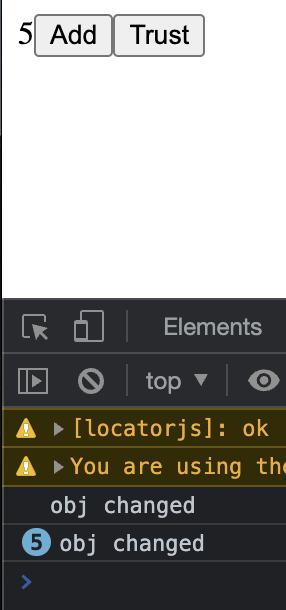
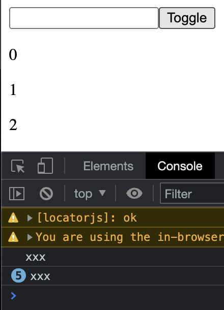

# useMemo 使用场景

> [source code](https://github.com/dsz411/dsz411.github.io/tree/main/blog-examples/use-memo)

useMemo 主要用来改善组件性能, 我们知道在 react 中, 组件的任何一个依赖发生变化, 都会导致组件完全重新渲染, 它可以是组件依赖的一个外部 prop 发生变化, 或内部的一个 state 发生变化, 亦或是这个组件被引用在了另一个组件中

useMemo 的一个典型应用场景就是可以用来优化对象, 众所周知, 在 JavaScript 中, 即使两个对象拥有完全的键值对, 它们也不可能相等

```shell
> let a = {"name": "xxxx"}
> let b = {"name": "xxxx"}
> a == b
false
> a === b
false
```

所以这里就会诞生一个问题, 那就是你可能在组件中有一个对象的数据源, 在重新渲染中, 即使它的数据没有发生任何变化, 它也会被重新计算, 这是不应该的:

```jsx
      function App() {
        const [count, setCount] = React.useState(0);
        const [trust, setTrust] = React.useState(false);

        const obj = { trust: trust ? "true" : "false" };

        React.useEffect(() => {
          console.log("obj changed");
        }, [obj]);

        const handleClick = (id) => {
          if (id === "count") {
            setCount((prev) => ++prev);
          } else {
            setTrust((prev) => !prev);
          }
        };

        return (
          <div>
            {count}
            <button onClick={() => handleClick("count")}>Add</button>
            <button onClick={() => handleClick("trust")}>Trust</button>
          </div>
        );
      }

      ReactDOM.createRoot(document.getElementById("root")).render(<App />);
```

当我们只点击 Add 按钮时, 可以看到 obj 也发生了变化, useEffect 成功捕获了它



> 第一个打印的消息是由于组件初次渲染导致的

下面我们使用 useMemo 来优化这个组件, 使用 useMemo 包裹这个对象:

```jsx
        const obj = React.useMemo(() => {
          return { trust: trust ? "true" : "false" }
        }, [trust]);
```

这时就只有当我们点击 trust 按钮时, obj 才会改变

另一个典型的应用场景, 就是在你的组件中, 可能有一个非常耗时的函数, 如果不对它进行优化, 每次都重复运行它, 是非常耗性能的

```javascript
const [page, setPage] = useState(1);
const data = fetchPosts(page);
// ...
```

你应该这样改写上面的代码:

```javascript
const [page, setPage] = useState(1);
const data = useMemo(() => {
  return fetchPosts(page);
}, [page])
```

现在 fetchPosts 仅会在 page 被改变时触发, 而不会受其它情况的影响

## useCallback

useCallback 和 useMemo 非常相似, 函数签名也是一样的, 只是 useCallback 的返回值是一个函数, 而 useMemo 的返回值是它函数参数的返回值

```jsx
      function App() {
        const [number, setNumber] = React.useState(0);
        const [trust, setTrust] = React.useState(false);

        const getItems = () => {
          return [number, number + 1, number + 2];
        }

        React.useEffect(() => {
          console.log("xxx");
        }, [getItems]);

        return (
          <div>
            <input
              type="number"
              onChange={(evt) => setNumber(+evt.target.value)}
            />
            <button onClick={() => setTrust(prev => !prev)}>Toggle</button>
            {getItems().map((item, idx) => (
              <p key={idx}>{item}</p>
            ))}
          </div>
        );
      }

      ReactDOM.createRoot(document.getElementById("root")).render(<App />);
```



可以看到, 我们并没有改变数字输入, 而是在点击Toggle按钮, 但是 getItems 依然重新计算了, 这是不应该的, 这里我们用 useCallback 来优化它

```jsx
        const getItems = React.useCallback(() => {
          return [number, number + 1, number + 2];
        }, [number]);
```

useCallback 与 useMemo 的最大的一个区别是: useCallback 的返回值是一个函数, 而 useMemo 的返回值是它函数参数的返回值

所以使用 useCallback,我们就可以调用函数, 从而实现一些定制, 而 useMemo 则不行

```jsx
        // getItems = f() => [number, number + 1, number + 2]
				const getItems = React.useCallback(() => {
          return [number, number + 1, number + 2];
        }, [number]);
				// getItems ==> [number, number + 1, number + 2]
        const getItems = React.useMemo(() => {
          return [number, number + 1, number + 2];
        }, [number]);
```

```jsx
      function App() {
        const [number, setNumber] = React.useState(0);
        const [trust, setTrust] = React.useState(false);
				
        // *
        const getItems = React.useCallback((accelator) => {
          return [number + accelator, number + accelator + 1, number + accelator + 2];
        }, [number]);

        React.useEffect(() => {
          console.log("xxx");
        }, [getItems]);

        return (
          <div>
            <input
              type="number"
              onChange={(evt) => setNumber(+evt.target.value)}
            />
            <button onClick={() => setTrust(prev => !prev)}>Toggle</button>
            {/* * */}
            {getItems(5).map((item, idx) => (
              <p key={idx}>{item}</p>
            ))}
          </div>
        );
      }
```


使用 useCallback, getItems 可以通过参数来定制, 而这是 useMemo 无法做到的
