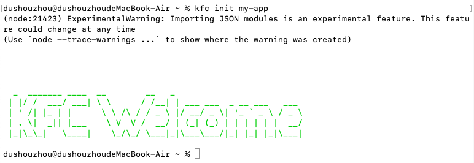
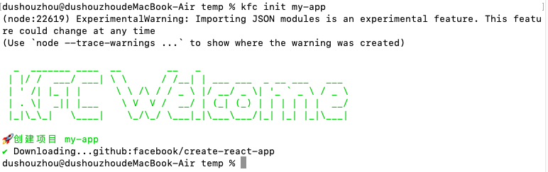

# CLI 开发的简单介绍

> 代码地址: https://github.com/dsz411/my-blog/tree/master/code/ja/cli-app

新建项目

```shell
$ mkdir cli-app
$ cd cli-app
$ npm init
```

安装依赖

```shell
$ npm install commander download-git-repo ora handlebars figlet clear chalk open watch
```

新建 `bin/kfc.js` 文件, 写入以下代码

```javascript
#!/usr/bin/env node
console.log("cli....");
```

第一行是比不可少的(特别是在 MacOS 环境中)，它指定了程序使用 node 解析器, 否则会报错: `line 1: syntax error near unexpected token "cli..."`

在 package.json 文件里添加 bin 字段

```javascript
{
	// ...
  "bin": {
    "kfc": "./bin/kfc.js"
  },
  //...
}
```

然后运行 npm link 命令, npm link 命令可以把 kfc 设置为全局(也就是在其它文件夹也可以使用 kfc 命令)

```shell
$ npm link
```

现在就可以使用 kfc 命令来打印 'cli....' 了

```shell
$ kfc
cli....
```

## 创建命令行界面

使用 commander 库定制命令, 在 bin/kfc.js 文件里输入

```javascript
#!/usr/bin/env node
import {program} from "commander";
import packageInfo from "../package.json" assert { type: "json" };

program.version(packageInfo.version);

program
  .command("init <name>") // name 为参数
  .description("init project")
  .action((name) => {
    console.log("init", name);
  });

program.parse(process.argv);
```

现在在输入 kfc, 就不一样了

```shell
$ kfc
Usage: kfc [options] [command]

Options:
  -V, --version   output the version number
  -h, --help      display help for command

Commands:
  init <name>     init project
  help [command]  display help for command
```

现在将 action 里的逻辑分割到一个新的文件夹中, 新建 lib/init.mjs 文件(注意后缀名是 `.mjs`), 输入以下内容

```javascript
import { promisify } from "node:util";
import _figlet from "figlet";
import clear from "clear";
import chalk from "chalk";

const figlet = promisify(_figlet);


const log = (content) => console.log(chalk.green(content));

export default async (name) => {
  // 打印欢迎界面
  clear();
  const data = await figlet("KFC Welcome");
  log(data);
};
```

然后回到 bin/kfc.js 文件导入它

```javascript
#!/usr/bin/env node
import {program} from "commander";
import packageInfo from "../package.json" assert { type: "json" };
import actions from "../lib/init.mjs";

program.version(packageInfo.version);

program
  .command("init <name>")
  .description("init project")
  .action(actions);

program.parse(process.argv);
```

此时运行 `kfc init ...` 就会不一样了



## 从 Github 上下载模板

现在从 Github 上下载模板, 为此新建 lib/download.js 文件, 输入以下内容

```javascript
import { promisify } from "node:util";

const clone = async (repo, desc) => {
  const download = promisify(require("download-git-repo"));
  const ora = require("ora");
  const process = ora(`Downloading...${repo}`);
  process.start();
  await download(repo, desc);
  process.succeed();
}

export { clone };
```

然后在 lib/init.js 文件中导入它

```javascript
import { promisify } from "node:util";
import _figlet from "figlet";
import clear from "clear";
import chalk from "chalk";
import { clone } from "./download.mjs";

const figlet = promisify(_figlet);

const log = (content) => console.log(chalk.green(content));

export default async (name) => {
  // 打印欢迎界面
  clear();
  const data = await figlet("KFC Welcome");
  log(data);

  // 克隆项目
  log(`🚀创建项目 ${name}`);
  await clone(
    "github:facebook/create-react-app",
    name
  );
};
```

现在运行 `kfc init my-app`



现在可以看到在 temp 文件夹下有了一个 my-app 文件夹

有时, 在一些项目中, 它们还会为你自动安装依赖, 如果你想自动安装依赖, 你可以使用下面这段代码, 在 lib/init.js 中添加

```javascript
import { promisify } from "node:util";
import _figlet from "figlet";
import clear from "clear";
import chalk from "chalk";
import { clone } from "./download.mjs";
import { spawn as _spawn } from "node:child_process";

const figlet = promisify(_figlet);

const log = (content) => console.log(chalk.green(content));

const spawn = async (...args) => {
  return new Promise((resolve) => {
    const proc = _spawn(...args);
    proc.stdout.pipe(process.stdout);
    proc.stderr.pipe(process.stderr);
    proc.on("close", () => {
      resolve();
    });
  });
};

export default async (name) => {
  // 打印欢迎界面
  clear();
  const data = await figlet("KFC Welcome");
  log(data);

  // 克隆项目
  log(`🚀创建项目 ${name}`);
  await clone("github:facebook/create-react-app", name);

  // 自动安装依赖
  log("安装依赖");
  await spawn("yarn", ["install"], { cwd: `./${name}` });
  log(`
  👌 安装完成
  To get Start:
  =============================
    cd ${name}
    npm run serve
  =============================
    `);
};
```

> 注意在 windows 上, yarn 要用 yarn.cmd, 而不是 yarn, 可以使用以下语句进行判断
>
> ```javascript
> process.platform === "win32" ? "yarn.cmd" : "yarn";
> ```

现在程序是可以正常运行的

你还可以配置程序自动启动并且打开浏览器, 在 lib/init.js 文件中添加如下代码

```javascript
import { promisify } from "node:util";
import _figlet from "figlet";
import clear from "clear";
import chalk from "chalk";
import { clone } from "./download.mjs";
import { spawn as _spawn } from "node:child_process";
import open from "open";

const figlet = promisify(_figlet);

const log = (content) => console.log(chalk.green(content));

const spawn = async (...args) => {
  return new Promise((resolve) => {
    const proc = _spawn(...args);
    proc.stdout.pipe(process.stdout);
    proc.stderr.pipe(process.stderr);
    proc.on("close", () => {
      resolve();
    });
  });
};

export default async (name) => {
  // 打印欢迎界面
  clear();
  const data = await figlet("KFC Welcome");
  log(data);

  // 克隆项目
  log(`🚀创建项目 ${name}`);
  await clone("github:facebook/create-react-app", name);

  // 自动安装依赖
  log("安装依赖");
  await spawn("yarn", ["install"], { cwd: `./${name}` });
  log(`
  👌 安装完成
  To get Start:
  =============================
    cd ${name}
    npm run serve
  =============================
    `);

  open(`http://localhost:8080`);
  // 启动
  await spawn("yarn", ["serve"], { cwd: `./${name}` });
};
```

现在程序是可以正常运行的
