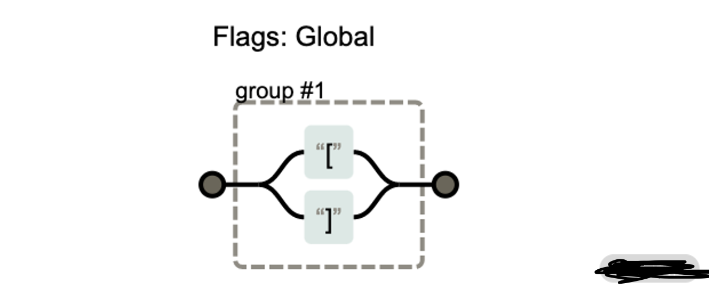

# 如何扁平化一个数组

如何实现数组扁平化？怎样用最普通的方法解决数组扁平化问题？ES6 里面是否有一些高级的方法能够直接实现？

数组的扁平化其实就是将一个嵌套多层的数组 array（嵌套可以是任何层数）转换为只有一层的数组

举个简单的例子，假设有个名为 flatten 的函数可以做到数组扁平化，效果如下面这段代码所示:

```javascript
var arr = [1, [2, [3, 4，5]]];
console.log(flatten(arr)); // [1, 2, 3, 4，5]
```

其实就是把多维的数组“拍平”，输出最后的一维数组

## 普通的递归实现

普通的递归思路很容易理解，就是通过循环递归的方式，一项一项地去遍历，如果每一项还是一个数组，那么就继续往下遍历，利用递归程序的方法，来实现数组的每一项的连接

我们来看下这个方法是如何实现的，如下所示:

```javascript
// 方法1
var a = [1, [2, [3, 4, 5]]];
function flatten(arr) {
  let result = [];

  for(let i = 0; i < arr.length; i++) {
    if(Array.isArray(arr[i])) {
      result = result.concat(flatten(arr[i]));
    } else {
      result.push(arr[i]);
    }
  }
  return result;
}
flatten(a);  //  [1, 2, 3, 4，5]
```

从上面这段代码可以看出，最后返回的结果是扁平化的结果，这段代码核心就是循环遍历过程中的递归操作，就是在遍历过程中发现数组元素还是数组的时候进行递归操作，把数组的结果通过数组的 concat 方法拼接到最后要返回的 result 数组上，那么最后输出的结果就是扁平化后的数组

## 利用 reduce 函数迭代

从上面普通的递归函数中可以看出，其实就是对数组的每一项进行处理，那么我们其实也可以用 reduce 来实现数组的拼接，从而简化第一种方法的代码

改造后的代码如下所示:

```javascript
// 方法2
var arr = [1, [2, [3, 4]]];
function flatten(arr) {
    return arr.reduce(function(prev, next){
        return prev.concat(Array.isArray(next) ? flatten(next) : next)
    }, [])
}
console.log(flatten(arr));//  [1, 2, 3, 4，5]
```

这段代码在控制台执行之后，也可以得到想要的结果

这里你可以回忆一下之前说的 reduce 的参数问题，我们可以看到 reduce 的第一个参数用来返回最后累加的结果，思路和第一种递归方法是一样的，但是通过使用 reduce 之后代码变得更简洁了，也同样解决了扁平化的问题

## 扩展运算符实现

这个方法的实现，采用了扩展运算符和 some 的方法，两者共同使用，达到数组扁平化的目的

还是来看一下代码:

```javascript
// 方法3
var arr = [1, [2, [3, 4]]];
function flatten(arr) {
    while (arr.some(item => Array.isArray(item))) {
        arr = [].concat(...arr);
    }
    return arr;
}
console.log(flatten(arr)); //  [1, 2, 3, 4，5]
```

从执行的结果中可以发现，我们先用数组的 some 方法把数组中仍然是组数的项过滤出来，然后执行 concat 操作，利用 ES6 的展开运算符，将其拼接到原数组中，最后返回原数组，达到了预期的效果

前三种实现数组扁平化的方式其实是最基本的思路，都是通过最普通递归思路衍生的方法，尤其是前两种实现方法比较类似

值得注意的是 reduce 方法，它可以在很多应用场景中实现，由于 reduce 这个方法提供的几个参数比较灵活，能解决很多问题，所以是值得熟练使用并且精通的

## split 和 toString 共同处理

我们也可以通过 split 和 toString 两个方法，来共同实现数组扁平化，由于数组会默认带一个 toString 的方法，所以可以把数组直接转换成逗号分隔的字符串，然后再用 split 方法把字符串重新转换为数组

如下面的代码所示:

```javascript
// 方法4
var arr = [1, [2, [3, 4]]];
function flatten(arr) {
    return arr.toString().split(',');
}
console.log(flatten(arr)); //  [1, 2, 3, 4]
```

通过这两个方法可以将多维数组直接转换成逗号连接的字符串，然后再重新分隔成数组，你可以在控制台执行一下查看结果

## 调用 ES6 中的 flat

我们还可以直接调用 ES6 中的 flat 方法，可以直接实现数组扁平化

先来看下 flat 方法的语法：`arr.flat([depth])`

其中 depth 是 flat 的参数，depth 是可以传递数组的展开深度（默认不填、数值是 1），即展开一层数组

那么如果多层的该怎么处理呢？参数也可以传进 Infinity，代表不论多少层都要展开

那么我们来看下，用 flat 方法怎么实现，请看下面的代码:

```javascript
// 方法5
var arr = [1, [2, [3, 4]]];
function flatten(arr) {
  return arr.flat(Infinity);
}
console.log(flatten(arr)); //  [1, 2, 3, 4，5]
```

可以看出，一个嵌套了两层的数组，通过将 flat 方法的参数设置为 Infinity，达到了我们预期的效果

其实同样也可以设置成 2，也能实现这样的效果

因此，你在编程过程中，发现对数组的嵌套层数不确定的时候，最好直接使用 Infinity，可以达到扁平化

## 正则和 JSON 方法共同处理

我们在第四种方法中已经尝试了用 toString 方法，其中仍然采用了将 JSON.stringify 的方法先转换为字符串，然后通过正则表达式过滤掉字符串中的数组的方括号，最后再利用 JSON.parse 把它转换成数组

请看下面的代码:

```javascript
// 方法 6
let arr = [1, [2, [3, [4, 5]]], 6];
function flatten(arr) {
  let str = JSON.stringify(arr);
  str = str.replace(/(\[|\])/g, '');
  str = '[' + str + ']';
  return JSON.parse(str); 
}
console.log(flatten(arr)); //  [1, 2, 3, 4，5]
```

可以看到，其中先把传入的数组转换成字符串，然后通过正则表达式的方式把括号过滤掉，这部分正则的表达式你不太理解的话，可以看看下面的图片:



通过这个在线网站 https://regexper.com/ 可以把正则分析成容易理解的可视化的逻辑脑图

其中我们可以看到，匹配规则是：全局匹配（g）左括号或者右括号，将它们替换成空格，最后返回处理后的结果

之后拿着正则处理好的结果重新在外层包裹括号，最后通过 JSON.parse 转换成数组返回

