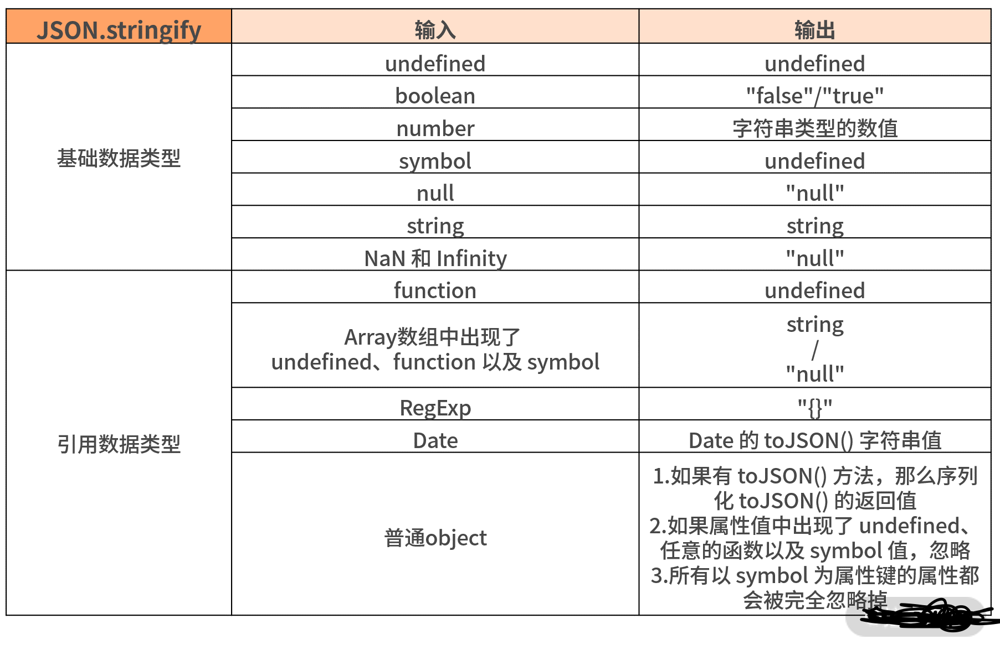

# 实现一个 JSON Stringify 方法

JSON.stringify 是日常开发中经常用到的 JSON 对象中的一个方法，JSON 对象包含两个方法：一是用于解析成 JSON 对象的 parse()；二是用于将对象转换为 JSON 字符串方法的 stringify()。下面我们分别来看下两个方法的基本使用情况。

JSON.parse 方法用来解析 JSON 字符串，构造由字符串描述的 JavaScript 值或对象。该方法有两个参数：第一个参数是需要解析处理的 JSON 字符串，第二个参数是可选参数提供可选的 reviver 函数，用在返回之前对所得到的对象执行变换操作。

> 该方法的语法为：JSON.parse(text[, reviver])

下面通过一段代码来看看这个方法以及 reviver 参数的用法，如下所示。

```javascript
const json = '{"result":true, "count":2}';
const obj = JSON.parse(json);
console.log(obj.count);
// 2
console.log(obj.result);
// true
/* 带第二个参数的情况 */
JSON.parse('{"p": 5}', function (k, v) {
    if(k === '') return v;     // 如果k不是空，
    return v * 2;              // 就将属性值变为原来的2倍返回
});                            // { p: 10 }
```

上面的代码说明了，我们可以将一个符合 JSON 格式的字符串转化成对象返回；带第二个参数的情况，可以将待处理的字符串进行一定的操作处理，比如上面这个例子就是将属性值乘以 2 进行返回。

JSON.stringify 方法是将一个 JavaScript 对象或值转换为 JSON 字符串，默认该方法其实有三个参数：第一个参数是必选，后面两个是可选参数非必选。第一个参数传入的是要转换的对象；第二个是一个 replacer 函数，比如指定的 replacer 是数组，则可选择性地仅处理包含数组指定的属性；第三个参数用来控制结果字符串里面的间距，后面两个参数整体用得比较少。

> 该方法的语法为：JSON.stringify(value[, replacer [, space]])

下面我们通过一段代码来看看后面几个参数的妙用，如下所示。

```javascript
JSON.stringify({ x: 1, y: 2 });
// "{"x":1,"y":2}"
JSON.stringify({ x: [10, undefined, function(){}, Symbol('')] })
// "{"x":[10,null,null,null]}"
/* 第二个参数的例子 */
function replacer(key, value) {
  if (typeof value === "string") {
    return undefined;
  }
  return value;
}
var foo = {foundation: "Mozilla", model: "box", week: 4, transport: "car", month: 7};
var jsonString = JSON.stringify(foo, replacer);
console.log(jsonString);
// "{"week":4,"month":7}"
/* 第三个参数的例子 */
JSON.stringify({ a: 2 }, null, " ");
/* "{
 "a": 2
}"*/
JSON.stringify({ a: 2 }, null, "");
// "{"a":2}"
```

从上面的代码中可以看到，增加第二个参数 replacer 带来的变化：通过替换方法把对象中的属性为字符串的过滤掉，在 stringify 之后返回的仅为数字的属性变成字符串之后的结果；当第三个参数传入的是多个空格的时候，则会增加结果字符串里面的间距数量，从最后一段代码中可以看到结果

## 分析各种数据类型及边界情况

我们来分析一下都有哪些数据类型传入，传入了之后会有什么返回，通过分析的结果我们之后才能更好地实现编码。大致的分析汇总如下表所示



上面这个表中，基本整理出了各种数据类型通过 JSON.stringify 这个方法之后返回对应的值，但是还有一个特殊情况需要注意：对于包含循环引用的对象执行此方法，会抛出错误

## 代码逻辑实现

我们先利用 typeof 把基础数据类型和引用数据类型分开，分开之后再根据不同情况来分别处理不同的情况，按照这个逻辑代码实现如下。

```javascript
function jsonStringify(data) {
  let type = typeof data;

  if(type !== 'object') {
    let result = data;
    //data 可能是基础数据类型的情况在这里处理
    if (Number.isNaN(data) || data === Infinity) {
       //NaN 和 Infinity 序列化返回 "null"
       result = "null";
    } else if (type === 'function' || type === 'undefined' || type === 'symbol') {
      // 由于 function 序列化返回 undefined，因此和 undefined、symbol 一起处理
       return undefined;
    } else if (type === 'string') {
       result = '"' + data + '"';
    }
    return String(result);
  } else if (type === 'object') {
     if (data === null) {
        return "null"  // 第01讲有讲过 typeof null 为'object'的特殊情况
     } else if (data.toJSON && typeof data.toJSON === 'function') {
        return jsonStringify(data.toJSON());
     } else if (data instanceof Array) {
        let result = [];
        //如果是数组，那么数组里面的每一项类型又有可能是多样的
        data.forEach((item, index) => {
        if (typeof item === 'undefined' || typeof item === 'function' || typeof item === 'symbol') {
               result[index] = "null";
           } else {
               result[index] = jsonStringify(item);
           }
         });
         result = "[" + result + "]";
         return result.replace(/'/g, '"');
      } else {
         // 处理普通对象
         let result = [];
         Object.keys(data).forEach((item, index) => {
            if (typeof item !== 'symbol') {
              //key 如果是 symbol 对象，忽略
              if (data[item] !== undefined && typeof data[item] !== 'function' && typeof data[item] !== 'symbol') {
                //键值如果是 undefined、function、symbol 为属性值，忽略
                result.push('"' + item + '"' + ":" + jsonStringify(data[item]));
              }
            }
         });
         return ("{" + result + "}").replace(/'/g, '"');
        }
    }
}
```

手工实现一个 JSON.stringify 方法的基本代码如上面所示，有几个问题你还是需要注意一下：

1. 由于 function 返回 'null'， 并且 typeof function 能直接返回精确的判断，故在整体逻辑处理基础数据类型的时候，会随着 undefined，symbol 直接处理了；

2. 由于 01 讲说过 typeof null 的时候返回'object'，故 null 的判断逻辑整体在处理引用数据类型的逻辑里面；

3. 关于引用数据类型中的数组，由于数组的每一项的数据类型又有很多的可能性，故在处理数组过程中又将 undefined，symbol，function 作为数组其中一项的情况做了特殊处理；

4. 同样在最后处理普通对象的时候，key （键值）也存在和数组一样的问题，故又需要再针对上面这几种情况（undefined，symbol，function）做特殊处理；

5. 最后在处理普通对象过程中，对于循环引用的问题暂未做检测，如果是有循环引用的情况，需要抛出 Error；
6. 根据官方给出的 JSON.stringify 的第二个以及第三个参数的实现，本段模拟实现的代码并未实现，如果有兴趣你可以自己尝试一下。

## 实现效果测试

上面的这个方法已经实现了，那么用起来会不会有问题呢？我们就用上面的代码，来进行一些用例的检测吧。

上面自己实现的这个 jsonStringify 方法和真正的 JSON.stringify 想要得到的效果是否一样呢？请看下面的测试结果。

```javascript
let nl = null;
console.log(jsonStringify(nl) === JSON.stringify(nl));
// true
let und = undefined;
console.log(jsonStringify(undefined) === JSON.stringify(undefined));
// true
let boo = false;
console.log(jsonStringify(boo) === JSON.stringify(boo));
// true
let nan = NaN;
console.log(jsonStringify(nan) === JSON.stringify(nan));
// true
let inf = Infinity;
console.log(jsonStringify(Infinity) === JSON.stringify(Infinity));
// true
let str = "jack";
console.log(jsonStringify(str) === JSON.stringify(str));
// true
let reg = new RegExp("\w");
console.log(jsonStringify(reg) === JSON.stringify(reg));
// true
let date = new Date();
console.log(jsonStringify(date) === JSON.stringify(date));
// true
let sym = Symbol(1);
console.log(jsonStringify(sym) === JSON.stringify(sym));
// true
let array = [1,2,3];
console.log(jsonStringify(array) === JSON.stringify(array));
// true
let obj = {
    name: 'jack',
    age: 18,
    attr: ['coding', 123],
    date: new Date(),
    uni: Symbol(2),
    sayHi: function() {
        console.log("hi")
    },
    info: {
        sister: 'lily',
        age: 16,
        intro: {
            money: undefined,
            job: null
        }
    }
}
console.log(jsonStringify(obj) === JSON.stringify(obj));
// true
```

通过上面这些测试的例子可以发现，我们自己实现的 jsonStringify 方法基本和 JSON.stringify 转换之后的结果是一样的，不难看出 jsonStringify 基本满足了预期结果。
