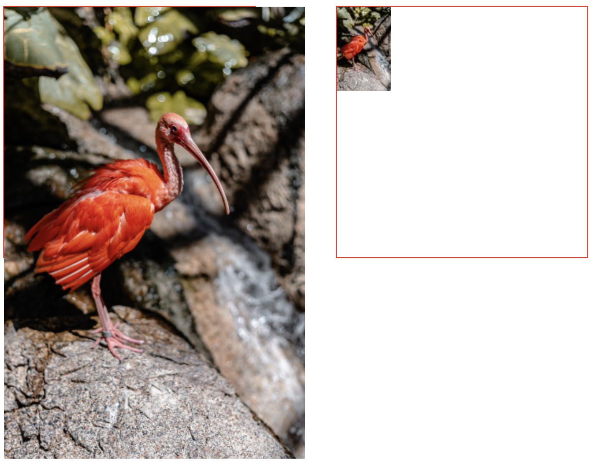
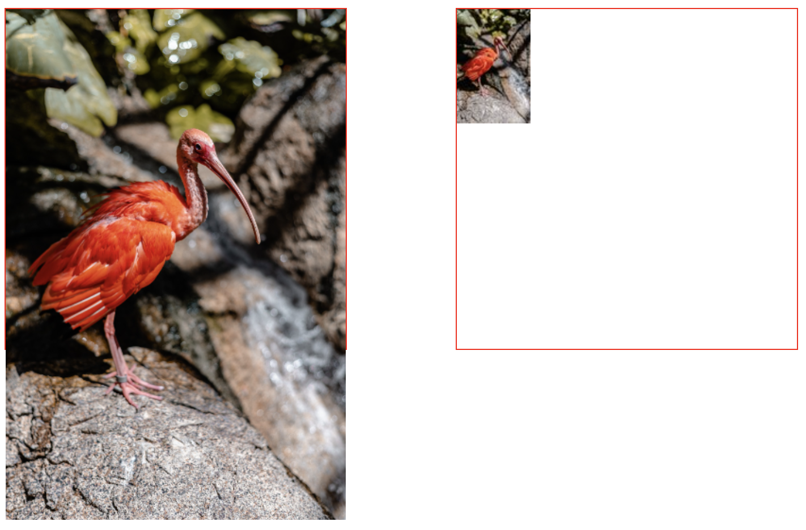
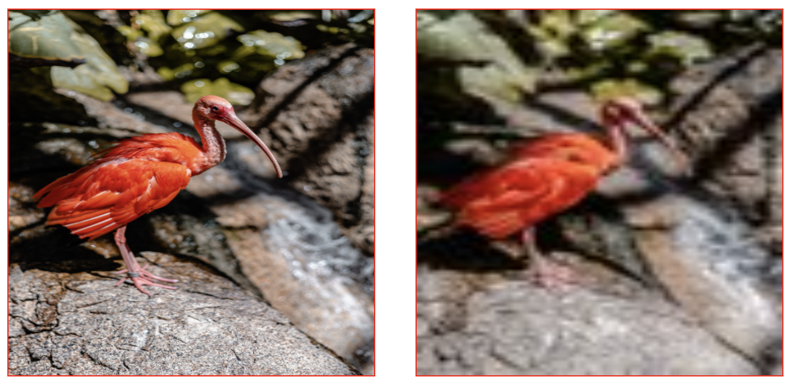
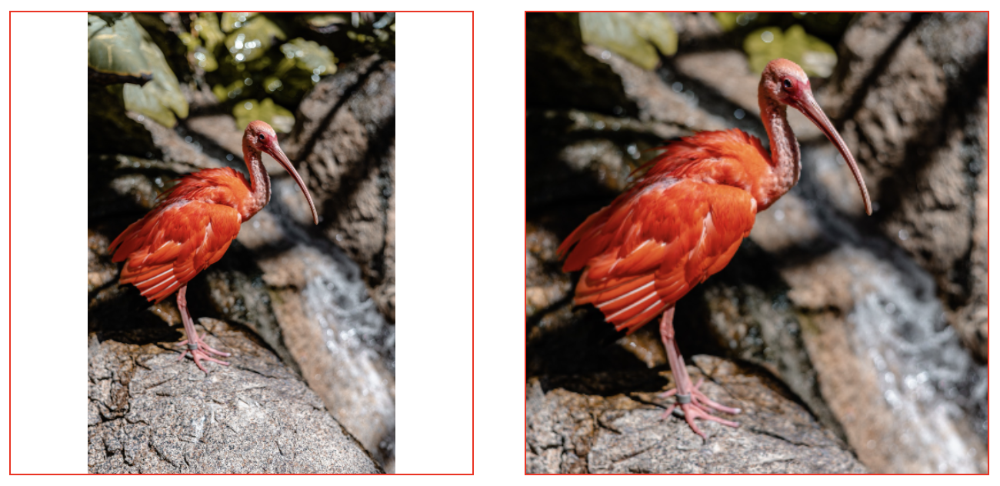
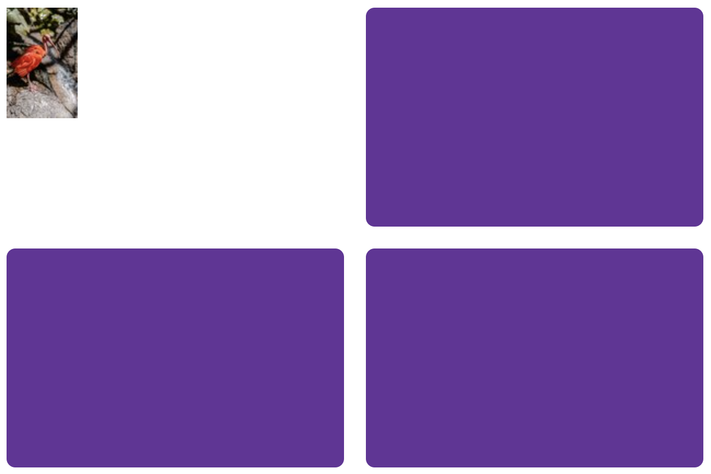
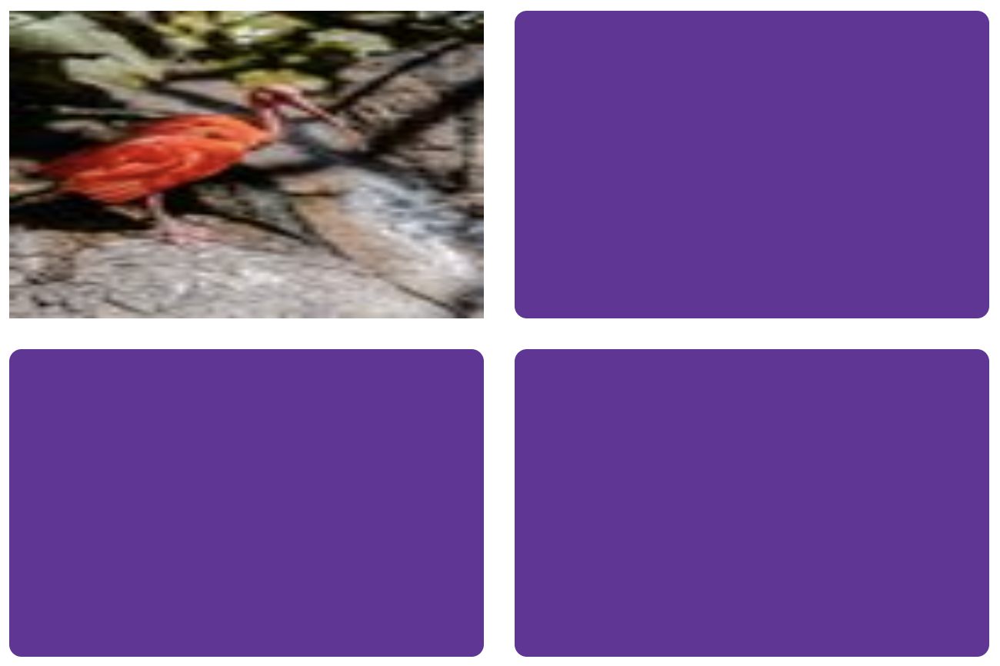

# 样式化替换元素

> 代码地址: https://github.com/dsz411/my-blog/tree/master/code/dev_notes/replaced_elements

- 什么是替换元素
  
  图像和视频是典型的替换元素, 它们本身具有固定尺寸, 比如你在页面渲染一个图像时, img 元素所占的区域由你引入的图像的尺寸决定, 它们的 display 为 inline, 并且它们没有伪元素
  
  替换元素参考: https://developer.mozilla.org/en-US/docs/Web/CSS/Replaced_element
  
- 可以使用 object-fit 和 object-position 这两个 css 属性来样式化替换元素的内容的位置以及其定位方式

  object-fit 类似于 background-size

  object-position 类似于 background-position

如果我们将一张图片放在一个小于它本身尺寸的盒子里, 那么图片会溢出盒子, 反之, 如果我们将一张图片放在一个大于它本身尺寸的盒子里, 它也不会拉伸来适应盒子, 在下面的例子中, 我们定义了两个盒子, 它们的大小都是 300 像素

你可以看到, 比盒子尺寸小的图像不会拉伸, 另一个比盒子尺寸大的图像会溢出

```html
<!DOCTYPE html>
<html lang="en">
<head>
  <meta charset="UTF-8">
  <meta http-equiv="X-UA-Compatible" content="IE=edge">
  <meta name="viewport" content="width=device-width, initial-scale=1.0">
  <title>Document</title>
  <style>
    .container {
      display: flex;
      justify-content: space-between;
    }

    .box {
      width: 300px;
      height: 300px;

      border: 1px solid red;
    }
  </style>
</head>
<body>
  <div class="container">
    <div class="box">
      
    </div>
    <div class="box">
      
    </div>
  </div>
</body>
</html>
```



那么我们在这里可以怎么做呢? 一种常见的技术是将 img 元素的 max-width 设置为 100%, 如果你这样做了, 你可以看到右边的图像会保持不变, 较大的图像会被缩小以适应盒子

```css
img {
	max-width: 100%;
}
```



这很好, 但还不够, 因为很明显右边的图像并不具备观赏性, 这时我们用下面的css属性来样式img元素

```css
    img {
      width: 100%;
      height: 100%;
    }
```



> 右边的图像被拉扯了, 这是因为盒子的尺寸与图像的纵横比并不搭配, 但这并不是我们这里的重点

接下来, 我们使用 object-fit 属性来控制图像内部内容的显示:

```css
    img {
      width: 100%;
      height: 100%;
      object-fit: contain;
    }

    .box:last-of-type img {
      object-fit: cover;
    }
```



contain 会让图像缩小以适应盒子, 由于这里盒子的尺寸与图像的尺寸的纵横比不兼容, 所以这里出现了一个类似于信封装箱的感觉, 而 cover 则会放大图像, 使图像看起来就像在海报上一样

最后, 在布局中, 替换元素也有不同之处, 在 flex 或 grid 的布局中, 元素会默认拉伸来填充整个区域, 但图像不会拉伸, 而是会对齐到网格区域或伸缩容器的开始位置

```html
<!DOCTYPE html>
<html lang="en">
  <head>
    <meta charset="UTF-8" />
    <meta http-equiv="X-UA-Compatible" content="IE=edge" />
    <meta name="viewport" content="width=device-width, initial-scale=1.0" />
    <title>Document</title>
    <style>
      .wrapper {
        display: grid;
        grid-template-columns: 1fr 1fr;
        grid-template-rows: 200px 200px;
        gap: 20px;
      }

      .wrapper > div {
        background-color: rebeccapurple;
        
        border-radius: 0.5em;
      }
    </style>
  </head>
  <body>
    <div class="wrapper">
      
      <div></div>
      <div></div>
      <div></div>
    </div>
  </body>
</html>
```



css 之所以会把它们设置成这样, 是因为不想图像被奇怪的拉伸, 如果你想让图像被拉伸, 你可以编写这样的代码:

```css
      img {
        width: 100%;
        height: 100%;
      }
```


