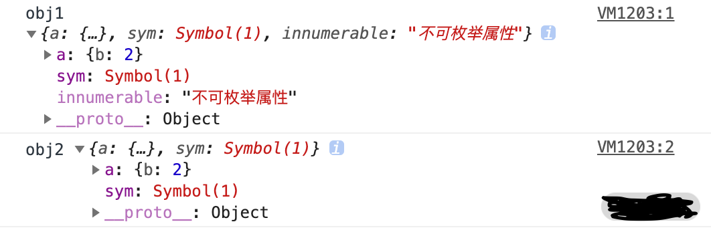

# 浅拷贝的实现

- 浅拷贝：只拷贝第一层，深层的依然是引用，改变深层会影响原对象
- 深拷贝：每一层都拷贝了，改变数据不会影响原对象

## Object.assign()

`object.assign` 是 `object` 的一个方法, 该方法可以用于 JS 对象的合并等多个用途, 其中一个用途就是可以进行浅拷贝, 该方法的第一个参数是拷贝的目标对象, 后面的参数是拷贝的来源对象(也可以是多个来源)

> `object.assign` 的语法为 `Object.assign(target, ...sources)`

`object.assign` 的示例代码如下

```javascript
let target = {};
let source = { a: { b: 1 } };
Object.assign(target, source);
console.log(target); // { a: { b: 1 } };
```

从上面的代码中可以看到, 通过 `object.assign` 的确简单实现了一个浅拷贝, "target" 就是新拷贝的对象, 下面再看一个和上面不太一样的例子

```javascript
let target = {};
let source = { a: { b: 2 } };
Object.assign(target, source);
console.log(target); // { a: { b: 10 } }; 
source.a.b = 10; 
console.log(source); // { a: { b: 10 } }; 
console.log(target); // { a: { b: 10 } };
```

从上面代码中可以看到, 首先通过 `Object.assign` 将 source 拷贝到 target 对象中, 然后尝试将 source 对象中的 b 属性由 2 修改为 10, 通过控制台可以发现, 打印结果中, 三个 target 里的 b 属性都变为 10 了, 证明 `Object.assign` 暂时实现了想要的拷贝效果

但是使用 `object.assign` 方法有几点需要注意

- 它不会拷贝对象的继承属性
- 它不会拷贝对象的不可枚举的属性
- 可以拷贝 Symbol 类型的属性

可以简单理解为: `Object.assign` 循环遍历原对象的属性, 通过复制的方式将其赋值给目标对象的相应属性, 来看一下这段代码, 以验证它可以拷贝 Symbol 类型的对象

```javascript
let obj1 = { a:{ b:1 }, sym:Symbol(1)}; 
Object.defineProperty(obj1, 'innumerable' ,{
    value:'不可枚举属性',
    enumerable:false
});
let obj2 = {};
Object.assign(obj2,obj1)
obj1.a.b = 2;
console.log('obj1',obj1);
console.log('obj2',obj2);
```

来看一下控制台打印的结果, 如下图所示



从上面的样例代码中可以看到, 利用 `object.assign` 也可以拷贝 Symbol 类型的对象, 但是如果到了对象的第二层属性 `obj1.a.b` 这里的时候, 前者值的改变也会影响后者的第二层属性的值, 说明其中依旧存在着访问共同堆内存的问题, 也就是说这种方法还不能进一步复制, 而只是完成了浅拷贝的功能

## 扩展运算符

也可以利用 JS 的扩展运算符, 在构造对象的同时完成浅拷贝的功能

> 扩展运算符的语法为: `let cloneObj = { ...obj };`

代码如下所示

```javascript
/* 对象的拷贝 */
let obj = {a:1,b:{c:1}}
let obj2 = {...obj}
obj.a = 2
console.log(obj)  //{a:2,b:{c:1}} console.log(obj2); //{a:1,b:{c:1}}
obj.b.c = 2
console.log(obj)  //{a:2,b:{c:2}} console.log(obj2); //{a:1,b:{c:2}}
/* 数组的拷贝 */
let arr = [1, 2, 3];
let newArr = [...arr]; //跟arr.slice()是一样的效果
```

扩展运算符和 `object.assign` 有同样的缺陷, 也就是实现的浅拷贝的功能差不多, 但是如果属性都是基本类型的值, 使用扩展运算符进行浅拷贝会更加方便

## Array#concat

数组的 concat 方法其实也是浅拷贝, 所以连接一个含有引用类型的数组时, 需要注意修改原数组中的元素的属性, 因为它会影响拷贝之后连接的数组, 不过 concat 只能用于数组的浅拷贝, 使用场景比较局限, 代码如下所示

```javascript
let arr = [1, 2, 3];
let newArr = arr.concat();
newArr[1] = 100;
console.log(arr);  // [ 1, 2, 3 ]
console.log(newArr); // [ 1, 100, 3 ]
```

## Array#slice

slice 方法也比较有局限性, 因为它仅仅针对数组类型, slice 方法会返回一个新的数组对象, 这一对象由该方法的前两个参数来决定原数组截取的开始和结束时间, 是不会影响和改变原始数组的

> slice 的语法为: `arr.slice(begin, end);`

来看一下 slice 怎么使用, 代码如下所示

```javascript
let arr = [1, 2, {val: 4}];
let newArr = arr.slice();
newArr[2].val = 1000;
console.log(arr);  //[ 1, 2, { val: 1000 } ]
```

从上面的代码中可以看出, 这就是浅拷贝的限制所在了, 它只能拷贝一层对象, 如果存在对象的嵌套，那么浅拷贝将无能为力

因此深拷贝就是为了解决这个问题而生的，它能解决多层对象嵌套问题，彻底实现拷贝

根据以上对浅拷贝的理解, 如果让自己实现一个浅拷贝, 大致的思路分为两点:

1. 对基础类型做一个最基本的一个拷贝
2. 对引用类型开辟一个新的存储, 并且拷贝一层对象属性

那么, 围绕着这两个思路来实现一个浅拷贝吧, 代码如下所示

```javascript
const shallowClone = (target) => {
  if (typeof target === 'object' && target !== null) {
    const cloneTarget = Array.isArray(target) ? []: {};
    for (let prop in target) {
      if (target.hasOwnProperty(prop)) {
          cloneTarget[prop] = target[prop];
      }
    }
    return cloneTarget;
  } else {
    return target;
  }
}
```

从上面这段代码可以看出, 利用类型判断, 针对引用类型的对象进行 for 循环遍历对象属性赋值给目标对象的属性, 基本就可以手工实现一个浅拷贝的代码了

