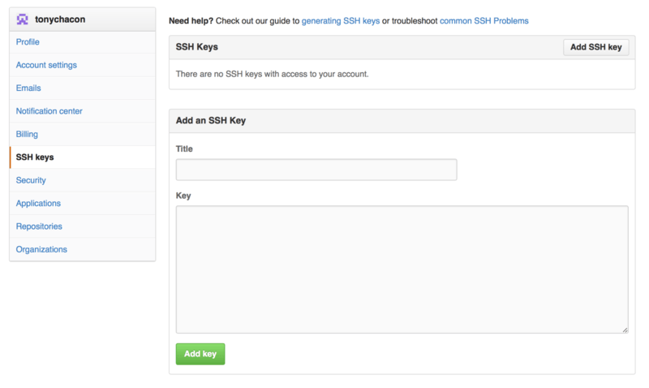

# 账户的创建和配置

GitHub 是最大的 Git 版本库托管商，是成千上万的开发者和项目能够合作进行的中心

大部分 Git 版本库都托管在 GitHub，很多开源项目使用 GitHub 实现 Git 托管、问题追踪、代码审查以及其它事情

所以，尽管这不是 Git 开源项目的直接部分，但如果想要专业地使用 Git，你将不可避免地与 GitHub 打交道，所以这依然是一个绝好的学习机会

你所需要做的第一件事是创建一个免费账户

直接访问 [https://github.com](https://github.com/)，选择一个未被占用的用户名，提供一个电子邮件地址和密码，点击写着“Sign up for GitHub”的绿色大按钮即可

你将看到的下一个页面是升级计划的价格页面，目前我们可以直接忽略这个页面

GitHub 会给你提供的邮件地址发送一封验证邮件

尽快到你的邮箱进行验证，这是非常重要的（我们会在后面了解到这点）

> GitHub 为免费账户提供了几乎所有的功能，除了一些高级的特性
>
> GitHub 的付费计划包含一些高级工具和功能，不过本书将不涉及这部分内容
>
> 关于可选方案及其对比的更多信息见 https://github.com/pricing

点击屏幕左上角的章鱼猫图标，你将来到控制面板页面

现在，你已经做好了使用 GitHub 的准备工作

## SSH访问

现在，你完全可以使用 `https://` 协议，通过你刚刚创建的用户名和密码访问 Git 版本库

但是，如果仅仅克隆公有项目，你甚至不需要注册——刚刚我们创建的账户是为了以后 fork 其它项目，以及推送我们自己的修改

如果你习惯使用 SSH 远程，你需要配置一个公钥（如果你没有公钥，参考 [生成 SSH 公钥](https://git-scm.com/book/zh/v2/ch00/_generate_ssh_key)） 

使用窗口右上角的链接打开你的账户设置：

然后在左侧选择“SSH keys”部分

在这个页面点击“`Add an SSH key`”按钮，给你的公钥起一个名字，将你的 `~/.ssh/id_rsa.pub` （或者自定义的其它名字）公钥文件的内容粘贴到文本区，然后点击“Add key”

> 确保给你的 SSH 密钥起一个能够记得住的名字
>
> 你可以为每一个密钥起名字（例如，“我的笔记本电脑”或者“工作账户”等），以便以后需要吊销密钥时能够方便地区分
