# 机器学习的步骤(第二部分)

## 图形的种类和画法

> 使用 Matplotlib 显示图形的方法

### 在页面上显示图形

在 Jupyter Notebook 页面上可显示图形

在 Code 单元格内，运行 `%matplotlib inline` 这个以 `%` 开始的“魔法”命令后，即使不运行后面将介绍的 `show`方法，页面上也会输出图形

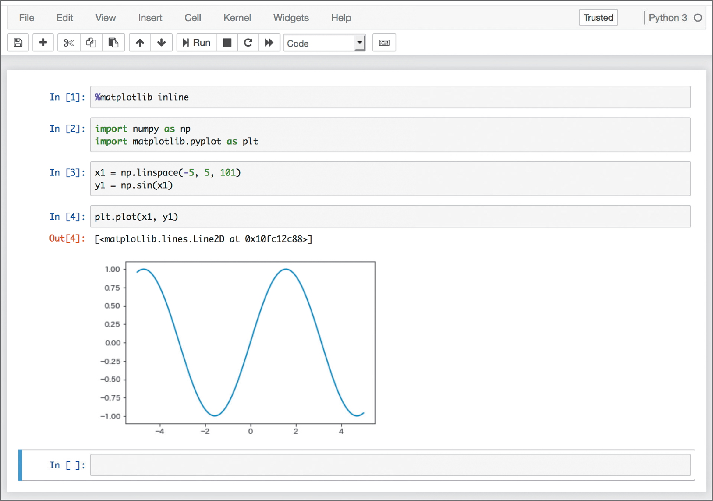

> 在 notebook 内显示图形

下面看一下上图中的代码

```python
import numpy as np
import matplotlib.pyplot as plt
```

上面的代码为了生成数据而导入了 `numpy`，为了显示图形而导入了 `matplotlib`

NumPy 是以数组形式处理数据并进行高效计算的 Python 第三方包

习惯上分别以别名 `np` 和 `plt` 调用 `numpy` 和 `matplotlib` 的 `pyplot`

下面以 sin 曲线为例，显示其图形

```python
x1 = np.linspace(-5, 5, 101)
y1 = np.sin(x1)
```

- `x1` 中保存的是为显示 sin 曲线而生成的从 -5 到 5 的 101 个数据
- `y1` 中保存的是使用 NumPy 的 `sin` 函数生成的数据

下面以用 Matplotlib 绘制 sin 曲线的图形为例进行说明

最简单的显示图形的方法是 `plt.plot(x1, y1)`

```python
plt.plot(x1, y1)
```

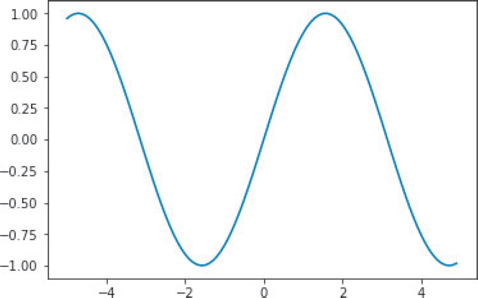

> sin 曲线的图形

下面介绍使用 Matplotlib 绘制图形的代码的标准写法

前面只是简单地调用了 `plt.plot`，这种做法没有明确输出对象，只是声明“在这里绘图”，比较粗糙

严密的做法应为先创建要绘制的对象，再输出图形，代码及图形如下

```python
fig, ax = plt.subplots()
ax.set_title("Sin")
ax.set_xlabel("rad")
ax.plot(x1, y1)
handles, labels = ax.get_legend_handles_labels()
ax.legend(handles, labels)
plt.show()
```

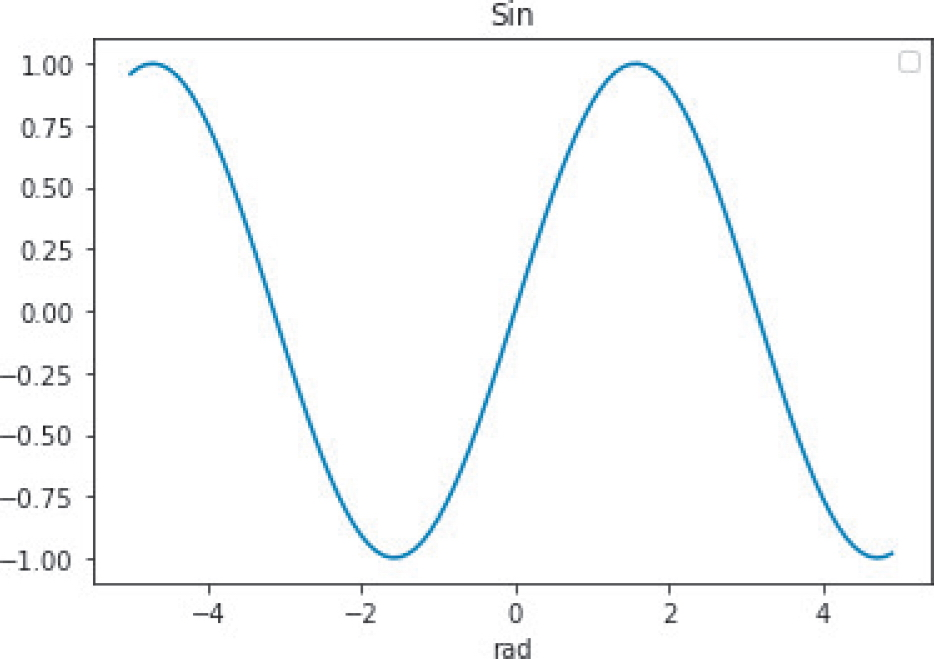

> 先创建对象再输出图形

上面的代码包含了显示标签和坐标轴名称等信息的处理，因此变成了 7 行，但其中用于显示图形的主要代码只有 `ax.plot(x1, y1)` 一行

虽然这种方法更受欢迎，不过如果要输出简单的图形，可以使用 `plt.plot(x1, y1)` 形式

请记住，方法共有两种：一种是 `plt.plot` 这种简易方法；另一种是 `ax.plot` 这种严密地面向对象进行声明的方法

最后运行 `plt.show()`

如果已运行魔法命令 `%matplotlib inline`，那就不用特意调用 `show` 了

为了使代码在 Jupyter Notebook 之外的环境中也能输出图形，这里特意编写了这一行代码

不管写不写这行代码，图形都会在 Jupyter Notebook 中显示

### 绘制各种图形

首先生成用于显示图形的数据

```python
x2 = np.arange(100)
y2 = x2 * np.random.rand(100)
```

`x2` 中保存的是元素为“从 0 到 99 的整数”的数组

`y2` 中保存的是元素为“在从 0 到 1 的范围内随机选出的 100 个数据”的数组与刚才的变量 `x2` 相乘的结果

下面将使用这两个变量绘制各种图形

接下来要展示的是通过 `plt` 变量声明图形形式的简易方法的示例

对于前面代码中明示图形位置的 `ax` 变量，我们也可以用同样的方式输出其图形

- 散点图: 使用 `scatter` 方法绘制散点图

  ```python
  plt.scatter(x2, y2)
  ```

  `x2` 和 `y2` 的散点图如图所示

  

  > 散点图

- 直方图: 使用 `hist` 方法绘制直方图

  ```python
  plt.hist(y2, bins=5)
  ```

  设 `y2` 的直方图的 `bin` 为 5，输出的图形如图所示

  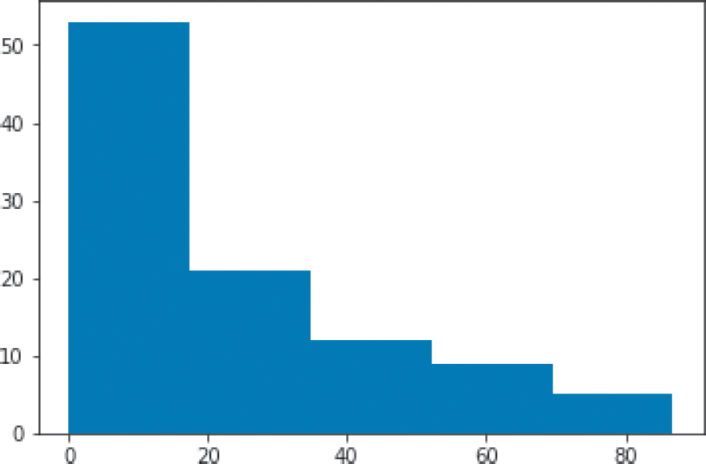

  > 直方图

- 柱状图: 使用 `bar` 方法绘制柱状图

  ```python
  plt.bar(x2, y2)
  ```

  输出的柱状图如图所示

  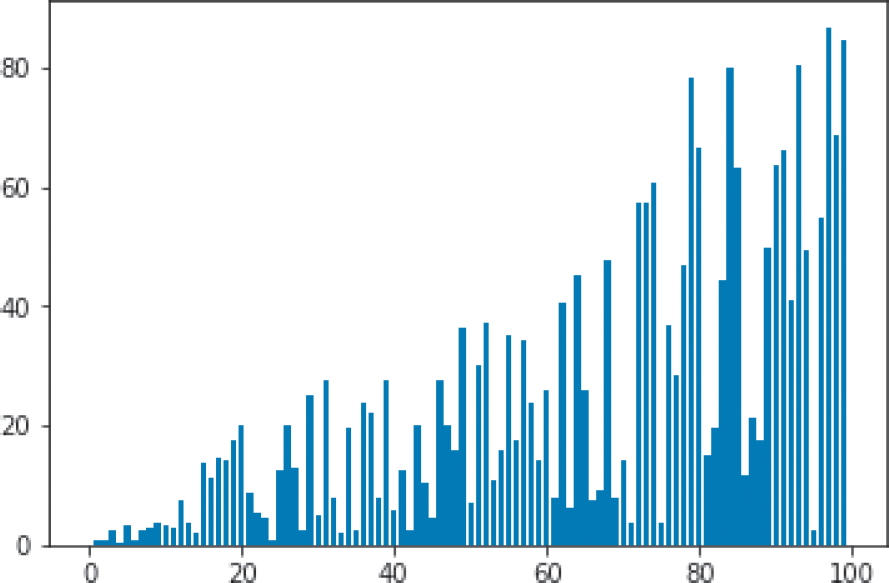

  > 柱状图

- 折线图: 使用 `plot` 方法绘制折线图

  ```python
  plt.plot(x2, y2)
  ```

  `x2` 和 `y2` 的折线图如图所示

  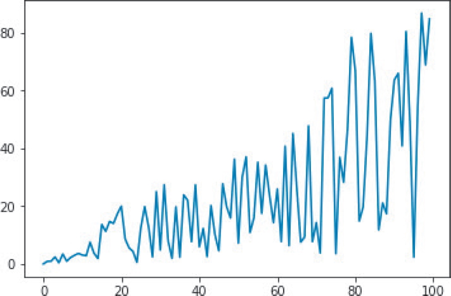

  > 折线图

- 箱型图: 使用 `boxplot` 方法绘制箱形图

  ```python
  plt.boxplot(y2)
  ```

  用箱形图输出 `y2` 的数据，如图所示

  箱形图是查看数据分布的优秀的可视化方法

  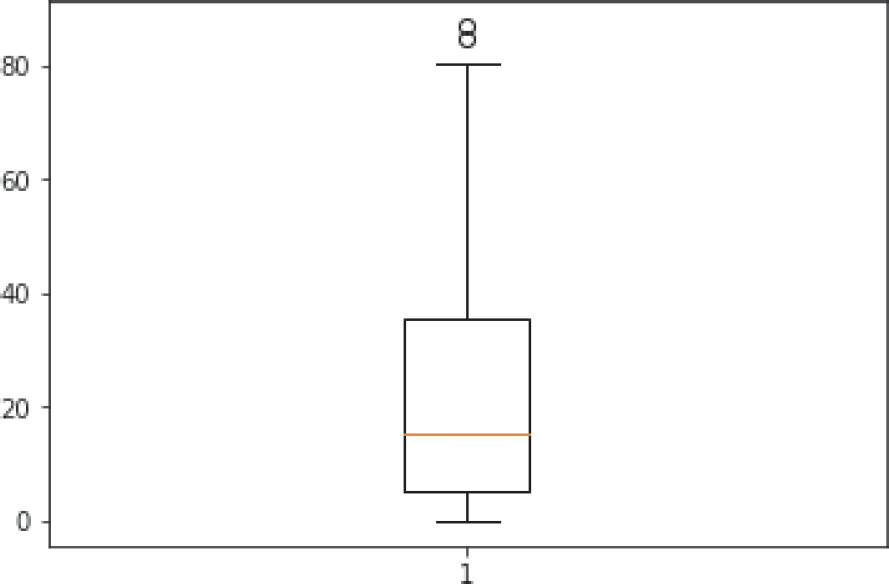

  > 箱形图

### 红酒数据集

下面对 scikit-learn 内置的红酒数据进行可视化

```python
from sklearn.datasets import load_wine
data = load_wine()
```

加载与红酒有关的数据，并将数据保存在变量 `data` 中

```python
x3 = data.data[:, [0]]
y3 = data.data[:, [9]]
```

将要显示的索引为 0 的 alcohol（酒精度）和索引为 9 的 color_intensity（色泽）数据分别赋值给 `x3` 和 `y3`

下面输出散点图

```python
plt.scatter(x3, y3)
```

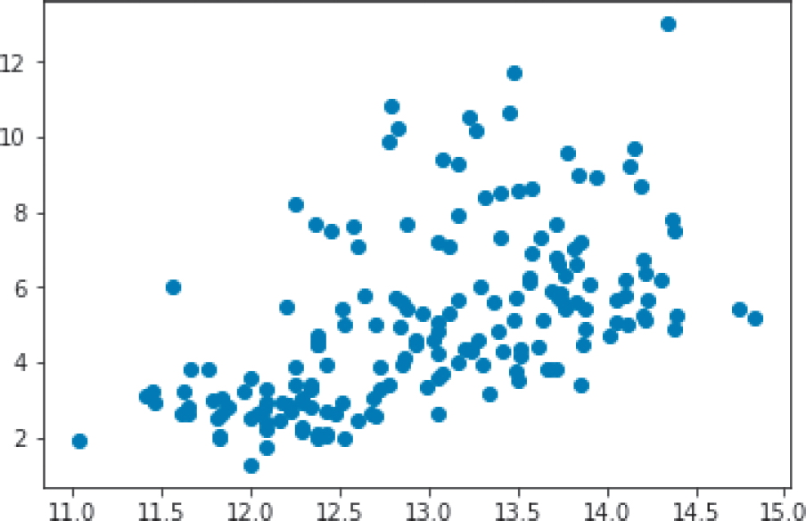

> 红酒数据集的散点图

下面输出 `y3` 的直方图

```python
plt.hist(y3, bins=5)
```


> $$y3$$ 的直方图

通过可视化查看与红酒数据集相关的两个图形，我们可以了解数据的特性

## 使用 pandas 理解和处理数据

> 在进行机器学习时，有时会查看特征值、对数据进行取舍选择或再加工等
>
> 下面将介绍如何使用 pandas 库的数据可视化的方便功能去了解数据的情况
>
> 已经知道 pandas 基本用法的读者和想先了解机器学习算法的读者，跳过这一部分也没关系

下面介绍使用 pandas 库进行数据可视化的方便功能

```python
import pandas as pd
```

上面的代码导入了常用于机器学习数据的变形等操作的 `pandas`

与 `numpy` 的 `np` 一样，习惯上用 `pd` 来调用它

```python
from sklearn.datasets import load_wine
data = load_wine()
df_X = pd.DataFrame(data.data, columns=data.feature_names)
```

然后将红酒数据转换为 pandas 的 DataFrame

DataFrame 可以方便地处理像 Excel 工作表那样的二维数据

`df_X` 是 DataFrame 形式的特征值

下面的代码调用 `head` 方法输出了数据集前 5 行的数据

用于查看数据集中包含了什么样的数据

```python
df_X.head()
```


> 红酒数据

接着将红酒数据的目标变量转换为 pandas 的 DataFrame

```python
df_y = pd.DataFrame(data.target, columns=["kind(target)"])
```

接下来看一下转换后的数据。做法和刚才相同：调用 `head` 方法

从表中可以看出，`df_y` 是名副其实的目标变量数据

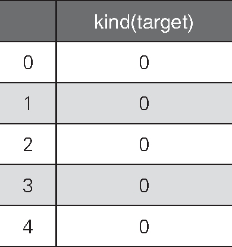

> 红酒数据的目标变量

```python
df_y.head()
```

为了便于使用，我们将这些数据合并在一起

下面使用 pandas 的 `concat` 将特征值 `df_X` 和目标变量 `df_y` 合并

```python
df = pd.concat([df_X, df_y], axis=1)
```

输出数据的前几行看看

下面的代码使用 `head` 方法输出了合并结果的前 5 行

这样就得到了包含特征值和目标变量的数据

```python
df.head()
```

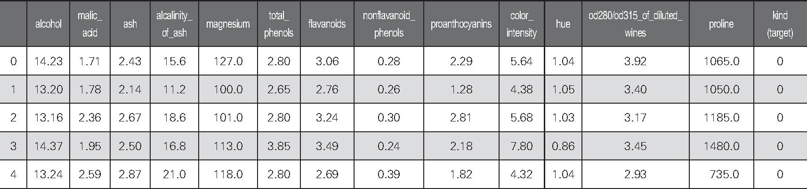

> 红酒数据的特征值和目标变量

接下来，通过可视化和数理统计来分析这份数据

下图是以直方图的形式输出的 alcohol 列的数据

由于下面的代码没有指定 `bins` 参数，所以程序使用默认的参数值 10，输出了有 10 个区间的直方图

```python
plt.hist(df.loc[:, "alcohol"])
```

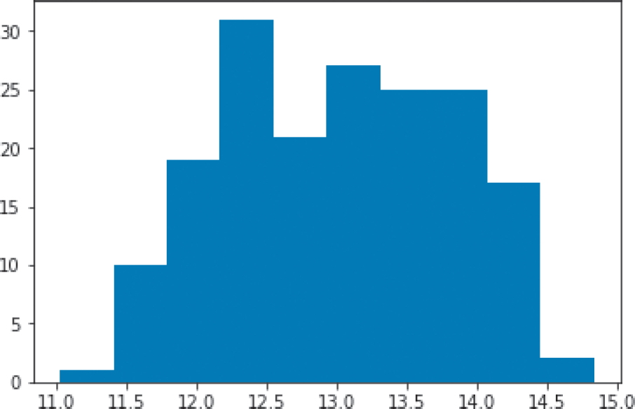

> 有 10 个区间的直方图

下图是以箱形图显示的同一个 alcohol 列的数据

接下来开始使用 pandas 的统计功能

```python
plt.boxplot(df.loc[:, "alcohol"])
```


> 以箱形图显示的 alcohol 列的数据

下面的代码使用 `corr` 方法汇总计算并输出了相关系数

相关系数越接近于 1，越表明数据之间是正相关关系；越接近于 -1，越表明数据之间是负相关关系

换言之，如果相关系数在 0 左右，表明数据列之间的相关性很低

```python
df.corr()
```


> 相关系数

下面再介绍一个查看数据情况的方法

`describe` 方法用于输出每列的统计信息

输出的统计信息从上到下依次为行数、平均值、标准差、最小值、25 百分位数、中位数、75 百分位数、最大值

从统计信息可以看出每列包含的数据具有何种特性、有没有缺损等信息

```python
df.describe()
```

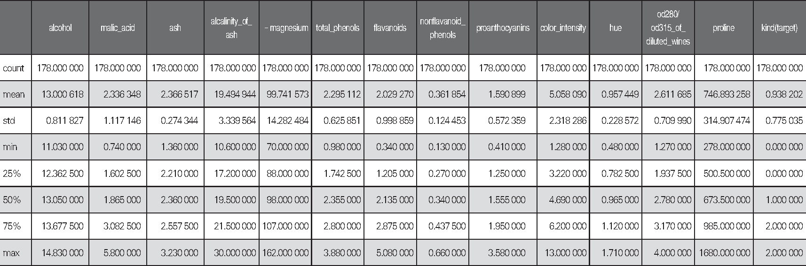

> 统计信息

下面使用 pandas 的功能将所有列之间的关系可视化

使用 `scatter_matrix` 输出散点图矩阵

这里将 14 列全都输出了出来

```python
from pandas.plotting import scatter_matrix
_ = scatter_matrix(df, figsize=(15, 15))
```

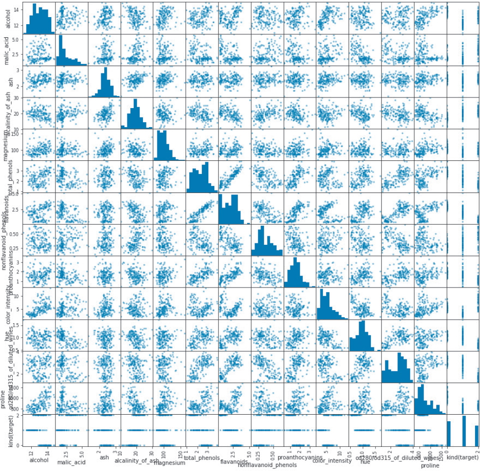

> 各列的关联性

下面只查看部分列的关联性

下列代码输出的是从所有散点图矩阵中选出的索引为 0 的列、索引为 9 的列和最后一列的关联性

通过像这样减少散点图矩阵输出的列，能够看出更细致的情况

```python
_ = scatter_matrix(df.iloc[:, [0, 9, -1]])
```

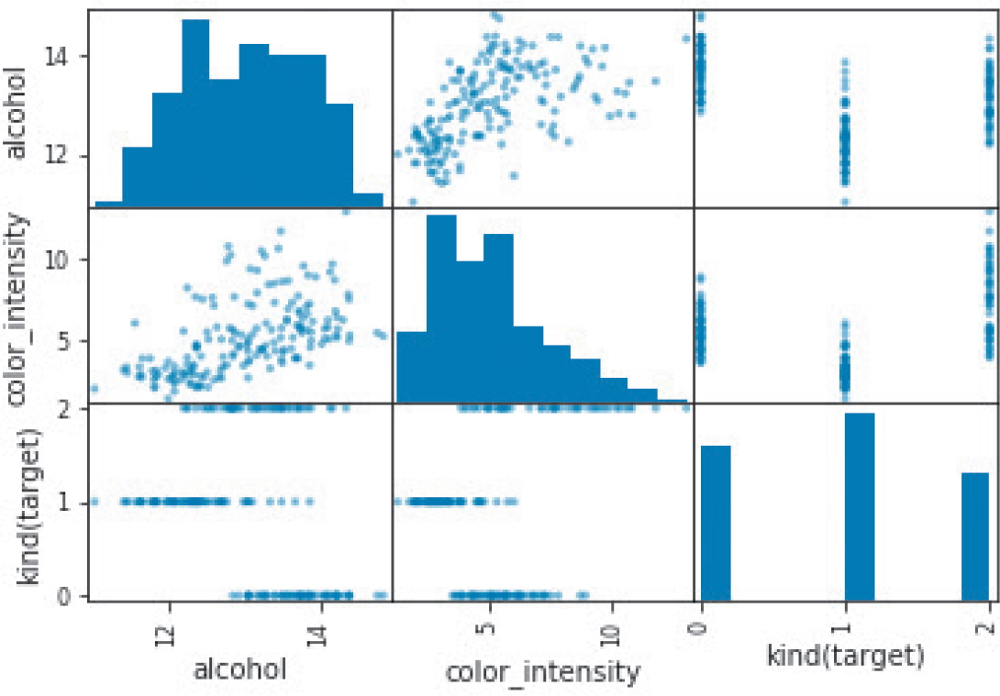

> 显示重要的关联性

