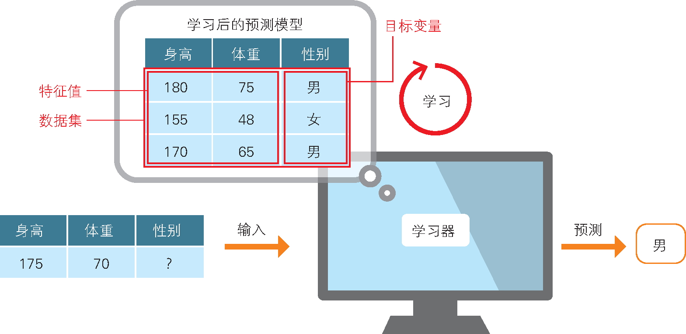
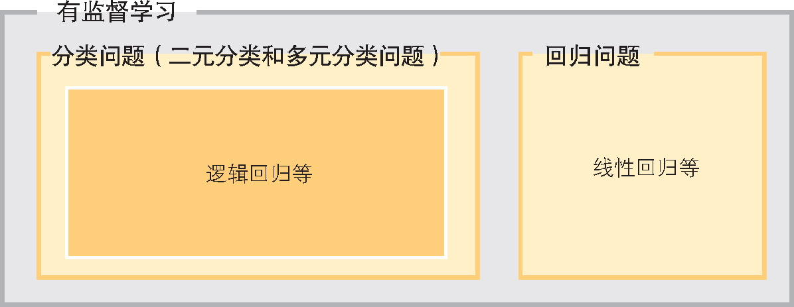
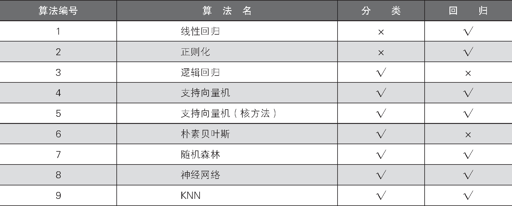
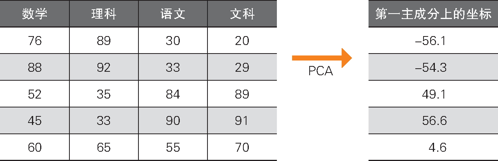
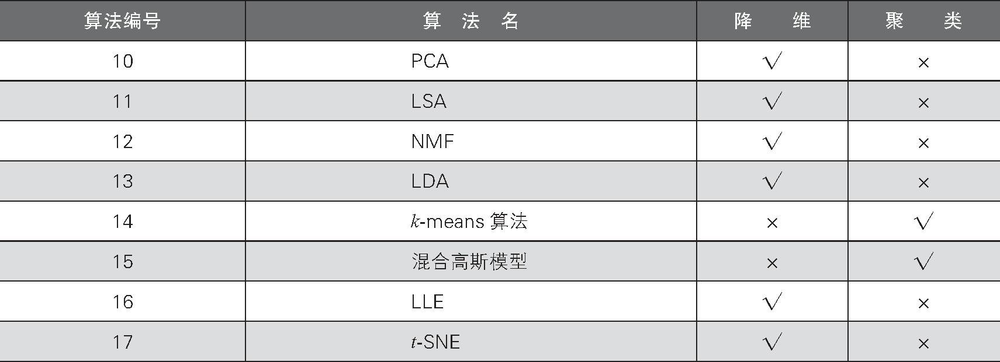

# 机器学习概要

## 什么是机器学习

**机器学习**指的是计算机根据给定的问题、课题或环境进行学习，并利用学习结果解决问题或课题等的一整套机制

> 分类的示意图

与机器学习共同成为热门话题的还有人工智能和深度学习。这里梳理一下它们之间的关系

**人工智能**的含义很广泛，是一个综合性系统

机器学习是实现人工智能的一种方法

也就是说，机器学习并非实现人工智能的唯一方法，但是近年来人工智能的研究一般使用机器学习

实现人工智能的方法还有很多，比如根据事先定好的规则进行数理统计预测等方法

> 机器学习的包含关系

近年来，一种被称为**深度学习**的机器学习算法备受关注，以至于出现了这样的误解：提起人工智能，人们想到的就是深度学习

然而，深度学习只不过是机器学习算法的其中一种而已

深度学习在图像识别领域取得了划时代的成果，是当前热门的算法

目前在图像识别领域之外，深度学习也取得了许多成绩

在进行机器学习时会用到各种各样的算法，需要根据机器学习对象的不同进行选择

本书的目标就是帮助读者学会选择合适的算法

在理解了各算法的特性后，读者就能实际处理机器学习问题了

## 机器学习的种类

机器学习包含不同的种类

根据不同的输入数据，分类如下:

- 有监督学习
- 无监督学习
- 强化学习

下面我们依次详细地看一下

### 有监督学习

**有监督学习**是将问题的答案告知计算机，使计算机进行学习并给出机器学习模型的方法

这种方法要求数据中包含表示特征的数据和作为答案的目标数据

如下图所示，已有表示特征的身高和体重数据，作为答案的数据是性别（男 / 女）

我们向计算机提供这些数据的组合，使计算机进行学习并给出预测模型

然后，将新的身高和体重数据提供给模型，由模型预测出性别

> 有监督分类的示意图

预测性别这样的类别的问题叫作**分类问题**

由于这次是将数据分类到两个类别中，所以叫**二元分类**；还有将数据分类到更多类别，比如 10 个类别的情况，这样的情况叫作**多元分类**

这种答案变量不是连续值，而是作为类别数据的离散值的问题就是分类问题

> 有监督学习的分类和回归的关系

此外，表示特征的数据叫作**特征值**或者**特征变量**，作为答案的数据叫作**目标变量**或者**标签**

我们身边的一个分类问题的例子就是垃圾邮件过滤

用户判断邮件是否为垃圾邮件的过程就是打标签的过程，标签数据就是目标变量，邮件的发件人和内容则为特征值

打了标签的数据越多，机器学习的效果就越好，得到的结果的精度越高

除了分类问题之外，有监督学习还包括**回归问题**

如下图所示，已有表示特征的性别和身高数据，以及答案数据——鞋的尺码

在分类问题中，男和女的标签分别被数值化为 0 和 1，这两个数值之间的大小关系是没有意义的

与之相对，鞋的尺码 26.5 cm 和 24 cm 之间的大小关系则是有意义的

对这样的数据进行预测的问题就是回归问题

在回归问题中，目标变量是作为连续值处理的，所以预测值有可能是 23.7 cm 这种不存在的尺码

> 回归问题的示意图

后面将详细介绍如下表所示的有监督学习的算法

> 有监督学习算法与分类和回归的应用范围

### 无监督学习

有监督学习是将特征值和目标变量（答案）作为一套数据进行学习的方法，而**无监督学习**的数据中没有作为答案的目标变量

有人可能会产生疑问：没有答案，该如何去学习呢？

无监督学习将表示特征的数据作为输入，通过将数据变形为其他形式或者找出数据中的部分集合，来理解输入数据的构造

此外，与有监督学习相比，无监督学习的结果难以解释，或者要求分析者基于经验加以主观的解释

有监督学习以“能否正确预测目标变量”为指标，相比之下，为了能够对结果进行解释，在进行无监督学习时，用户需要对输入数据的前提知识有一定程度的了解

这里举一个无监督学习的例子

我们思考一下对某个中学的学生成绩进行分析的场景

假设各科目之间存在着这样的关联性：擅长数学的学生也擅长理科，但不擅长语文和文科

对于这样的输入数据，在使用无监督学习的代表性算法主成分分析（Principal Component Analysis，PCA）时，我们引入了新的轴，以说明被称为第一主成分的数据

在第一主成分上的坐标可以解释为“小值表明该生擅长理科，大值表明该生擅长文科”，如下表所示，可以将数学、理科、语文、文科这 4 个特征值归纳在 1 个轴上加以展示

> PCA 的例子

这个例子使用 PCA 通俗易懂地解释了分析结果，但是需要根据输入数据选择合适的算法

近年来，无监督学习的研究在图像和自然语言处理方面取得了进展，是当前备受瞩目的领域

这里介绍的 PCA 属于**降维**算法

降维是以更少的特征值来理解数据的算法

无监督学习中也包括**聚类**算法

聚类是将数据分类为几个簇（相似数据的集合）的算法

人类很难直接理解多变量数据（由 3 个以上的变量构成的数据），通过聚类，数据能够以簇这种简单的形式进行展现

> 无监督学习的降维和聚类的关系

后面将详细介绍如下表所示的无监督学习的算法

通过下表，还可以了解每个算法适合的任务

> 无监督学习与降维和聚类的应用范围

### 强化学习

**强化学习**是以在某个环境下行动的智能体获得的奖励最大化为目标而进行学习的方法

*这里暂时未涉及强化学习*

这里简单地介绍一下强化学习

在主机游戏（环境）中，玩家（智能体）为了获得赛点（奖励）并取得最终的胜利，会无数次地重复尝试

我们也可以把强化学习看作有监督学习的目标变量被作为奖励提供的情况

拿主机游戏的例子来说，由于全部场景下所有操作的组合实在太多，很难通过人力进行评估，所以可以将游戏的场景和操作作为特征值，将游戏赛点作为目标变量，玩家无须依赖人力，通过无数次的游戏即可自行收集特征值和目标变量的数据组

强化学习在重复地玩游戏、查看结果中不断学习更恰当的行动

### 机器学习的应用

机器学习在各领域的应用都取得了较大进展，比如自动驾驶领域的研究就很有名

在文章的自动分类和自动翻译方面，机器学习成果颇丰

在医疗领域，机器学习对 X 射线影像的分析有助于疾病的早期发现

此外，很早之前人们就将机器学习应用在气象信息领域了

近年来，随着计算机越来越便宜，数量越来越多，机器学习的研究也在不断加速

互联网产业的发达和物联网（Internet of Things，IoT）等技术的应用也为机器学习带来了丰富的数据

根据数据的特性选择合适的算法，就会有前所未有的发现，这是机器学习领域有意思的地方

从下一节开始，我们将学习具体的机器学习步骤，目标是达到能对实际的数据应用机器学习的水平