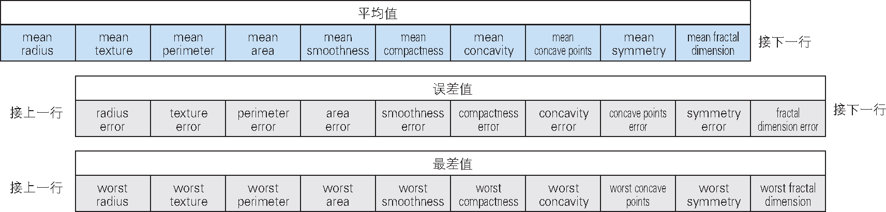

# 机器学习的步骤

机器学习具体要做哪些事情呢？本节的目标就是使读者了解机器学习的大致步骤。通过阅读本节，读者将对作为机器学习算法基础的处理流程有所理解，并学到机器学习的基本概念。

## 数据的重要性

在使用机器学习时，必须要有汇总并整理到一定程度的数据。以数据为基础，按规定的法则进行学习，最终才能进行预测。

没有数据，就不能进行机器学习。换言之，收集数据是首先要做的事情。本节将说明机器学习的训练过程的一系列流程。为了便于理解，本节基于示例数据进行讲解，使用的是主流机器学习库 **scikit-learn 包**内置的数据，这个数据便于入手，可自由使用。

> **专栏　数据收集、数据预处理的重要性**
>
> 在实际用机器学习解决问题之前，要先收集数据，有时还需要做问卷调查，甚至购买数据。然后，需要为收集到的数据人工标注答案标签，或者将其加工为机器学习算法易于处理的形式，删除无用的数据，加入从别的数据源获得的数据等。另外，基于平均值和数据分布等统计观点查看数据，或者使用各种图表对数据进行可视化，把握数据的整体情况也很重要。此外，有时还需要对数据进行正则化处理。
>
> 这些操作被称为数据预处理。有这样一种说法：机器学习工作 80% 以上的时间花在了数据预处理上。

> **专栏　scikit-learn 包**
>
> scikit-learn 是一个机器学习库，包含了各种用于机器学习的工具。
>
> 这个库以 BSD 许可证开源，谁都可以免费、自由地使用。在写作本书时（2019 年 3 月），它的最新版本是 0.20.3。scikit-learn 实现了许多有监督学习和无监督学习的算法，是一套包含了用于评估的工具、方便的函数、示例数据集等的工具套件。在机器学习领域，scikit-learn 已成为事实上的标准库，它具有两大优点：一是操作方法统一；二是易于在 Python 中使用。关于 Python 环境的设置和 scikit-learn 的安装方法，请参考第 5 章。

### 数据和学习的种类

前面说过，没有数据，就不能进行机器学习。具体来说，机器学习需要的是什么样的数据呢？

机器学习需要的是二维的表格形式的数据（根据解决问题的目的不同，存在例外的情况）。表格的列中含有表示数据本身特征的多种信息，行则是由多个信息构成的数据集。接下来，我们看一个更具体的例子：学校的某个社团有 4 名学生，下面的表 1-4 是每个学生的姓名、身高、体重、出生日期和性别信息的数据。


> **表格形式的学生数据**

我们思考一下用机器学习进行性别预测的问题。

因为要预测的是性别，所以性别列的男或女的数据就是预测对象。本书把预测对象的数据称为**目标变量**。不过，根据分类的场景的不同，有时也称为**标签**或**类别标签数据**，对应的英文单词为 target。

除了性别之外的 4 个列（姓名、身高、体重、出生日期）是用于预测的原始数据。本书将用于预测的原始数据称为**特征值**，根据场景的不同，有时也称为**特征变量**或**输入变量**，对应的英文单词为 feature。

### 了解示例数据

我们看一下 scikit-learn 包中内置的示例数据。这里显示了部分鸢尾花（iris）数据（表 1-5）。Python 生态圈中用于处理数据的工具有 pandas，它常与 scikit-learn 搭配使用。关于使用 pandas 处理数据的方法，请参考后文的“使用 pandas 理解和处理数据”部分。

下面输出数据的基本信息。

```python
import pandas as pd
from sklearn.datasets import load_iris
data = load_iris()
X = pd.DataFrame(data.data, columns=data.feature_names)
y = pd.DataFrame(data.target, columns=["Species"])
df = pd.concat([X, y], axis=1)
df.head()
```


> **部分鸢尾花数据**

列方向上有 sepal length（cm）、sepal width（cm）、petal length（cm）、petal width（cm）、Species 这 5 种信息，意思分别是鸢尾花的萼片长度、萼片宽度、花瓣长度、花瓣宽度、品种。前面 4 列是表示特征的特征值，最后 1 列是目标变量。在这个数据集中，目标变量的值为 0、1、2 这 3 个值之一。

本书在讲解的过程中使用了基于 scikit-learn 库编写的代码。下面将讲解 scikit-learn 的大致用法。不过本书不会全面讲解 scikit-learn 的功能。关于 scikit-learn 的详细信息，请参考官方文档和其他图书。

## 有监督学习（分类）的例子

本节将介绍基于有监督学习解决分类问题的实现方法。

下面依次来看例题和实现方法。

### 例题

例题采用的是美国威斯康星州乳腺癌数据集。这个数据集中包含 30 个特征值，目标变量的值为“良性”或者“恶性”。数据数量有 569 条，其中“恶性”（M）数据 212 条，“良性”（B）数据 357 条。换言之，这是根据 30 个特征值判断结果是恶性还是良性的二元分类问题。

下面看一下数据长什么样子（表 1-6）。


> **部分乳腺癌数据**

这份数据可以通过 scikit-learn 包读取。

```python
from sklearn.datasets import load_breast_cancer
data = load_breast_cancer()
```

这段代码用于导入 scikit-learn 内置的读取数据集的函数，并将所读取的数据保存在变量 `data` 中。

接下来，从数据集中取出特征值赋给 `X`，取出目标变量赋给 `y`。

```python
X = data.data
y = data.target
```

`X` 由多个特征值向量构成，我们将其作为矩阵处理，因此遵照惯例使用大写字母作为变量名。`y` 是目标变量的向量，其元素值的含义为：0 表示恶性（M），1 表示良性（B）。

`X` 是大小为 569 × 30 的数据，可将其看作 569 行 30 列的矩阵。虽然 `y` 是向量，但把它当作 569 行 1 列的矩阵后，`X` 和 `y` 的行就能一一对应了。比如特征值 `X` 的第 10 行与目标变量 `y` 的第 10 个元素相对应（图 1-7）。


> **与 `y` 的第 10 个元素对应**

要想详细了解这个数据集，需要具备相应的医学知识，但是这里我们仅将其作为数值，对其进行有监督学习的二元分类。特征值共有 30 个，分为平均值、误差值、最差值 3 类，每类包括 10 项，分别为半径、纹理、面积等。这次我们着眼于平均值、误差值、最差值这 3 类数据中的平均值（图 1-8）。



> **特征值的种类**

```python
X = X[:, :10]
```

这行操作使得只有平均值被重新赋值给了变量 `X`，用作特征值的数据现在缩减到了 10 项。

### 实现方法

下面趁热打铁，基于美国威斯康星州乳腺癌数据集创建并训练进行二元分类的模型。这里使用的分类算法是逻辑回归。虽然算法名中有“回归”二字，却能用于分类，详细内容请参考 2.3 节。

```python
from sklearn.linear_model import LogisticRegression
model = LogisticRegression()
```

> **注意**　在使用 scikit-learn 进行模型的初始化和训练时，读者有可能会看到输出的警告信息。警告信息是 FutureWarning，即对将来有可能会变更的功能的通知，在训练不收敛时有可能会出现。本书没有提及警告的输出，如果读者在实践中发现有警告输出，请根据警告内容采取相应的措施。

为了使用逻辑回归模型，上面的代码导入了 scikit-learn 的 `LogisticRegression` 类，然后创建了 `LogisticRegression` 类的实例，并将已初始化的模型赋给了 `model`。

```python
model.fit(X, y)
```

上面的代码使用 `model`（`LogisticRegression` 的实例）的 `fit` 方法训练模型，方法的参数是特征值 `X` 和目标变量 `y`。

在调用 `fit` 方法后，`model` 成为学习后的模型。

```python
y_pred = model.predict(X)
```

上面的代码使用学习后的模型 `model` 的 `predict` 方法对学习时用到的特征值 `X` 进行预测，并将预测结果赋给变量 `y_pred`。

### 评估方法

下面介绍分类的评估方法。

首先看一下正确率（详见第 4 章）。这里使用 scikit-learn 的 `accuracy_score` 函数查看正确率。

```python
from sklearn.metrics import accuracy_score
accuracy_score(y, y_pred)
```

```python
0.9086115992970123
```

代码的输出结果是学习后的模型预测的结果 `y_pred` 相对于作为正确答案的目标变量 `y` 的正确率。

这个验证通常应使用另外准备的一些不用于学习的数据来进行，否则会产生**过拟合**（overfitting）问题。过拟合是有监督学习的一个严重问题。有监督学习追求的是正确预测未知的数据，但是现在输出的正确率是使用学习时用过的数据计算出来的。这就意味着我们不知道模型对于未用于学习的未知数据的预测性能的好坏，不知道得到的学习后的模型是不是真正优秀。关于过拟合，详见 4.1 节的“模型的过拟合”部分。

关于评估方法，还有其他问题需要考虑。比如，只看正确率就能判断结果是否正确吗？根据数据的特性不同，有些情况下不能保证分类是正确的。这次用的数据中有“恶性”数据 212 条，“良性”数据 357 条，可以说是在一定程度上均衡的数据。

对于“良性”“恶性”极不均衡的数据，光看正确率无法判断结果是否正确。我们再以另外一组数据为例，看一下 30 岁~ 39 岁人群的癌症检测数据。通常来说，诊断为恶性的数据只占整体的百分之几，大多数人没有肿瘤或者肿瘤是良性的。对于这样的数据，如果模型将所有的样本都判断为良性的，那么尽管正确率很高，但光看正确率也不能正确评估这个模型（图 1-9）。


> **光看正确率无法正确评估模型**

关于这些内容，第 4 章会详细介绍。

## 无监督学习（聚类）的例子

下面看一下无监督学习的聚类问题的实现方法的各个步骤。与前面一样，这里我们也使用 scikit-learn 包。

### 例题

例题采用的是 scikit-learn 包内置的与葡萄酒种类有关的数据集。这个数据集有 13 个特征值，目标变量是葡萄酒种类（表 1-7）。由于这次介绍的是无监督学习的聚类算法，所以不使用目标变量。简单起见，本次只使用 13 个特征值中的 alcohol（酒精度）和 color_intensity（色泽）两个特征值（表 1-8）。我们对这个数据集应用 $$k - means$$ 聚类算法，将其分割为 3 个簇。


> **葡萄酒数据的特征值**


> **本次使用的两个特征值**

下面使用 scikit-learn 包加载这个数据集。

```python
from sklearn.datasets import load_wine
data = load_wine()
```

上面的代码用于导入 scikit-learn 内置的读取葡萄酒数据集的函数，并将读取的数据保存在变量 `data` 中。

接着，仅从数据集中选择 alcohol 列和 color_intensity 列作为特征值赋给 `X`。这么做是为了在显示结果时，只用二维图形对结果进行可视化。

```python
X = data.data[:, [0, 9]]
```

特征值 `X` 是 178 行 2 列的数据。

### 实现方法

下面使用 $$k - means$$ 算法实现聚类。

```python
from sklearn.cluster import KMeans
n_clusters = 3
model = KMeans(n_clusters=n_clusters)
```

上面的代码导入并使用了实现 $$k - means$$ 算法的 `KMeans` 类。

初始化 `KMeans` 类，把它作为学习前的模型赋给变量 `model`。通过 `n_clusters` 参数，指示模型将数据分为 3 个簇。

```python
pred = model.fit_predict(X)
```

上面的代码用于向学习前的模型 `model` 的 `fit_predict` 方法传入特征值数据。预测结果赋给变量 `pred`。

下面看一下赋给 `pred` 的数据是如何聚类的。

### 查看结果

这里将聚类的结果可视化。

由于本次使用的特征值只有两种，所以绘制二维图形即可实现结果的可视化。图 1-10 是以图形展示的聚类结果。图形中每个数据点对应的是一种葡萄酒。从数据点的颜色可以看出每种酒属于哪个簇。3 个黄色的星星是各个簇的重心，是这 3 个簇的代表点。


> **特征值的可视化**

原本以酒精度、色泽变量表示的葡萄酒，现在以“属于哪个簇”这种简洁直观的形式展示了出来。此外，要想了解各个簇具有什么特征，只需查看作为代表点的重心的值即可。比如，第 3 个簇的特点是“酒精度低、色泽淡”。

通过 $$k-means$$ 算法实现的聚类是以“将酒精度百分之多少以上的数据分到第 1 个簇”之类的规则进行聚类的，这些规则不是由人预先设置的，而是由算法自动进行聚类得出的。这一点很重要，说明这个算法具有通用性，可应用于葡萄酒之外的数据。

无监督学习的评估方法将在第 3 章介绍各个算法时进行说明，请参考相应内容。

## 可视化

可视化是利用图形等把握数据的整体情况的方法。在机器学习领域中，许多场景下需要进行可视化。有时用于了解数据的概况，有时用于以图形展示机器学习的结果。

这里介绍一下使用 Python 进行可视化的方法，书中也将展示作为可视化结果的图形等。

### 工具介绍

这里使用常用的 Python 可视化工具 Matplotlib。Matplotlib 具有许多可视化功能。在可视化时，为了使图形美观，需要编写多行 Python 代码来设置坐标轴、标签、布局和配色等。代码行数的增加容易让人觉得晦涩难懂，但其实用于输出图形的重要部分的代码只有寥寥几行。

在使用 Matplotlib 实现可视化后，我们就能很容易地把握数据的偏差和特征等信息，所以要掌握它的用法。

Python 的可视化工具不只有 Matplotlib，还有以下几种。

- pandas: pandas 是处理数组数据的库，也具有可视化功能。
- seaborn: seaborn 在 Matplotlib 的基础上强化了表现力，用起来更简单。
- Bokeh: Bokeh 使用了 JavaScript，可用于显示动态图形。

### 在浏览器上显示

使用 Jupyter Notebook 可以简单地在浏览器上显示数据的可视化结果。

Jupyter Notebook 是在 Web 浏览器上运行 Python 等语言代码的环境（图 1-11）。


> **在 Jupyter Notebook 上运行 Python 代码**

下面依次来看一下例题及其实现。

在 Jupyter　Notebook 上运行 Python 程序，进行机器学习的实验。Jupyter Notebook 不仅能运行 Python，还可以作为 R 等语言的运行环境。

关于 Jupyter Notebook 的安装和环境设置方法，请参考第 5 章。

### 启动方法

在 Jupyter Notebook 安装成功后，就可以使用 `jupyter` 命令了。我们可以从命令提示行和终端运行 `jupyter notebook` 命令。

```shell
$ jupyter notebook
```

在命令运行后，浏览器将自动打开，显示已运行的当前目录的文件或文件夹（图 1-12）。在 Web 浏览器上的单元格内输入程序代码后，页面上将显示运行结果。运行结果为 notebook 格式的文件，以 .ipynb 扩展名保存。用户还可以在自己的计算机上打开其他人创建的 .ipynb 文件，按顺序执行每个单元格并查看其运行结果。也可以查看中间处理的变量，改变条件再次运行以查看不同的结果。


> **显示文件列表**

此外，把这种文件提交到 GitHub 后，不仅可以分享运行结果，还可以在 GitHub 上以图形显示运行结果。

### 用法

从右上角的 New 菜单选择 Python 3，可新建 notebook 格式的文件（图 1-13）。


> **新建 notebook 文件**

Web 浏览器将打开新建的文件。

在叫作单元格的输入框里编写程序代码。此外，单元格有不同的种类，可通过界面上的 Code 和 Markdown 等下拉菜单决定单元格的作用。默认选项是 Code，系统将其识别为可运行的单元格（图 1-14）。


> **可运行的 notebook**

在单元格内输入程序代码后，使用 Enter 键在单元格内换行，使用 Ctrl 和 Enter 组合键运行程序代码。另外，可使用 Shift 和 Enter 组合键运行程序代码，并移动到下一个单元格。

点击上部的标题 Untitled，可修改文件的标题（图 1-15）。Jupyter Notebook 会自动在此处确定的标题后附加扩展名 .ipynb，以此作为文件名创建文件。


> **修改 notebook 的标题**

从菜单选择 Save and Checkpoint，可保存当前的状态。

上面简要地介绍了 Jupyter Notebook 的使用方法。除此之外，它还有很多方便的用法，感兴趣的读者可参考官网、相关的文章和图书。

## 图形的种类和画法：使用 Matplotlib 显示图形的方法

### 在页面上显示图形

在 Jupyter Notebook 页面上可显示图形。在 Code 单元格内，运行 `%matplotlib inline` 这个以 `%` 开始的“魔法”命令后，即使不运行后面将介绍的 `show`方法，页面上也会输出图形（图 1-16）。


> **在 notebook 内显示图形**

下面看一下图 1-16 中的代码。

```python
import numpy as np
import matplotlib.pyplot as plt
```

上面的代码为了生成数据而导入了 `numpy`，为了显示图形而导入了 `matplotlib`。NumPy 是以数组形式处理数据并进行高效计算的 Python 第三方包。习惯上分别以别名 `np` 和 `plt` 调用 `numpy` 和 `matplotlib` 的 `pyplot`。

下面以 sin 曲线为例，显示其图形。

```python
x1 = np.linspace(-5, 5, 101)
y1 = np.sin(x1)
```

- `x1` 中保存的是为显示 sin 曲线而生成的从 -5 到 5 的 101 个数据。
- `y1` 中保存的是使用 NumPy 的 `sin` 函数生成的数据。

下面以用 Matplotlib 绘制 sin 曲线的图形为例进行说明。

最简单的显示图形的方法是 `plt.plot(x1, y1)`（图 1-17）。

```python
plt.plot(x1, y1)
```


> **sin 曲线的图形**

下面介绍使用 Matplotlib 绘制图形的代码的标准写法。前面只是简单地调用了 `plt.plot`，这种做法没有明确输出对象，只是声明“在这里绘图”，比较粗糙。严密的做法应为先创建要绘制的对象，再输出图形，代码及图形如下（图 1-18）。

```python
fig, ax = plt.subplots()
ax.set_title("Sin")
ax.set_xlabel("rad")
ax.plot(x1, y1)
handles, labels = ax.get_legend_handles_labels()
ax.legend(handles, labels)
plt.show()
```


> **先创建对象再输出图形**

上面的代码包含了显示标签和坐标轴名称等信息的处理，因此变成了 7 行，但其中用于显示图形的主要代码只有 `ax.plot(x1, y1)` 一行。虽然这种方法更受欢迎，不过如果要输出简单的图形，可以使用 `plt.plot(x1, y1)` 形式。请记住，方法共有两种：一种是 `plt.plot` 这种简易方法；另一种是 `ax.plot` 这种严密地面向对象进行声明的方法。最后运行 `plt.show()`。如果已运行魔法命令 `%matplotlib inline`，那就不用特意调用 `show` 了。为了使代码在 Jupyter Notebook 之外的环境中也能输出图形，这里特意编写了这一行代码。不管写不写这行代码，图形都会在 Jupyter Notebook 中显示。

### 绘制各种图形

首先生成用于显示图形的数据。

```python
x2 = np.arange(100)
y2 = x2 * np.random.rand(100)
```

`x2` 中保存的是元素为“从 0 到 99 的整数”的数组。

`y2` 中保存的是元素为“在从 0 到 1 的范围内随机选出的 100 个数据”的数组与刚才的变量 `x2` 相乘的结果。

下面将使用这两个变量绘制各种图形。

接下来要展示的是通过 `plt` 变量声明图形形式的简易方法的示例。对于前面代码中明示图形位置的 `ax` 变量，我们也可以用同样的方式输出其图形。

- 散点图: 使用 `scatter` 方法绘制散点图。

  ```python
  plt.scatter(x2, y2)
  ```

  `x2` 和 `y2` 的散点图如图 1-19 所示。

  

  > **散点图**

- 直方图: 使用 `hist` 方法绘制直方图。

  ```python
  plt.hist(y2, bins=5)
  ```

  设 `y2` 的直方图的 `bin` 为 5，输出的图形如图 1-20 所示。

  

  > **直方图**

- 柱状图: 使用 `bar` 方法绘制柱状图。

  ```python
  plt.bar(x2, y2)
  ```

  输出的柱状图如图 1-21 所示。

  

  > **柱状图**

- 折线图: 使用 `plot` 方法绘制折线图。

  ```python
  plt.plot(x2, y2)
  ```

  `x2` 和 `y2` 的折线图如图 1-22 所示。

  

  > **折线图**

- 箱型图: 使用 `boxplot` 方法绘制箱形图。

  ```python
  plt.boxplot(y2)
  ```

  用箱形图输出 `y2` 的数据，如图 1-23 所示。箱形图是查看数据分布的优秀的可视化方法。

  

  > **箱形图**

### 红酒数据集

下面对 scikit-learn 内置的红酒数据进行可视化。

```python
from sklearn.datasets import load_wine
data = load_wine()
```

加载与红酒有关的数据，并将数据保存在变量 `data` 中。

```python
x3 = data.data[:, [0]]
y3 = data.data[:, [9]]
```

将要显示的索引为 0 的 alcohol（酒精度）和索引为 9 的 color_intensity（色泽）数据分别赋值给 `x3` 和 `y3`。

下面输出散点图（图 1-24）。

```python
plt.scatter(x3, y3)
```


> **红酒数据集的散点图**

下面输出 `y3` 的直方图（图 1-25）。

```python
plt.hist(y3, bins=5)
```


> $$y3$$ 的直方图

通过可视化查看与红酒数据集相关的两个图形，我们可以了解数据的特性。