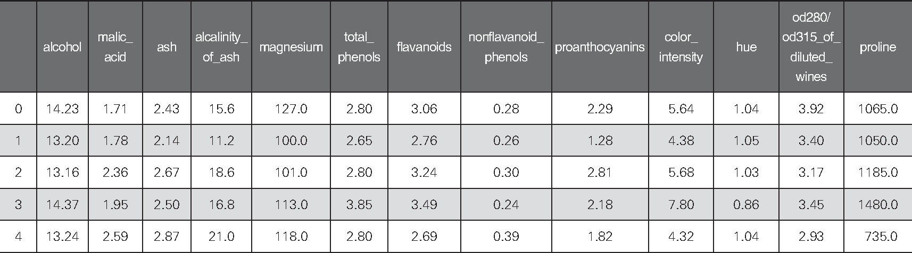
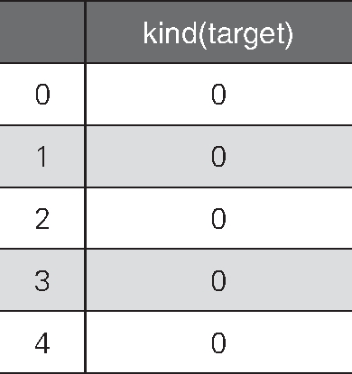
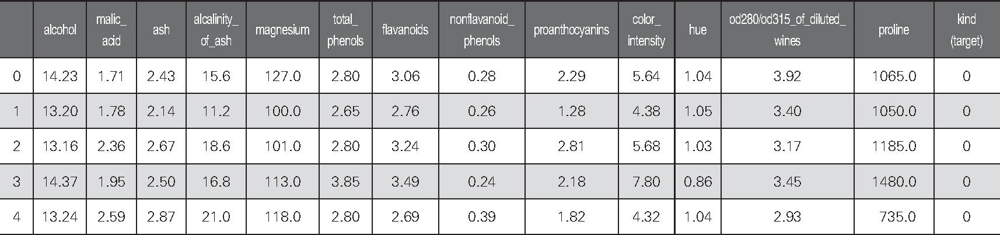
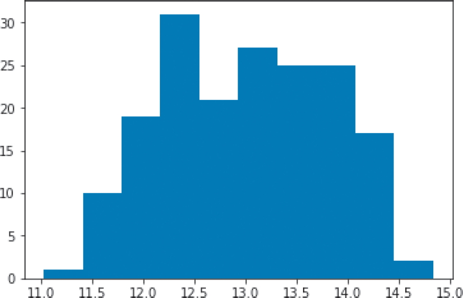
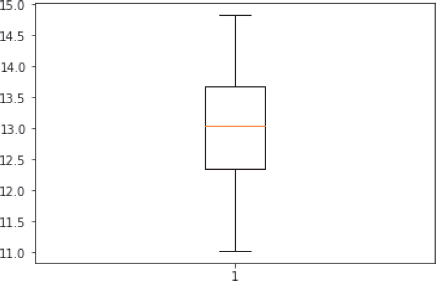
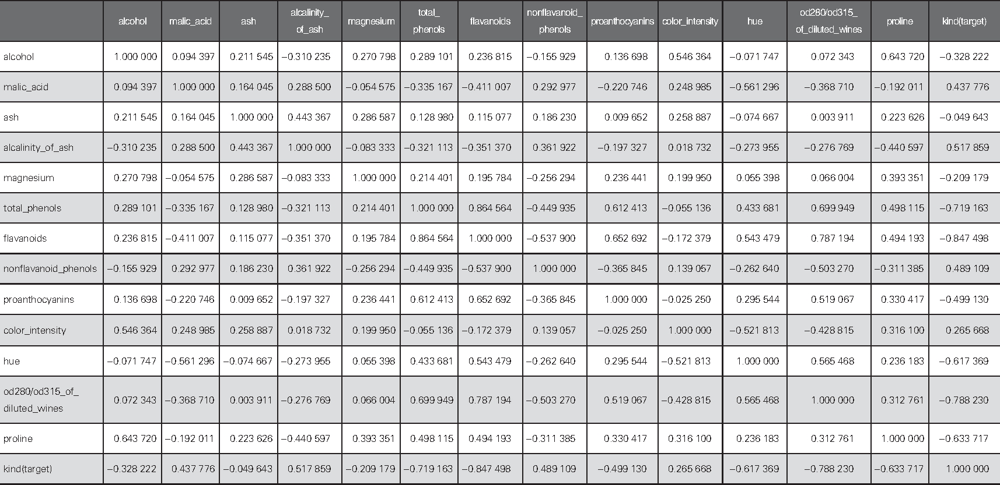
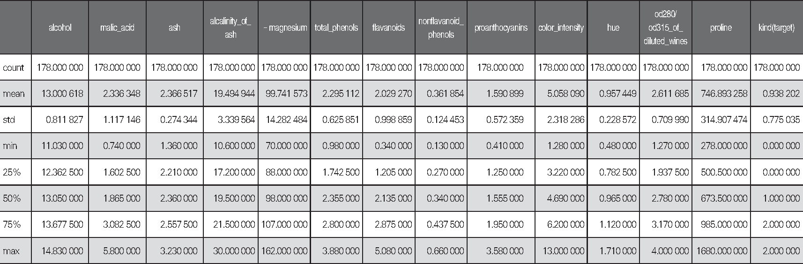
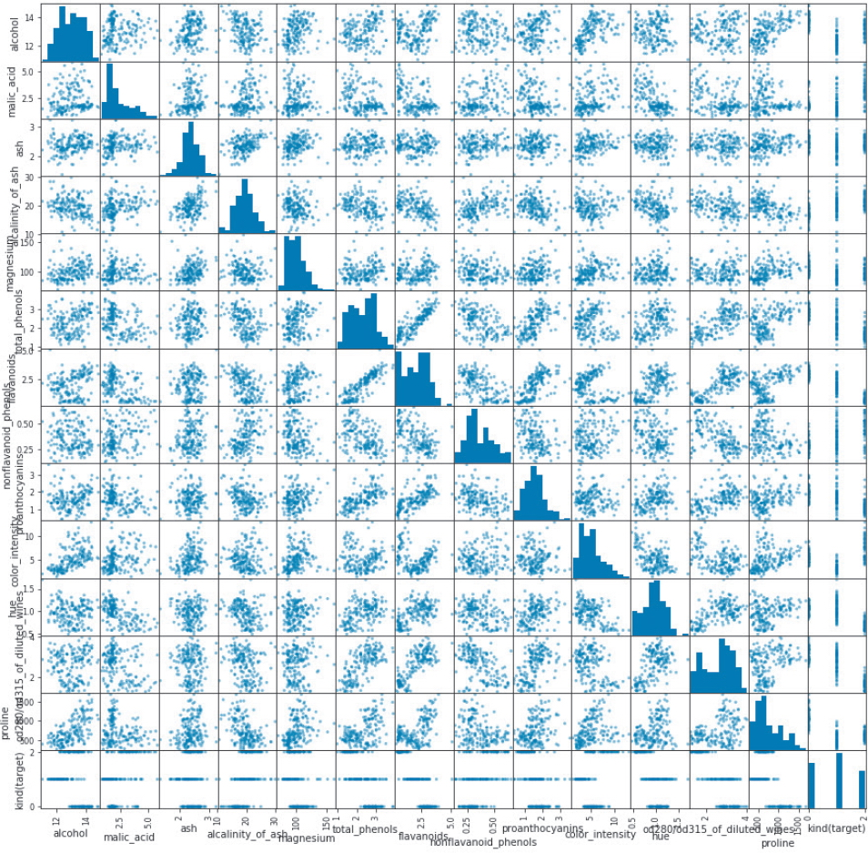
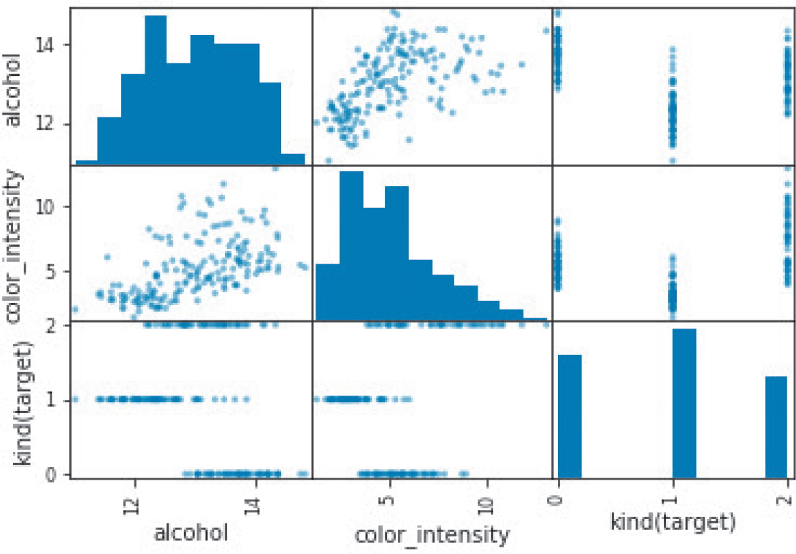

# 机器学习的步骤(第二部分)

## 使用 pandas 理解和处理数据

> **注意**　在进行机器学习时，有时会查看特征值、对数据进行取舍选择或再加工等。下面将介绍如何使用 pandas 库的数据可视化的方便功能去了解数据的情况。已经知道 pandas 基本用法的读者和想先了解机器学习算法的读者，跳过这一部分也没关系。

下面介绍使用 pandas 库进行数据可视化的方便功能。

```python
import pandas as pd
```

上面的代码导入了常用于机器学习数据的变形等操作的 `pandas`。与 `numpy` 的 `np` 一样，习惯上用 `pd` 来调用它。

```python
from sklearn.datasets import load_wine
data = load_wine()
df_X = pd.DataFrame(data.data, columns=data.feature_names)
```

然后将红酒数据转换为 pandas 的 DataFrame。

DataFrame 可以方便地处理像 Excel 工作表那样的二维数据。`df_X` 是 DataFrame 形式的特征值。

下面的代码调用 `head` 方法输出了数据集前 5 行的数据（表 1-9），用于查看数据集中包含了什么样的数据。

```python
df_X.head()
```



> **红酒数据**

接着将红酒数据的目标变量转换为 pandas 的 DataFrame。

```python
df_y = pd.DataFrame(data.target, columns=["kind(target)"])
```

接下来看一下转换后的数据。做法和刚才相同：调用 `head` 方法。从表 1-10 中可以看出，`df_y` 是名副其实的目标变量数据。



> **红酒数据的目标变量**

```python
df_y.head()
```

为了便于使用，我们将这些数据合并在一起。下面使用 pandas 的 `concat` 将特征值 `df_X` 和目标变量 `df_y` 合并。

```python
df = pd.concat([df_X, df_y], axis=1)
```

输出数据的前几行看看。下面的代码使用 `head` 方法输出了合并结果的前 5 行（表 1-11）。这样就得到了包含特征值和目标变量的数据。

```python
df.head()
```



> **红酒数据的特征值和目标变量**

接下来，通过可视化和数理统计来分析这份数据。

图 1-26 是以直方图的形式输出的 alcohol 列的数据。由于下面的代码没有指定 `bins` 参数，所以程序使用默认的参数值 10，输出了有 10 个区间的直方图。

```python
plt.hist(df.loc[:, "alcohol"])
```



> **有 10 个区间的直方图**

图 1-27 是以箱形图显示的同一个 alcohol 列的数据。接下来开始使用 pandas 的统计功能。

```python
plt.boxplot(df.loc[:, "alcohol"])
```



> **以箱形图显示的 alcohol 列的数据**

下面的代码使用 `corr` 方法汇总计算并输出了相关系数（表 1-12）。相关系数越接近于 1，越表明数据之间是正相关关系；越接近于 -1，越表明数据之间是负相关关系。换言之，如果相关系数在 0 左右，表明数据列之间的相关性很低。

```python
df.corr()
```



> **相关系数**

下面再介绍一个查看数据情况的方法。

`describe` 方法用于输出每列的统计信息。输出的统计信息从上到下依次为行数、平均值、标准差、最小值、25 百分位数、中位数、75 百分位数、最大值（表 1-13）。从统计信息可以看出每列包含的数据具有何种特性、有没有缺损等信息。

```python
df.describe()
```



> **统计信息**

下面使用 pandas 的功能将所有列之间的关系可视化（图 1-28）。

使用 `scatter_matrix` 输出散点图矩阵。这里将 14 列全都输出了出来（图 1-28）。

```python
from pandas.plotting import scatter_matrix
_ = scatter_matrix(df, figsize=(15, 15))
```



> 各列的关联性

下面只查看部分列的关联性。

下列代码输出的是从所有散点图矩阵中选出的索引为 0 的列、索引为 9 的列和最后一列的关联性（图 1-29）。通过像这样减少散点图矩阵输出的列，能够看出更细致的情况。

```python
_ = scatter_matrix(df.iloc[:, [0, 9, -1]])
```



> 显示重要的关联性