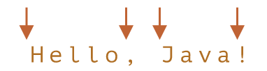

# 单词边界

词边界 `\b` 是一种检查, 就像 `^` 和 `$` 一样, 当正则表达式引擎遇到 `\b` 时, 它会检查字符串中的位置是否是词边界, 有三种不同的位置可作为词边界:

- 在字符串开头, 如果第一个字符是单词字符 `\w`
- 在字符串中的两个字符之间, 其中一个是单词字符 `\w`, 另一个不是
- 在字符串末尾, 如果最后一个字符是单词字符 `\w`

例如, 可以在 `Hello, Java!` 中找到匹配 `\bJava\b` 的单词, 其中 `Java` 是一个独立的单词, 而在 `Hello, JavaScript!` 中则不行

```javascript
alert( "Hello, Java!".match(/\bJava\b/) ); // Java
alert( "Hello, JavaScript!".match(/\bJava\b/) ); // null
```

在字符串 `Hello, Java!` 中, 以下位置对应于 `\b`:



因此, 它与模式 `\bHello\b` 相匹配, 因为:

1. 字符串的开头符合第一种检查 `\b`
2. 然后匹配了单词 `Hello`
3. 然后与 `\b` 再次匹配, 因为我们在 `o` 和一个空格之间

模式 `\bJava\b` 也同样匹配, 但 `\bHell\b`(因为 `l` 之后没有词边界)和 `Java!\b`(因为感叹号不是单词 `\w`, 所以其后没有词边界)却不匹配

```javascript
alert( "Hello, Java!".match(/\bHello\b/) ); // Hello
alert( "Hello, Java!".match(/\bJava\b/) );  // Java
alert( "Hello, Java!".match(/\bHell\b/) );  // null (no match)
alert( "Hello, Java!".match(/\bJava!\b/) ); // null (no match)
```

`\b` 既可以用于单词, 也可以用于数字; 例如, 模式 `\b\d\d\b` 查找独立的两位数, 换句话说, 它查找的是两位数, 其周围是与 `\w` 不同的字符, 例如空格或标点符号(或文本开头或结尾)

```javascript
alert( "1 23 456 78".match(/\b\d\d\b/g) ); // 23,78
alert( "12,34,56".match(/\b\d\d\b/g) ); // 12,34,56
```

> 词边界 `\b` 不适用于非拉丁字母, 词边界测试 `\b` 检查位置的一侧是否匹配 `\w`, 而另一侧则不匹配 `\w`, 但是, `\w` 表示拉丁字母 `a-z`(或数字或下划线), 因此此检查不适用于其他字符, 如西里尔字母或象形文字
>

下面我们编写一个正则表达式来在字符串 `Breakfast at 09:00 in the room 123:456.` 中查找时间

> 时间的格式是: `hours:minutes`, 小时和分钟都是两位数, 如 `09:00`
>
> 在这里没有必要校验时间的正确性, 所以 `25:99` 也可算做有效的结果, 不能匹配 `123:456`

```javascript
alert( "Breakfast at 09:00 in the room 123:456.".match( /\b\d\d:\d\d\b/ ) ); // 09:00
```

