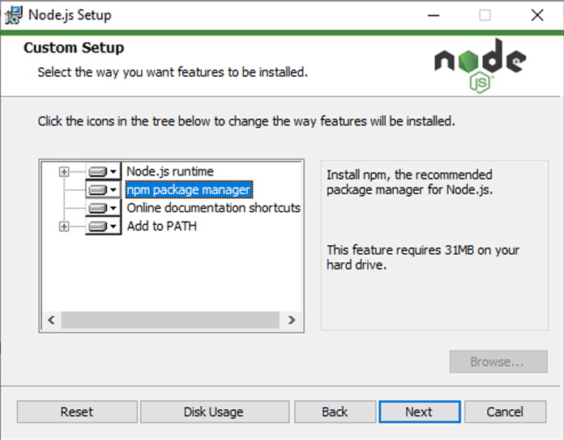

# 添加工具

现在我们已经了解了系统自带的一些内置命令，让我们看看如何安装和使用第三方CLI工具

目前，用于前端web开发的可安装工具的巨大生态系统主要存在于内部 npm, 与Node.js紧密合作的私有的包托管服务

随着时间的推移，您可以看到更多的包提供者

安装 Node.js 还要安装npm命令行工具(以及一个以npm为中心的补充工具npx)，它提供了安装其他命令行工具的网关

npm在所有系统上都能工作: macOS、Windows和Linux

现在在您的系统上安装npm，转到上面的URL，下载并运行适合您的操作系统的Node.js安装程序

如果出现提示，请确保将npm作为安装的一部分



尽管我们将在下一篇文章中讨论许多不同的工具，但我们将继续深入研究 Prettier

Prettier是一种固执己见的代码格式化程序，它只有“很少的选择”

更少的选择往往意味着更简单

考虑到工具在复杂性方面有时会失控，“很少的选项”可能非常有吸引力

## 在哪里下载我们的CLI工具？

在开始安装Prettier之前，有一个问题需要回答：“我们应该安装到哪里?”

用`npm` 我们可以选择在全局安装工具，因此我们可以在任何地方或本地访问当前项目目录

每种方式各有利弊 — 而这张全局安装的利弊清单还远远不够详尽：

| 全局安装的优点       | 全局安装的缺点                                               |
| :------------------- | :----------------------------------------------------------- |
| 任何地方在您的终端   | 可能与您项目的代码库不兼容                                   |
| 只下载一次           | 您团队中的其他开发人员无法使用这些工具，例如，如果您通过git这样的工具共享代码仓库 |
| 使用较少的磁盘空间   | 与前一点相关的是，它使得项目代码更难复制(如果您在本地安装工具，可以将它们设置为依赖项并使用npm进行安装(`npm install`) |
| 总是相同的版本       |                                                              |
| 就像任何其他unix命令 |                                                              |

尽管缺点清单比较短，但是全局安装的负面影响可能要比好处大得多

然而，现在我们宁可追求简单，而采用全局安装来保持简单

在下一篇文章中，我们将进一步了解本地安装以及它们的优点

## 下载 Prettier

对于本文，我们将安装Prettier作为全局命令行实用程序

Prettier是一款专门为前端开发人员设计的代码格式化工具，专注于基于javascript的语言，并增加了对HTML、CSS、SCSS、JSON等的支持。Prettier 能够:

- 省去了在所有代码文件中手动保持样式一致的认知开销;Prettier可以自动为您完成此操作
- 帮助Web新手以最佳方式完成他们的代码
- 安装在任何操作系统上，甚至直接作为项目工具的一部分，以确保从事您的代码工作的同事和朋友使用您正在使用的代码风格
- 配置为在保存时运行、在键入时运行，甚至在发布代码之前运行(使用稍后将在模块中看到的其他工具）

安装node之后，打开终端并运行以下命令来安装prettier程序：

```
npm install --global prettier
```

命令运行完成后，Prettier工具现在可以在终端中的文件系统中的任何位置使用

与许多其他命令一样，不带任何参数运行该命令将提供用法和帮助信息

现在试试这个

```
prettier
```

输出应该是这样的

```
Usage: prettier [options] [file/dir/glob ...]

By default, output is written to stdout.
Stdin is read if it is piped to Prettier and no files are given.

…
```

即使它很长，至少浏览一下使用信息也是值得的

它将帮助您更好地理解如何使用该工具

## 尝试 Prettier

让我们快速演示一下Prettier，这样您就可以看到它是如何工作的

首先，在文件系统中容易找到的地方创建一个新目录

可能是一个叫做`prettier-test` 的新目录

现在将以下代码保存在一个名为`index.js`, 在测试目录中:

```javascript
const myObj = {
a:1,b:{c:2}}
function printMe(obj){console.log(obj.b.c)}
printMe(myObj)
```

我们可以在代码基上运行得更好，以检查我们的代码是否需要调整

cd到您的目录中，并尝试运行此命令：

```
prettier --check index.js
```

你的产出应该是：

```
Checking formatting...
index.js
Code style issues found in the above file(s). Forgot to run Prettier?
```

有些代码样式是可以修改的

没有问题

添加 `--write` 命令将修复这些问题，让我们专注于实际编写有用的代码

现在尝试运行这个版本的命令：

```
prettier --write index.js
```

你可能得到这样的输出：

```
Checking formatting...
index.js
Code style issues fixed in the above file(s).
```

但更重要的是，如果你回头看你的JavaScript文件，你会发现它被重新格式化成这样：

```javascript
const myObj = {
  a: 1,
  b: { c: 2 },
};
function printMe(obj) {
  console.log(obj.b.c);
}
printMe(myObj);
```

根据您的工作流(或您选择的工作流)，您可以将其作为流程的自动化部分

自动化确实是工具的优势所在;我们的个人偏好是那种无需配置任何东西就能“自动发生”的自动化

使用Prettier有许多实现自动化的方法，尽管它们超出了本文的范围，但是有一些很好的在线资源可以提供帮助(已经链接到其中一些)

您可以调用 prettier：

- 在将代码提交到git存储库之前，使用Husky
- 当你在代码编辑器中点击“保存”的时候，无论是VS Code, Atom, 或Sublime Text
- 作为持续集成检查的一部分，可以使用以下工具Github Actions

我们个人的偏好是第二个当使用VS Code时，Prettier会启动并清理每次我们点击保存时需要做的格式化

关于以不同方式使用Prettier，您可以在 Prettier docs 中找到更多

