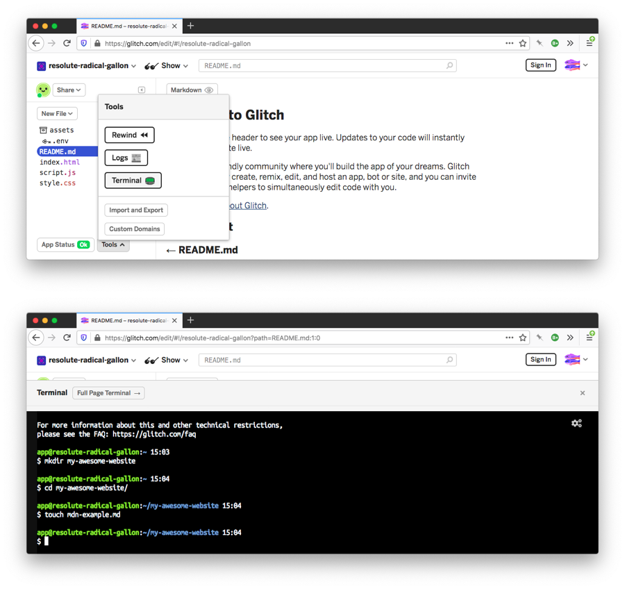

# 小心使用终端

我们之前提到过这一点，但为了明确起见，您需要小心使用终端

简单的命令不会带来太多危险，但是当您开始将更复杂的命令组合在一起时，您需要仔细考虑该命令将执行什么操作，并在最终在指定的目录中运行它们之前先尝试测试它们

假设您在一个目录中有1000个文本文件，您想遍历它们，并且只删除文件名中有特定子字符串的文件

如果不小心，可能会删除一些重要的内容，在此过程中丢失大量工作

要养成的一个好习惯是在文本编辑器中编写您的terminal命令，弄清楚您认为它应该是什么样子，然后对目录进行备份，并首先尝试在该备份上运行命令，以测试它

另一个好建议是，如果你不习惯在自己的机器上尝试终端命令，可以在Glitch.com上试试

除了是测试web开发代码的好地方外，这些项目还允许您访问终端，这样您就可以直接在该终端中运行所有这些命令，而且不会破坏您自己的机器

快速浏览特定终端命令的一个很好的资源是 [tldr.sh](https://tldr.sh/)

这是一个社区驱动的文档服务，类似于MDN，但特定于终端命令

在下一节中，让我们更进一步(实际上是几个层次)，看看如何在命令行上将工具连接在一起，从而真正了解终端如何优于常规的桌面用户界面