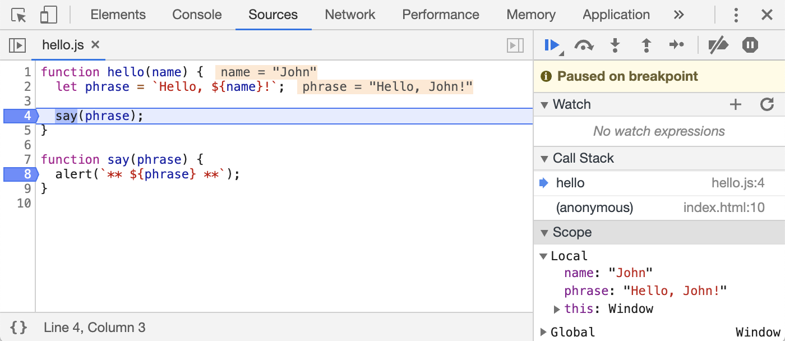

# 暂停并查看

在我们的例子中，`hello()` 函数在页面加载期间被调用，因此激活调试器的最简单的方法（在我们已经设置了断点后）就是 —— 重新加载页面

因此让我们按下 F5（Windows，Linux）或 Cmd+R（Mac）吧

设置断点之后，程序会在第 4 行暂停执行：

请打开右侧的信息下拉列表（箭头指示出的地方）

这里允许你查看当前的代码状态：

1. 察看（Watch） —— 显示任意表达式的当前值

   你可以点击加号 `+` 然后输入一个表达式

   调试器将随时显示它的值，并在执行过程中自动重新计算该表达式

2. 调用栈（Call Stack） —— 显示嵌套的调用链

   此时，调试器正在 `hello()` 的调用链中，被 `index.html` 中的一个脚本调用（这里没有函数，因此显示 “anonymous”）

   如果你点击了一个堆栈项，调试器将跳到对应的代码处，并且还可以查看其所有变量

3. 作用域（Scope） —— 显示当前的变量

   `Local` 显示当前函数中的变量，你还可以在源代码中看到它们的值高亮显示了出来

   `Global` 显示全局变量（不在任何函数中）

   这里还有一个 `this` 关键字，目前我们还没有学到它，不过我们很快就会学习它了

