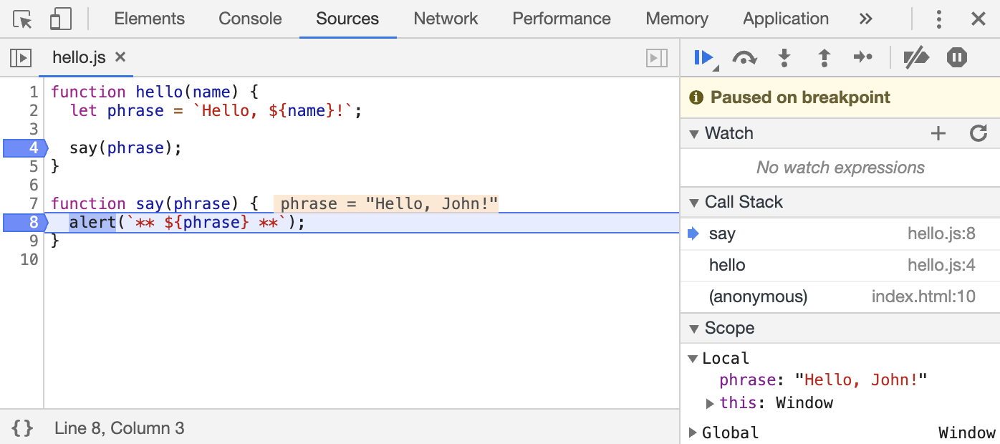

# 跟踪执行

现在是跟踪脚本的时候了

在右侧面板的顶部是一些关于跟踪脚本的按钮

让我们来使用它们吧

`>` —— “恢复（Resume）”：继续执行，快捷键 F8

继续执行

如果没有其他的断点，那么程序就会继续执行，并且调试器不会再控制程序

我们点击它一下之后，我们会看到这样的情况：

执行恢复了，执行到 `say()` 函数中的另外一个断点后暂停在了那里

看一下右边的 “Call stack”

它已经增加了一个调用信息

我们现在在 `say()` 里面

蓝色图标一排依次意义为

- “下一步（Step）”：运行下一条指令，快捷键 F9

  运行下一条语句

  如果我们现在点击它，`alert` 会被显示出来

  一次接一次地点击此按钮，整个脚本的所有语句会被逐个执行

- “跨步（Step over）”：运行下一条指令，但 不会进入到一个函数中，快捷键 F10

  跟上一条命令“下一步（Step）”类似，但如果下一条语句是函数调用则表现不同

  这里的函数指的是：不是内建的如 `alert` 函数等，而是我们自己写的函数

  “下一步（Step）”命令进入函数内部并在第一行暂停执行，而“跨步（Step over）”在无形中执行函数调用，跳过了函数的内部

  执行会在该函数执行后立即暂停

  如果我们对该函数的内部执行不感兴趣，这命令会很有用

- “步入（Step into）”，快捷键 F11

  和“下一步（Step）”类似，但在异步函数调用情况下表现不同

  如果你刚刚才开始学 JavaScript，那么你可以先忽略此差异，因为我们还没有用到异步调用

  至于之后，只需要记住“下一步（Step）”命令会忽略异步行为，例如 `setTimeout`（计划的函数调用），它会过一段时间再执行

  而“步入（Step into）”会进入到代码中并等待（如果需要）

  详见 [DevTools 手册](https://developers.google.com/web/updates/2018/01/devtools#async)

- “步出（Step out）”：继续执行到当前函数的末尾，快捷键 Shift+F11

  继续执行代码并停止在当前函数的最后一行

  当我们使用 偶然地进入到一个嵌套调用，但是我们又对这个函数不感兴趣时，我们想要尽可能的继续执行到最后的时候是非常方便的

- 启用/禁用所有的断点

  这个按钮不会影响程序的执行

  只是一个批量操作断点的开/关

- 启用/禁用出现错误时自动暂停脚本执行

  当启动此功能并且开发者工具是打开着的时候，任何一个脚本的错误都会导致该脚本执行自动暂停

  然后我们可以分析变量来看一下什么出错了

  因此如果我们的脚本因为错误挂掉的时候，我们可以打开调试器，启用这个选项然后重载页面，查看一下哪里导致它挂掉了和当时的上下文是什么

> 在代码中的某一行上右键，在显示的关联菜单（context menu）中点击一个非常有用的名为 “Continue to here” 的选项
>
> 当你想要向前移动很多步到某一行为止，但是又懒得设置一个断点时非常的方便

