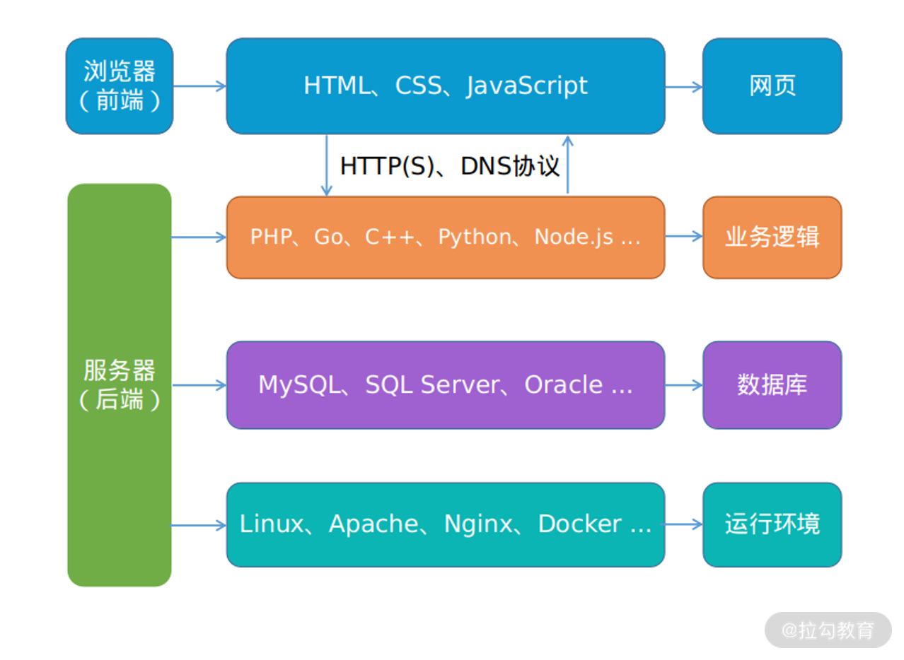

# Web 安全概览

国内外企业都有自建安全响应中心, 用于接收外部报告漏洞

- [腾讯安全应急响应中心](https://security.tencent.com/)
- [微软安全响应中心](https://www.microsoft.com/zh-cn/msrc)
- [HackerOne](https://www.hackerone.com/)
- ...

一般来说, 常说的 Web 是指网站, 其本义是万维网, 这个实际涵盖的内容就很多了, 涉及浏览器, 服务器运行环境等常出现内存破坏漏洞的应用和系统, 但是在安全行业内, 通常所说的 Web 安全, 是指 Web 应用安全, 即网站安全, 也包含仅提供后端 CGI 服务的应用(供移动 App 调用的, 无直接的前端网页), 可以简单地分为前端和后端, 如下图所示

平常行业内所说的二进制安全, 通常是指内存破坏漏洞, 逆向工程, 病毒对抗等涉及二进制数据分析的技术领域, 虽然浏览器, Linux 系统等也是 Web 领域中的一个环节, 但本课程不涉及二进制安全内容, 仍以狭义上的网站安全为主要内容

在学习 Web 安全的过程中, 有 3 个阶段

- 前端知识学习: 包括 HTTP 的知识
- 后端知识学习
- 漏洞攻防学习: Web 漏洞包含哪一些主流的漏洞类型, 最佳的参考就是 [OWASP Top 10](https://owasp.org/www-project-top-ten/)

## 面向漏洞学习

在国外有词叫 Variant Analysis, 直译过来叫"变异分析", 意思是通过历史漏洞学习和研究, 从而挖掘出类似产品中更多相似的漏洞, 尤其是同一款产品下, 如果开发写出了一个漏洞, 那么在其他地方出现同一类漏洞的概率就比较大

乌云网已经成为历史, 但其遗留下的漏洞案例是一笔不错的财富, 网上也有人搭建了乌云镜像提供相关的漏洞, 知识库的检索, 可以点击[链接](https://wooyun.x10sec.org/)查看

HackerOne 通常在漏洞修复后的 3 个月会公开漏洞细节, 栏目名叫 "[Hacktivity](https://hackerone.com/hacktivity)", 它提供 RSS 订阅, 可以非常方便地关注

说到漏洞库就不得不提 [Exploit-db](https://www.exploit-db.com/), 其中有着丰富的漏洞细节和利用代码, 2014 年那时还是一个叫 milw00rm 的漏洞库为主流, milw00rm 不再维护后, 所有漏洞信息都被并入了 Exploit-db, 至今, Exploit-db 还在正常运营, 其背后的团队正是打造了著名黑客系统 Kali 的 Offensive-Security 安全公司, 是一家专门从事安全培训和渗透测试服务的提供商

这种通过漏洞学习漏洞的方式, 除了加深对漏洞的理解, 还可以提高漏洞挖掘的产出, 是一种十分有效地学习方式

## 关注安全动态

技术发展非常迅速, 一不留眼你就落后了, 所以要避免闭门造车, 比如诺基亚的塞班, 微软的 Windows Mobile, 现在都退出了历史舞台, 如果你之前不关注这些, 还在埋头研究它们的安全性, 那就有点浪费时间了

你可以关注一些技术资讯网站, 公众号, Twitter, Github, 博客, RSS 订阅集合, 国内外安全大会(工业界顶会：BlackHat, Defcon, CanSecWest, OffensiveCon; 学术界顶会：CCS, NDSS, Oakland S&P, USENIX Security ), 以及 CTF 比赛等, 这些都可以帮你了解安全动态的途径

在文末的“网站推荐”中，我已经整理一份清单, 建议采用 RSS 订阅的方式关注, 手机上装个 RSS 订阅客户端, 比如 Inoreader, Feedly, 深蓝阅读, 一有更新就可以立马感知到, 非常方便

## 网站推荐

- FreeBuf: https://www.freebuf.com
- 安全客: https://www.anquanke.com
- Seebug Paper: https://paper.seebug.org
- 安全 RSS 订阅: http://riusksk.me/media/riusksk_RSS_20190330.xml
- CTFTime Writeups: https://ctftime.org/writeups
- 安全脉搏: https://www.secpulse.com
- SecWiki: https://www.sec-wiki.com
- 玄武每日安全: https://sec.today/pulses
- 学术论文检索: https://arxiv.org/search/cs
- Exploit-db: https://www.exploit-db.com
- 信息安全知识库: https://vipread.com
- 先知社区: https://xz.aliyun.com
